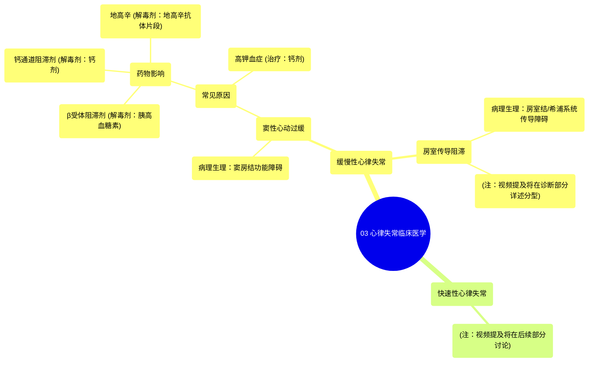

# 03 Arrhythmias Clinical Medicine

  <video controls preload="metadata" playsinline>
    <source src="https://helly.s3.bitiful.net/心血管学科/%E4%B8%93%E8%BE%91%2014%EF%BC%9A%E5%BF%83%E8%A1%80%E7%AE%A1%E5%86%85%E7%A7%91%E7%BB%BC%E5%90%88%20%28Cardiovascular%20Medicine%29/03%20Arrhythmias%20Clinical%20Medicine.mp4" type="video/mp4">
    
您的浏览器不支持播放，请升级。

  </video>

::: tip ⚡️ 核心考点 (30s速读)
*   **核心考点**：心律失常分为**缓慢性心律失常**（心率过慢）和**快速性心律失常**（心率过快）。缓慢性心律失常主要分为**窦性心动过缓**和**房室传导阻滞**。
*   **临床意义**：识别导致心动过缓的常见药物（如β受体阻滞剂、钙通道阻滞剂、地高辛）和高钾血症至关重要，因其有特定的病理生理机制和解毒/治疗方法。
:::

## 🧠 深度精讲

*   **缓慢性心律失常的分类与病理生理**：缓慢性心律失常主要分为两大类：
    1.  **窦性心动过缓**：根本问题在于**窦房结功能障碍**，导致其无法以正常速率发放冲动。常见原因包括药物影响（如β受体阻滞剂、钙通道阻滞剂、地高辛）和高钾血症。
    2.  **房室传导阻滞**：问题出在**房室结或希浦系统**，导致心房冲动向心室的传导延迟或中断。视频提到将在诊断部分深入讨论其不同类型。

*   **药物性心动过缓的机制与解毒**：
    *   **β受体阻滞剂**（如美托洛尔）：阻断β1受体，抑制钙内流，导致窦房结细胞除极障碍。**解毒剂：胰高血糖素**。
    *   **钙通道阻滞剂**（如维拉帕米、地尔硫卓）：阻断钙通道，抑制钙内流，影响除极。**解毒剂：钙剂**。
    *   **地高辛**：增加乙酰胆碱，激活毒蕈碱2型受体，引起钾外流和细胞超极化，抑制电活动传导。中毒时可用**地高辛特异性抗体片段**逆转。
    *   **高钾血症**：细胞外钾离子浓度升高，使静息膜电位升高，导致钠通道持续失活，无法正常除极。心电图可表现为高尖T波、PR间期延长、宽QRS波。**治疗：给予钙剂稳定心肌细胞膜**。

## 📚 双语术语表 (Terminology)
| 英文术语 | 中文翻译 | 定义/解释 |
| :--- | :--- | :--- |
| Arrhythmias | 心律失常 | 心脏电活动的频率、节律、起源部位、传导速度或激动次序的异常。 |
| Bradyarrhythmias | 缓慢性心律失常 | 心率过慢（通常<60次/分，显著者<50次/分）的一类心律失常。 |
| Tachyarrhythmias | 快速性心律失常 | 心率过快的一类心律失常。 |
| Sinus Bradycardia | 窦性心动过缓 | 由于窦房结功能障碍导致心率过慢。 |
| AV Blocks | 房室传导阻滞 | 心房冲动在通过房室结向心室传导过程中发生延迟或中断。 |
| SA Node | 窦房结 | 心脏的正常起搏点，位于右心房上部。 |
| AV Node | 房室结 | 位于心房和心室之间的电传导“中继站”，可延迟冲动传导。 |
| Beta Blockers | β受体阻滞剂 | 一类通过阻断β肾上腺素能受体（尤其是β1受体）来减慢心率、降低心肌收缩力的药物。 |
| Calcium Channel Blockers | 钙通道阻滞剂 | 一类通过阻断钙离子通道来减慢心率、降低心肌收缩力、扩张血管的药物。 |
| Digoxin | 地高辛 | 一种强心苷类药物，具有正性肌力作用和负性变时作用。 |
| Hyperkalemia | 高钾血症 | 血液中钾离子浓度异常升高。 |
| Digibind | 地高辛特异性抗体片段 | 用于治疗严重地高辛中毒的特异性解毒剂。 |

## 🗺️ 知识图谱

