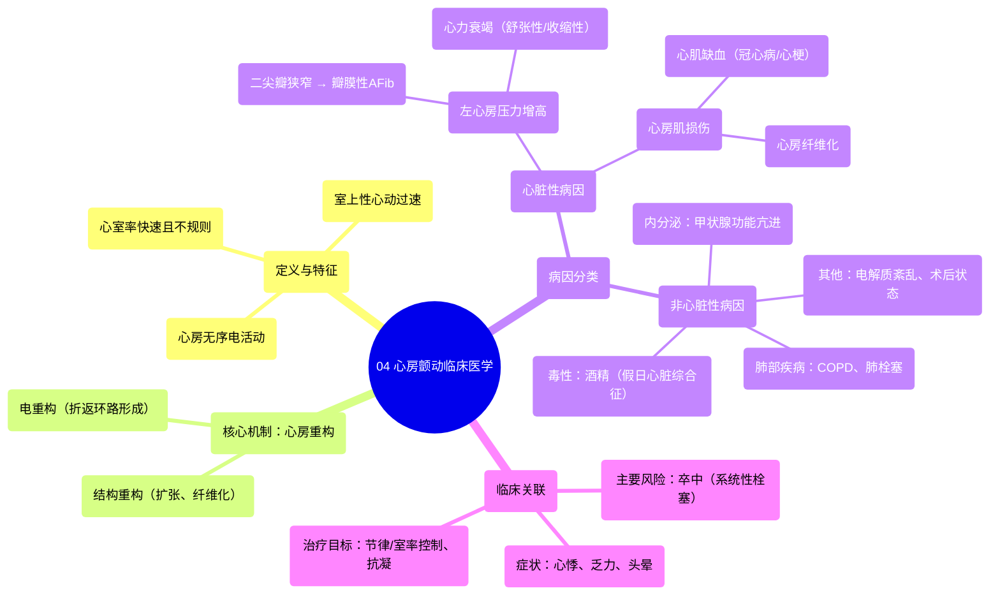

# 04 Atrial Fibrillation Clinical Medicine

  <video controls preload="metadata" playsinline>
    <source src="https://helly.s3.bitiful.net/心血管学科/%E4%B8%93%E8%BE%91%2014%EF%BC%9A%E5%BF%83%E8%A1%80%E7%AE%A1%E5%86%85%E7%A7%91%E7%BB%BC%E5%90%88%20%28Cardiovascular%20Medicine%29/04%20Atrial%20Fibrillation%20Clinical%20Medicine.mp4" type="video/mp4">
    
您的浏览器不支持播放，请升级。

  </video>

::: tip ⚡️ 核心考点 (30s速读)
*   **核心考点**：心房颤动（AFib）是一种常见的室上性心动过速，其发生与**心房电重构**密切相关。核心病因分为**心脏性**（如二尖瓣狭窄、心力衰竭、心肌缺血）和**非心脏性**（如甲状腺功能亢进、酒精、肺部疾病）。
*   **临床意义**：AFib不仅是心律失常，更是重要的**卒中风险因素**。其不规则心律可导致心悸、血流动力学不稳定，并因心房内血流淤滞而易形成血栓，引发系统性栓塞。
:::

## 🧠 深度精讲

*   **概念1：心房颤动的定义与本质**
    心房颤动（Atrial Fibrillation, AFib）是一种起源于心房的**室上性心动过速**。其核心特征是心房电活动完全无序，失去有效的机械收缩，导致心室出现**快速且完全不规则**的应答。这不仅是心律问题，更是一种与多种临床后果相关的病理状态。

*   **概念2：心房颤动的核心发生机制——心房重构**
    无论何种病因，最终导致AFib的共同通路是**心房重构**。这包括结构重构（如心房扩张、纤维化）和电重构（如离子通道功能改变、传导异常）。重构破坏了心房内正常的电传导通路，易于形成多个微小的**折返环路**，这些环路自发产生快速、混乱的电冲动，下传至心室，从而引发AFib。

*   **概念3：心脏性病因（Cardiac Causes）**
    此类病因直接源于心脏结构或功能异常，通过增加心房压力或直接损伤心房肌，触发重构。
    1.  **左心房压力增高**：这是关键机制。压力增高导致心房扩张，进而引发电重构。
        *   **二尖瓣狭窄**：血液从左心房流入左心室受阻，左心房压力显著升高。由风湿性心脏病等引起的二尖瓣病变导致的AFib，特称为**瓣膜性心房颤动**，其卒中风险极高，是抗凝治疗的强指征。
        *   **心力衰竭（特别是舒张性心力衰竭）**：心室充盈受限或过度充血，使心房排血受阻，压力升高。
    2.  **心房肌缺血/纤维化**：
        *   **冠状动脉疾病/心肌梗死**：心房肌供血不足（缺血）或梗死后的纤维化瘢痕，可成为折返激动的病灶，直接扰乱心房电路。

*   **概念4：非心脏性病因（Non-Cardiac Causes）**
    此类病因通过全身性代谢、毒性或压力效应间接影响心房。
    1.  **甲状腺功能亢进**：过量的甲状腺激素直接增加心肌细胞的兴奋性，并可能通过高动力状态增加心房负荷。
    2.  **酒精**（“假日心脏综合征”）：急性大量酒精摄入可触发AFib，机制可能与电解质紊乱、交感神经兴奋及酒精对心肌的直接毒性有关。
    3.  **肺部疾病**（如慢性阻塞性肺疾病、肺栓塞）：导致缺氧、高碳酸血症、肺动脉高压，进而增加右心负荷，可能牵拉心房或引起电解质和酸碱失衡，诱发AFib。
    4.  **其他**：包括电解质紊乱（如低钾、低镁）、交感神经张力增高（如 sepsis、术后状态）、肥胖、睡眠呼吸暂停等。

## 📚 双语术语表 (Terminology)
| 英文术语 | 中文翻译 | 定义/解释 |
| :--- | :--- | :--- |
| Atrial Fibrillation (AFib) | 心房颤动 | 一种以心房快速、无序电活动为特征的心律失常，导致心室反应不规则。 |
| Supraventricular Tachycardia (SVT) | 室上性心动过速 | 起源于心房或房室结以上部位的心动过速。 |
| Atrial Remodeling | 心房重构 | 心房在病理刺激下发生的结构（扩张、纤维化）和电生理特性改变，是AFib发生和维持的基础。 |
| Re-entrant Circuit | 折返环路 | 一种异常的电传导路径，电冲动在其中循环往复，是产生许多快速性心律失常（包括AFib）的机制。 |
| Valvular AFib | 瓣膜性心房颤动 | 特指由中重度二尖瓣狭窄或人工心脏瓣膜存在所引起的心房颤动，具有特殊的卒中风险评估和抗凝策略。 |
| Left Atrial Pressure | 左心房压力 | 左心房的内部压力，其病理性升高是导致心房扩张和AFib的重要机制。 |
| Mitral Stenosis | 二尖瓣狭窄 | 二尖瓣开口狭窄，阻碍血液从左心房流入左心室。 |
| Diastolic Heart Failure | 舒张性心力衰竭 | 心室充盈受损导致的心力衰竭，射血分数可能正常。 |
| Electrical Remodeling | 电重构 | 心肌细胞离子通道功能、表达及连接蛋白的改变，导致动作电位时程和传导速度变化。 |
| “Holiday Heart” Syndrome | “假日心脏”综合征 | 指在节假日等场合因急性大量饮酒后诱发的心律失常，常为AFib。 |

## 🗺️ 知识图谱

