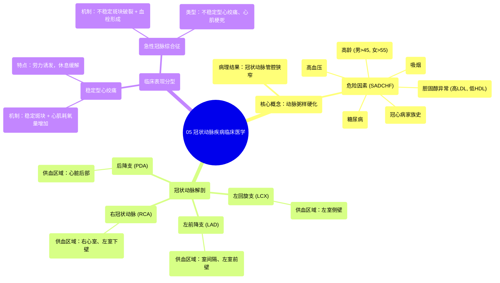

# 05 Coronary Artery Disease Clinical Medicine

  <video controls preload="metadata" playsinline>
    <source src="https://helly.s3.bitiful.net/心血管学科/%E4%B8%93%E8%BE%91%2014%EF%BC%9A%E5%BF%83%E8%A1%80%E7%AE%A1%E5%86%85%E7%A7%91%E7%BB%BC%E5%90%88%20%28Cardiovascular%20Medicine%29/05%20Coronary%20Artery%20Disease%20Clinical%20Medicine.mp4" type="video/mp4">
    
您的浏览器不支持播放，请升级。

  </video>

::: tip ⚡️ 核心考点 (30s速读)
*   **核心考点**：冠状动脉疾病（CAD）最常见的原因是动脉粥样硬化，导致冠状动脉管腔狭窄，心肌供氧减少。其临床表现取决于斑块的稳定性：稳定斑块在心肌耗氧量增加时引发稳定型心绞痛；不稳定斑块破裂则直接导致急性冠脉综合征（如心肌梗死）。
*   **临床意义**：掌握CAD的危险因素（SADCHF助记符）和主要冠状动脉（LAD、LCX、RCA、PDA）的供血区域，是理解其病理生理、诊断和治疗的基础。
:::

## 🧠 深度精讲

*   **冠状动脉解剖与功能**：心脏自身的血液供应依赖于冠状动脉。主要有四支：**左前降支（LAD）** 供应室间隔和左心室前壁；**左回旋支（LCX）** 供应左心室侧壁；**右冠状动脉（RCA）** 供应右心室和左心室下壁部分区域；**后降支（PDA）** 供应心脏后部。其中LAD最为重要，其闭塞后果严重。
*   **动脉粥样硬化与危险因素**：CAD的病理基础是动脉粥样硬化，即脂肪斑块在血管壁内形成。其危险因素可用助记符 **SADCHF** 记忆：**吸烟**、**高龄**（男>45岁，女>55岁）、**糖尿病**、**胆固醇异常**（高LDL，低HDL）、**高血压**、**冠心病家族史**。
*   **稳定型与不稳定型斑块**：
    *   **稳定型斑块**：斑块表面有较厚的纤维帽覆盖，性质稳定。它造成固定的管腔狭窄，导致心肌**供氧减少**。平时可能无症状，但当心肌**耗氧量增加**（如运动、情绪激动）时，供需失衡，引发**稳定型心绞痛**（劳力性胸痛）。
    *   **不稳定型斑块**：斑块纤维帽薄、脂质核心大、易破裂。斑块破裂会迅速激活血小板和凝血系统，形成血栓，急剧堵塞血管，导致**急性冠脉综合征**（如不稳定型心绞痛、心肌梗死）。这是临床急症。

## 📚 双语术语表 (Terminology)
| 英文术语 | 中文翻译 | 定义/解释 |
| :--- | :--- | :--- |
| Coronary Artery Disease (CAD) | 冠状动脉疾病 | 冠状动脉发生病变（主要是动脉粥样硬化）导致管腔狭窄或闭塞，引起心肌缺血、缺氧的心脏病。 |
| Atherosclerosis | 动脉粥样硬化 | 动脉壁内脂质、胆固醇等沉积，伴随纤维组织增生和钙化，形成斑块，使动脉壁变硬、管腔狭窄的病理过程。 |
| Left Anterior Descending (LAD) | 左前降支 | 最重要的冠状动脉分支，供应室间隔、左心室前壁及部分侧壁。 |
| Left Circumflex Artery (LCX) | 左回旋支 | 冠状动脉分支，主要供应左心室侧壁。 |
| Right Coronary Artery (RCA) | 右冠状动脉 | 冠状动脉分支，主要供应右心室、左心室下壁及后壁部分区域。 |
| Posterior Descending Artery (PDA) | 后降支 | 通常由RCA或LCX发出，供应心脏后部（下壁及后间隔）。 |
| Stable Plaque | 稳定斑块 | 具有厚纤维帽的动脉粥样硬化斑块，不易破裂，通常导致固定狭窄。 |
| Unstable Plaque | 不稳定斑块 | 纤维帽薄、脂质核心大的斑块，易破裂引发血栓形成，导致急性事件。 |
| Ischemia | 缺血 | 组织或器官的血液灌注量减少，导致氧气和营养物质供应不足的状态。 |
| Angina Pectoris | 心绞痛 | 由于心肌暂时性缺血、缺氧引起的以胸痛为主要表现的临床综合征。 |

## 🗺️ 知识图谱

