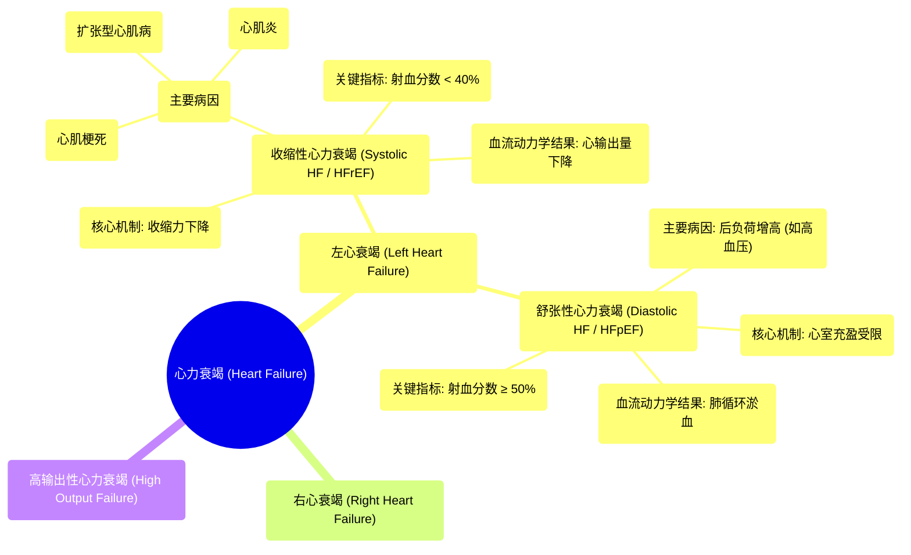

# 06 Congestive Heart Failure Clinical Medicine

  <video controls preload="metadata" playsinline>
    <source src="https://helly.s3.bitiful.net/心血管学科/%E4%B8%93%E8%BE%91%2014%EF%BC%9A%E5%BF%83%E8%A1%80%E7%AE%A1%E5%86%85%E7%A7%91%E7%BB%BC%E5%90%88%20%28Cardiovascular%20Medicine%29/06%20Congestive%20Heart%20Failure%20Clinical%20Medicine.mp4" type="video/mp4">
    
您的浏览器不支持播放，请升级。

  </video>

::: tip ⚡️ 核心考点 (30s速读)
*   **核心考点**：心力衰竭主要分为左心衰竭和右心衰竭。左心衰竭又分为**收缩性心力衰竭**（泵血能力下降，射血分数降低）和**舒张性心力衰竭**（心脏充盈受限，射血分数保留）。收缩性心力衰竭的核心是心肌**收缩力**下降，导致**心输出量**减少。
*   **临床意义**：区分收缩性与舒张性心力衰竭对治疗至关重要。收缩性心力衰竭（HFrEF）的治疗重点是增强心肌收缩力、减轻心脏负荷；而舒张性心力衰竭（HFpEF）的治疗则侧重于控制血压、改善心室舒张功能。
:::

## 🧠 深度精讲
*   **收缩性心力衰竭**：其核心病理生理是心肌**收缩力**下降。常见病因包括**心肌梗死**（导致心肌纤维化）、**扩张型心肌病**（心室变薄、无力）和**心肌炎**。收缩力下降导致左心室**射血分数**降低（通常<40%），称为**射血分数降低的心力衰竭**。这直接导致**心输出量**下降，引发前向血流不足的症状（如乏力、头晕）。
*   **舒张性心力衰竭**：其核心问题并非泵血无力，而是心室**充盈受限**。常见原因是**后负荷**异常增高，使得心脏在舒张期难以充分放松和接纳血液。高血压是导致后负荷增高的最常见原因。此类患者射血分数可能正常或接近正常，因此称为**射血分数保留的心力衰竭**。症状主要由肺循环淤血引起（如呼吸困难）。

## 📚 双语术语表 (Terminology)
| 英文术语 | 中文翻译 | 定义/解释 |
| :--- | :--- | :--- |
| Heart Failure (HF) | 心力衰竭 | 心脏泵血功能不足以满足身体代谢需要的临床综合征。 |
| Congestive Heart Failure (CHF) | 充血性心力衰竭 | 伴有肺循环和/或体循环淤血表现的心力衰竭。 |
| Left Heart Failure | 左心衰竭 | 左心室泵血功能受损，导致肺循环淤血。 |
| Systolic Heart Failure | 收缩性心力衰竭 | 因心肌收缩力下降导致泵血功能受损的心力衰竭。 |
| Diastolic Heart Failure | 舒张性心力衰竭 | 因心室舒张期充盈受限导致泵血功能受损的心力衰竭。 |
| HFrEF | 射血分数降低的心力衰竭 | 左心室射血分数 ≤ 40% 的心力衰竭。 |
| HFpEF | 射血分数保留的心力衰竭 | 左心室射血分数 ≥ 50% 的心力衰竭。 |
| Ejection Fraction (EF) | 射血分数 | 每搏输出量占心室舒张末期容积的百分比，反映心脏泵血效率。 |
| Contractility | 收缩力 | 心肌纤维收缩的内在能力。 |
| Afterload | 后负荷 | 心室射血时需要克服的阻力，主要取决于主动脉血压。 |
| Cardiac Output (CO) | 心输出量 | 每分钟由一侧心室泵出的血液总量。 |
| Myocardial Infarction (MI) | 心肌梗死 | 冠状动脉阻塞导致心肌缺血性坏死。 |
| Dilated Cardiomyopathy | 扩张型心肌病 | 以心室腔扩大、收缩功能减退为特征的心肌病。 |
| Myocarditis | 心肌炎 | 心肌的炎症性疾病。 |

## 🗺️ 知识图谱

