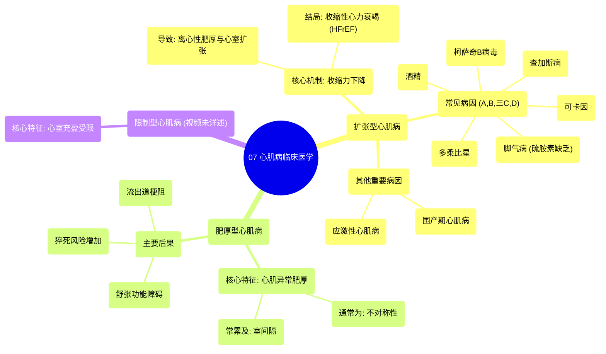

# 07 Cardiomyopathy Clinical Medicine

  <video controls preload="metadata" playsinline>
    <source src="https://helly.s3.bitiful.net/心血管学科/%E4%B8%93%E8%BE%91%2014%EF%BC%9A%E5%BF%83%E8%A1%80%E7%AE%A1%E5%86%85%E7%A7%91%E7%BB%BC%E5%90%88%20%28Cardiovascular%20Medicine%29/07%20Cardiomyopathy%20Clinical%20Medicine.mp4" type="video/mp4">
    
您的浏览器不支持播放，请升级。

  </video>

::: tip ⚡️ 核心考点 (30s速读)
*   **核心考点**：心肌病分为扩张型、肥厚型、限制型三类，其核心病理生理机制分别是心肌收缩力下降、心肌异常肥厚和心室充盈受限。
*   **临床意义**：扩张型心肌病常导致收缩性心力衰竭（射血分数降低）；肥厚型心肌病可导致舒张功能障碍、流出道梗阻和猝死风险增加。
:::

## 🧠 深度精讲

*   **扩张型心肌病**
    *   **核心病理生理**：心肌收缩力下降 → 心输出量/射血分数降低 → 血压下降 → 身体代偿性增加前负荷（静脉回流增多）→ 心室为适应容量负荷而发生**离心性肥厚**（肌节串联增加）→ 心室扩张、室壁变薄 → 形成恶性循环，最终导致**收缩性心力衰竭**（射血分数降低的心力衰竭，EF通常<40%）。
    *   **主要病因 (助记：A, B, 三C, D)**：
        *   **A**：酒精
        *   **B**：脚气病（硫胺素缺乏）
        *   **C**：可卡因中毒
        *   **C**：查加斯病（克氏锥虫感染）
        *   **C**：柯萨奇B病毒感染
        *   **D**：多柔比星（化疗药物）
    *   **其他重要病因**：
        *   **应激性心肌病**：由巨大身心应激（如强烈情绪波动、颅内出血）引发的急性、可逆性左心室功能障碍。
        *   **围产期心肌病**：发生于妊娠末期或分娩后数月内的心肌病。

*   **肥厚型心肌病**
    *   **核心病理生理**：心肌发生**异常肥厚**，通常为**不对称性**，最常累及**室间隔**。这会导致心室腔变小、舒张功能受损（心室充盈困难），严重时可造成左心室流出道梗阻，是年轻人猝死的重要原因之一。

## 📚 双语术语表 (Terminology)
| 英文术语 | 中文翻译 | 定义/解释 |
| :--- | :--- | :--- |
| Cardiomyopathy | 心肌病 | 心肌本身的结构或功能异常性疾病。 |
| Dilated Cardiomyopathy | 扩张型心肌病 | 以心室腔扩大、收缩功能减退为特征的心肌病。 |
| Hypertrophic Cardiomyopathy | 肥厚型心肌病 | 以心肌（尤其是室间隔）不对称性肥厚为特征的心肌病。 |
| Restrictive Cardiomyopathy | 限制型心肌病 | 以心室壁僵硬、舒张期充盈受限为特征的心肌病。 |
| Ejection Fraction (EF) | 射血分数 | 每搏输出量占心室舒张末期容积的百分比，反映心脏收缩功能。 |
| Systolic Heart Failure / HFrEF | 收缩性心力衰竭 / 射血分数降低的心力衰竭 | 因心肌收缩力下降导致射血分数降低（通常<40%）的心力衰竭。 |
| Eccentric Hypertrophy | 离心性肥厚 | 心肌纤维长度增加（肌节串联增多）导致的心室腔扩大伴室壁轻度增厚，见于容量负荷过重。 |
| Preload | 前负荷 | 心脏舒张末期心室内的血容量（压力），决定心肌纤维的初长度。 |
| Contractility | 心肌收缩力 | 心肌纤维本身收缩的强度和速度，与前、后负荷无关的内在特性。 |
| Takotsubo Cardiomyopathy | 应激性心肌病 | 又称“心尖球形综合征”，由强烈应激引发的一过性左心室功能障碍。 |
| Peripartum Cardiomyopathy | 围产期心肌病 | 发生于妊娠末期或产后数月内的特发性心肌病。 |
| Chagas Disease | 查加斯病 | 由克氏锥虫感染引起的疾病，可导致慢性心肌炎和心肌病。 |
| Coxsackie B Virus | 柯萨奇B病毒 | 一种常见于病毒性心肌炎的病原体。 |
| Doxorubicin | 多柔比星 | 一种蒽环类化疗药物，其心脏毒性可导致剂量依赖性的心肌损伤和心力衰竭。 |

## 🗺️ 知识图谱

