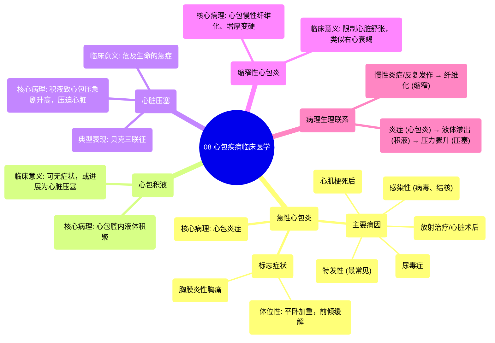

# 08 Pericardial Diseases Clinical Medicine

  <video controls preload="metadata" playsinline>
    <source src="https://helly.s3.bitiful.net/心血管学科/%E4%B8%93%E8%BE%91%2014%EF%BC%9A%E5%BF%83%E8%A1%80%E7%AE%A1%E5%86%85%E7%A7%91%E7%BB%BC%E5%90%88%20%28Cardiovascular%20Medicine%29/08%20Pericardial%20Diseases%20Clinical%20Medicine.mp4" type="video/mp4">
    
您的浏览器不支持播放，请升级。

  </video>

::: tip ⚡️ 核心考点 (30s速读)
*   **核心考点**：心包疾病的核心是理解从“炎症”到“积液”再到“填塞”的病理生理连续过程。急性心包炎是起点，表现为胸膜炎性、体位性胸痛；心包积液是液体异常积聚；心脏压塞是危及生命的紧急情况，表现为Beck三联征。
*   **临床意义**：掌握不同心包疾病的病因、典型症状（尤其是胸痛特点）和关键鉴别点，是快速诊断和正确处理的基础。
:::

## 🧠 深度精讲

*   **急性心包炎 (Acute Pericarditis)**
    *   **核心病理**：心包膜的炎症反应。
    *   **主要病因**：
        1.  **特发性**：最常见，原因不明。
        2.  **感染性**：病毒（如柯萨奇B病毒）、结核（在特定人群中）。
        3.  **心肌梗死后**：早期（1-3天）为纤维素性心包炎；晚期（≥14天）为Dressler综合征。
        4.  **尿毒症**：慢性肾病或急性肾损伤导致BUN/肌酐显著升高时发生。
        5.  **其他**：胸部放射治疗、心脏手术后（心包切开术后综合征）。
    *   **标志性症状**：**胸膜炎性胸痛**。
        *   **特点**：深呼吸时加重（因肺部扩张压迫发炎的心包）。
        *   **体位性**：平躺时加重（膈肌上抬压迫心包），身体前倾时缓解（膈肌下降，减轻压迫）。

*   **心包积液 (Pericardial Effusion)**
    *   **核心病理**：心包腔内液体的异常积聚。它是急性心包炎常见的并发症，也可以是其他过程（如肿瘤、创伤）的结果。
    *   **临床意义**：积液量少可能无症状；量大可压迫心脏，影响其充盈。

*   **心脏压塞 (Cardiac Tamponade)**
    *   **核心病理**：急性或大量心包积液导致心包腔内压力急剧升高，严重压迫心脏，阻碍心室舒张期充盈。
    *   **临床意义**：**危及生命的急症**！典型表现为**Beck三联征**：低血压、颈静脉怒张、心音遥远。需要紧急心包穿刺引流。

*   **缩窄性心包炎 (Constrictive Pericarditis)**
    *   **核心病理**：心包因慢性炎症、纤维化而增厚、变硬，失去弹性，像一个“硬壳”包裹心脏，限制其舒张。
    *   **临床意义**：表现为右心衰竭症状（如肝大、腹水、水肿），但心脏本身收缩功能可能正常。需与限制型心肌病鉴别。

## 📚 双语术语表 (Terminology)
| 英文术语 | 中文翻译 | 定义/解释 |
| :--- | :--- | :--- |
| Pericardial Diseases | 心包疾病 | 影响心包（包裹心脏的双层囊）的各种疾病总称。 |
| Acute Pericarditis | 急性心包炎 | 心包膜的急性炎症，常表现为特征性胸痛。 |
| Constrictive Pericarditis | 缩窄性心包炎 | 心包慢性增厚、纤维化，导致心脏舒张充盈受限。 |
| Pericardial Effusion | 心包积液 | 心包腔内液体的异常积聚。 |
| Cardiac Tamponade | 心脏压塞 | 心包积液导致心包内压力急剧升高，严重压迫心脏的危及生命的状况。 |
| Pleuritic Chest Pain | 胸膜炎性胸痛 | 与呼吸运动相关的胸痛，深呼吸时加重。 |
| Positional Chest Pain | 体位性胸痛 | 随身体姿势改变而加重或缓解的胸痛。 |
| Visceral Layer | 脏层 | 心包的内层，紧贴心脏表面（心外膜）。 |
| Parietal Layer | 壁层 | 心包的外层。 |
| Pericardial Cavity | 心包腔 | 位于脏层和壁层心包之间的潜在腔隙，含少量浆液。 |
| Coxsackie B Virus | 柯萨奇B病毒 | 一种常见的引起病毒性心包炎的病原体。 |
| Dressler Syndrome | 德雷斯勒综合征 | 心肌梗死后数周出现的迟发性心包炎，可能为自身免疫反应。 |
| Uremic Pericarditis | 尿毒症性心包炎 | 严重肾功能衰竭（尿毒症）引起的心包炎症。 |
| Post-pericardiotomy Syndrome | 心包切开术后综合征 | 心脏手术后出现的发热、胸痛、心包炎等表现。 |
| Beck‘s Triad | 贝克三联征 | 心脏压塞的典型三联征：低血压、颈静脉怒张、心音遥远。 |

## 🗺️ 知识图谱

