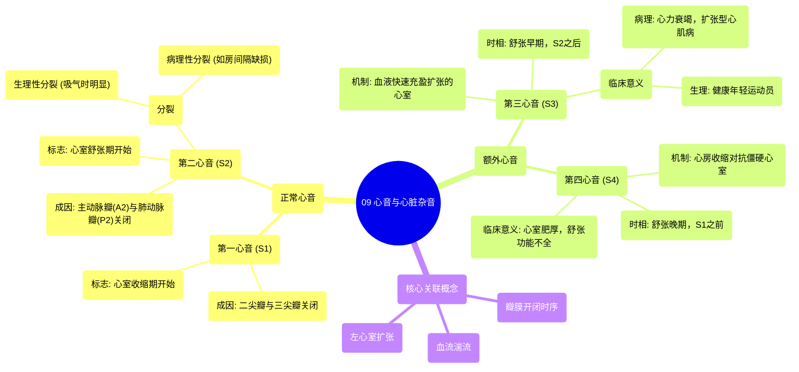

# 09 Heart Sounds & Murmurs _ Clinical Medicine

  <video controls preload="metadata" playsinline>
    <source src="https://helly.s3.bitiful.net/心血管学科/%E4%B8%93%E8%BE%91%2014%EF%BC%9A%E5%BF%83%E8%A1%80%E7%AE%A1%E5%86%85%E7%A7%91%E7%BB%BC%E5%90%88%20%28Cardiovascular%20Medicine%29/09%20Heart%20Sounds%20%26%20Murmurs%20_%20Clinical%20Medicine.mp4" type="video/mp4">
    
您的浏览器不支持播放，请升级。

  </video>

::: tip ⚡️ 核心考点 (30s速读)
*   **核心考点**：掌握正常心音S1、S2的成因（瓣膜关闭），理解额外心音S3、S4的产生机制与临床意义，特别是S3与左心室扩张（如心力衰竭、扩张型心肌病）的关联。
*   **临床意义**：通过听诊区分正常与异常心音是心血管疾病诊断的基础。S3音的出现常提示心室功能不全或容量负荷过重，是评估心功能的重要线索。
:::

## 🧠 深度精讲

*   **正常心音 (S1 & S2)**：
    *   **第一心音 (S1)**：标志着心室收缩期的开始。主要由**二尖瓣**和**三尖瓣**关闭产生。声音低沉，在心尖部听诊最清楚。
    *   **第二心音 (S2)**：标志着心室舒张期的开始。主要由**主动脉瓣 (A2)** 和**肺动脉瓣 (P2)** 关闭产生。正常情况下，A2关闭略早于P2，构成S2的生理性分裂。声音高亢，在心底部听诊最清楚。

*   **额外心音 (S3 & S4)**：
    *   **第三心音 (S3)**：发生在舒张早期，紧随S2之后。其产生机制是**心室快速充盈期，血液冲击扩张、顺应性下降的心室壁**所产生的振动。关键词是 **“左心室扩张”** 和 **“快速充盈”**。
        *   **病理意义**：常见于**收缩性心力衰竭**、**扩张型心肌病**等导致心室扩大的疾病。
        *   **生理意义**：可见于部分健康的青少年或运动员，因其每搏输出量大，心室充盈快。
    *   **第四心音 (S4)**：（视频片段未详细提及，但为完整知识体系补充）发生在舒张晚期，紧邻S1之前。由心房收缩将血液挤入**僵硬度增高、顺应性下降的心室**所产生。常提示心室肥厚、舒张功能不全（如高血压心脏病、肥厚型心肌病）。

*   **第二心音分裂**：视频提到这是进阶内容。S2分裂指A2和P2关闭不同步，听诊时可分辨为两个成分。
    *   **生理性分裂**：吸气时胸腔负压增加，回心血量增多，使右心室射血时间稍延长，P2延迟关闭，导致分裂更明显。
    *   **病理性分裂**：如房间隔缺损（固定性分裂）、右束支传导阻滞（宽分裂）等疾病会导致分裂异常。

## 📚 双语术语表 (Terminology)
| 英文术语 | 中文翻译 | 定义/解释 |
| :--- | :--- | :--- |
| Heart Sounds | 心音 | 心脏搏动时，瓣膜关闭、血流冲击心血管壁产生的声音。 |
| S1 (First Heart Sound) | 第一心音 | 心室收缩开始时，二尖瓣和三尖瓣关闭产生的声音。 |
| S2 (Second Heart Sound) | 第二心音 | 心室舒张开始时，主动脉瓣和肺动脉瓣关闭产生的声音。 |
| Murmur | 心脏杂音 | 心音以外，持续时间较长的异常声音，多由血流湍流引起。 |
| A2 (Aortic component of S2) | S2的主动脉瓣成分 | 第二心音中由主动脉瓣关闭产生的部分。 |
| P2 (Pulmonary component of S2) | S2的肺动脉瓣成分 | 第二心音中由肺动脉瓣关闭产生的部分。 |
| S3 (Third Heart Sound) | 第三心音 | 舒张早期出现的额外心音，与心室快速充盈和扩张有关。 |
| S4 (Fourth Heart Sound) | 第四心音 | 舒张晚期（收缩期前）出现的额外心音，与心房收缩对抗僵硬心室有关。 |
| Splitting of S2 | 第二心音分裂 | 听诊时A2和P2可被分辨为两个分开声音的现象。 |
| Left Ventricular Dilation | 左心室扩张 | 左心室内径异常增大，常导致收缩功能下降。 |
| Systolic Heart Failure | 收缩性心力衰竭 | 以心室收缩功能减弱（射血分数降低）为特征的心力衰竭。 |
| Dilated Cardiomyopathy | 扩张型心肌病 | 一种以心室腔扩大和收缩功能障碍为主的心肌病。 |

## 🗺️ 知识图谱

