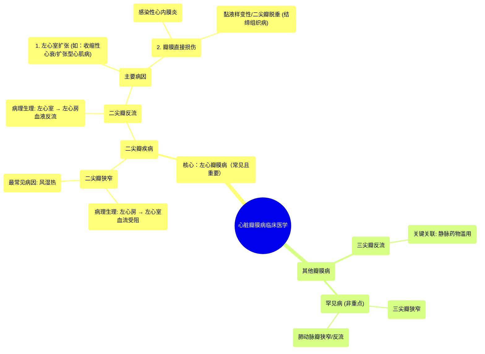

# 10 Valvular Heart Diseases Clinical Medicine

  <video controls preload="metadata" playsinline>
    <source src="https://helly.s3.bitiful.net/心血管学科/%E4%B8%93%E8%BE%91%2014%EF%BC%9A%E5%BF%83%E8%A1%80%E7%AE%A1%E5%86%85%E7%A7%91%E7%BB%BC%E5%90%88%20%28Cardiovascular%20Medicine%29/10%20Valvular%20Heart%20Diseases%20Clinical%20Medicine.mp4" type="video/mp4">
    
您的浏览器不支持播放，请升级。

  </video>

::: tip ⚡️ 核心考点 (30s速读)
*   **核心考点**：心脏瓣膜病主要分为狭窄（瓣膜打不开）和关闭不全/反流（瓣膜关不严）。左心瓣膜病（二尖瓣、主动脉瓣）是临床和考试重点。
*   **临床意义**：理解每种病变的血流动力学改变（血液往哪里流受阻或反流）是诊断和治疗的关键。
:::

## 🧠 深度精讲

*   **视频内容概述**：本视频是临床医学系列的一部分，重点讲解常见的心脏瓣膜病，包括二尖瓣狭窄、二尖瓣反流、主动脉瓣狭窄和主动脉瓣反流，并简要提及风湿热和三尖瓣反流。视频强调左心瓣膜病更为常见和重要。
*   **二尖瓣狭窄**
    *   **概念**：二尖瓣（位于左心房和左心室之间）因病变而开放受限、变硬。
    *   **病理生理**：导致血液从左心房流入左心室受阻。
    *   **最常见病因**：**风湿热**的后遗症。瓣膜发生纤维化、硬化。
*   **二尖瓣反流**
    *   **概念**：二尖瓣在心脏收缩期关闭不全。
    *   **病理生理**：导致血液从左心室**反流**回左心房（正常情况下不应发生）。
    *   **主要病因**：
        1.  **左心室扩张**：如收缩性心力衰竭（射血分数降低的心力衰竭）、扩张型心肌病。心室扩张将瓣膜瓣叶“拉开”，导致其对合不良。
        2.  **瓣膜直接损伤**：
            *   **感染性心内膜炎**：瓣膜被微生物破坏，常见于静脉药瘾者或有人工瓣膜的患者。
            *   **黏液样变性**：瓣膜本身因结缔组织病（如马凡综合征、埃勒斯-当洛斯综合征）而薄弱、退化，可导致**二尖瓣脱垂**（瓣叶在收缩期膨入左心房）。
*   **其他瓣膜病**：
    *   **三尖瓣反流**：需特别关注其与**静脉药物滥用**的高度相关性。
    *   **三尖瓣狭窄、肺动脉瓣狭窄/反流**：相对罕见，非考试重点。

## 📚 双语术语表 (Terminology)
| 英文术语 | 中文翻译 | 定义/解释 |
| :--- | :--- | :--- |
| Valvular Heart Disease (VHD) | 心脏瓣膜病 | 心脏瓣膜结构或功能异常导致的一类疾病。 |
| Mitral Stenosis | 二尖瓣狭窄 | 二尖瓣开放受限，阻碍血液从左心房流入左心室。 |
| Mitral Regurgitation | 二尖瓣反流 | 二尖瓣关闭不全，导致心脏收缩时血液从左心室反流回左心房。 |
| Rheumatic Fever | 风湿热 | A组链球菌感染后引起的自身免疫性疾病，是导致二尖瓣狭窄的最常见原因。 |
| Systolic Heart Failure / HFrEF | 收缩性心力衰竭 / 射血分数降低的心力衰竭 | 心室收缩功能减弱，泵血能力下降，常伴有心室扩张。 |
| Infective Endocarditis | 感染性心内膜炎 | 心脏内膜（尤其是瓣膜）的微生物感染，可破坏瓣膜结构。 |
| Myxomatous Degeneration | 黏液样变性 | 瓣膜结缔组织退行性变，导致瓣叶增厚、松弛、脆弱。 |
| Mitral Valve Prolapse | 二尖瓣脱垂 | 二尖瓣的一个或两个瓣叶在收缩期过度膨入左心房。 |
| Tricuspid Regurgitation | 三尖瓣反流 | 三尖瓣关闭不全，血液从右心室反流回右心房，与静脉药物滥用高度相关。 |

## 🗺️ 知识图谱

