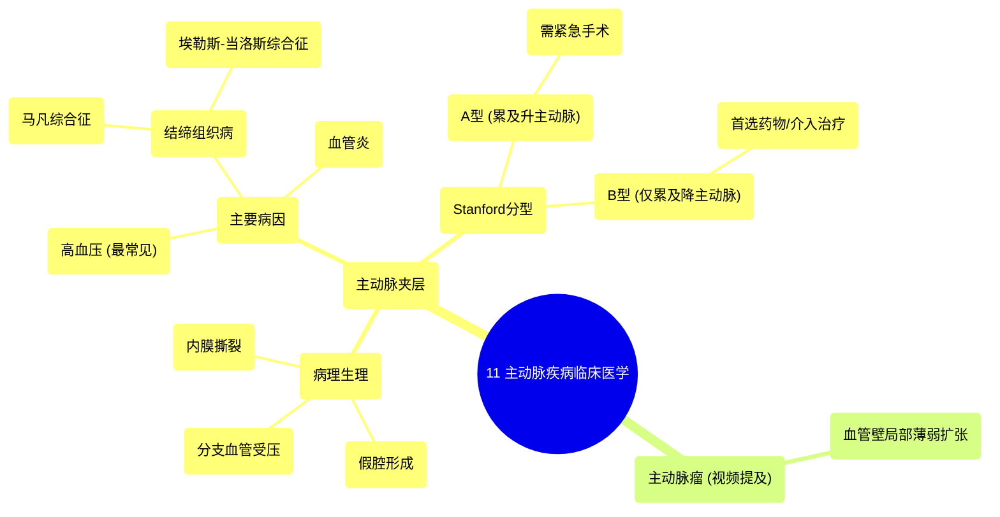

# 11 Aortic Diseases Clinical Medicine

  <video controls preload="metadata" playsinline>
    <source src="https://helly.s3.bitiful.net/心血管学科/%E4%B8%93%E8%BE%91%2014%EF%BC%9A%E5%BF%83%E8%A1%80%E7%AE%A1%E5%86%85%E7%A7%91%E7%BB%BC%E5%90%88%20%28Cardiovascular%20Medicine%29/11%20Aortic%20Diseases%20Clinical%20Medicine.mp4" type="video/mp4">
    
您的浏览器不支持播放，请升级。

  </video>

::: tip ⚡️ 核心考点 (30s速读)
*   **核心考点**：主动脉夹层是主动脉内膜撕裂，血液进入中膜形成“假腔”，可压迫分支血管导致缺血。主要病因是高血压和结缔组织病（如马凡综合征）。根据累及升主动脉与否，分为Stanford A型（累及升主动脉，更危险）和B型。
*   **临床意义**：主动脉夹层是心血管急症，典型表现为突发、剧烈的“撕裂样”胸背痛。需紧急控制血压、心率，并依据分型决定手术（A型）或药物/介入（B型）治疗。
:::

## 🧠 深度精讲
*   **主动脉夹层的病理生理**：主动脉壁由内向外分为内膜、中膜和外膜。主动脉夹层的始动因素是内膜出现撕裂口。在主动脉内高压（如高血压）或血管壁本身薄弱（如结缔组织病）的情况下，血液从真腔经内膜破口涌入，在中膜层内剥离、扩展，形成一个与真腔并行的“假腔”。这个假腔可能压迫真腔，或向远端延伸，堵塞从主动脉发出的重要分支动脉（如冠状动脉、头臂干、肾动脉等），导致相应器官（心脏、大脑、肾脏等）缺血，危及生命。
*   **主动脉夹层的病因**：主要分为两类。1. **血流动力学因素**：**高血压**是最常见的原因，长期高压冲击使内膜受损、撕裂。2. **血管壁结构异常**：包括**结缔组织遗传病**（如马凡综合征、埃勒斯-当洛斯综合征，导致中膜弹力纤维脆弱）和**获得性血管炎**（如大动脉炎、梅毒性主动脉炎，破坏血管壁结构）。动脉瘤导致的局部血管壁薄弱也是易感因素。
*   **主动脉夹层的分型（Stanford分型）**：这是最常用的临床分型，直接决定治疗策略。**Stanford A型**：夹层累及**升主动脉**，无论破口位置在何处。此型夹层易导致主动脉瓣关闭不全、心包填塞、冠状动脉受累，死亡率极高，**必须紧急外科手术**。**Stanford B型**：夹层仅累及**降主动脉**（左锁骨下动脉以远）。此型通常首选严格的药物保守治疗（控制血压、心率），必要时行腔内支架修复术。

## 📚 双语术语表 (Terminology)
| 英文术语 | 中文翻译 | 定义/解释 |
| :--- | :--- | :--- |
| Aortic Dissection | 主动脉夹层 | 主动脉内膜撕裂，血液流入中膜层，形成真假两腔的病理状态。 |
| Intimal Tear | 内膜撕裂 | 主动脉夹层的起始点，即内膜层的破口。 |
| False Lumen | 假腔 | 主动脉夹层时，血液在中膜内剥离形成的异常腔道。 |
| True Lumen | 真腔 | 主动脉原有的正常血流通道。 |
| Tunica Intima/Interna | 血管内膜 | 血管壁的最内层，由内皮细胞和结缔组织构成。 |
| Tunica Media | 血管中膜 | 血管壁的中间层，富含弹力纤维和平滑肌，赋予血管弹性和收缩性。 |
| Stanford Type A | Stanford A型 | 累及升主动脉的主动脉夹层，需急诊手术。 |
| Stanford Type B | Stanford B型 | 仅累及降主动脉的主动脉夹层，通常首选药物治疗。 |
| Hypertension | 高血压 | 体循环动脉压持续升高，是主动脉夹层最主要的危险因素。 |
| Marfan Syndrome | 马凡综合征 | 一种常染色体显性遗传的结缔组织病，特征为主动脉根部扩张，易发生夹层。 |

## 🗺️ 知识图谱

