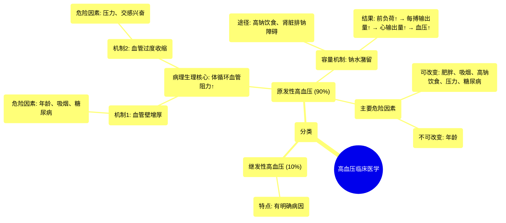

# 12 Hypertension Clinical Medicine

  <video controls preload="metadata" playsinline>
    <source src="https://helly.s3.bitiful.net/心血管学科/%E4%B8%93%E8%BE%91%2014%EF%BC%9A%E5%BF%83%E8%A1%80%E7%AE%A1%E5%86%85%E7%A7%91%E7%BB%BC%E5%90%88%20%28Cardiovascular%20Medicine%29/12%20Hypertension%20Clinical%20Medicine.mp4" type="video/mp4">
    
您的浏览器不支持播放，请升级。

  </video>

::: tip ⚡️ 核心考点 (30s速读)
*   **核心考点**：高血压分为“原发性”（占90%）和“继发性”（占10%）。原发性高血压的病理生理核心是**体循环血管阻力增加**，主要机制包括血管壁增厚和血管过度收缩。
*   **临床意义**：原发性高血压最常见，与年龄、吸烟、糖尿病、肥胖、高钠饮食及压力等可改变的危险因素密切相关。理解其机制是诊断和治疗的基础。
:::

## 🧠 深度精讲

*   **概念1：高血压的分类与流行病学**
    高血压主要分为两大类。**原发性高血压**（又称特发性高血压）约占所有病例的90%，其确切病因尚不完全清楚，但已知与多种危险因素相关。**继发性高血压**约占10%，由其他明确疾病（如肾脏疾病、内分泌疾病等）所引起，在临床诊断中需要重点排查。

*   **概念2：原发性高血压的病理生理机制**
    核心在于**体循环血管阻力** 的增加，这直接导致血压升高。具体可通过两个主要途径实现：
    1.  **血管结构性改变（血管壁增厚）**：随着年龄增长、吸烟、糖尿病等因素，血管壁发生硬化、钙化和增厚，导致血管内径变小，血流阻力增大。
    2.  **血管功能性改变（血管过度收缩）**：由于长期压力、交感神经过度兴奋或某些体液因子作用，血管平滑肌持续收缩，使管腔变窄，同样增加阻力。

*   **概念3：容量负荷与血压的关系**
    除了阻力增加，**容量负荷过重**也是升高血压的重要机制。例如，摄入**高钠饮食**或肾脏排钠功能受损时，会导致钠水潴留。这增加了回心血量（**前负荷**）和心脏每次搏出的血量（**每搏输出量**），进而提升**心输出量**。根据公式 **血压 = 心输出量 × 体循环血管阻力**，心输出量的增加直接推高血压。

*   **概念4：原发性高血压的主要危险因素**
    这些因素多与上述机制相关联，且部分是可干预的：
    *   **不可改变因素**：年龄增长。
    *   **可改变/行为因素**：吸烟、糖尿病、**肥胖**（最重要的可改变风险因素之一）、高钠（盐）饮食、长期精神压力（A型性格）。

## 📚 双语术语表 (Terminology)
| 英文术语 | 中文翻译 | 定义/解释 |
| :--- | :--- | :--- |
| Hypertension | 高血压 | 体循环动脉血压持续升高的病理状态。 |
| Essential / Primary Hypertension | 原发性 / 特发性高血压 | 病因未明的高血压，占绝大多数病例。 |
| Secondary Hypertension | 继发性高血压 | 由其他特定疾病引起的高血压。 |
| Systemic Vascular Resistance (SVR) | 体循环血管阻力 | 血液在体循环血管系统中流动所遇到的阻力，是决定血压的关键因素。 |
| Vasoconstriction | 血管收缩 | 血管管径变小的过程，会导致SVR增加。 |
| Preload | 前负荷 | 心脏舒张末期心室内的血容量，影响心肌的初长度。 |
| Stroke Volume | 每搏输出量 | 一次心搏中一侧心室射出的血液量。 |
| Cardiac Output | 心输出量 | 每分钟一侧心室射出的血液总量，等于每搏输出量×心率。 |
| Sodium Retention | 钠潴留 | 体内钠离子排出减少而蓄积，常伴随水潴留，增加血容量。 |

## 🗺️ 知识图谱

