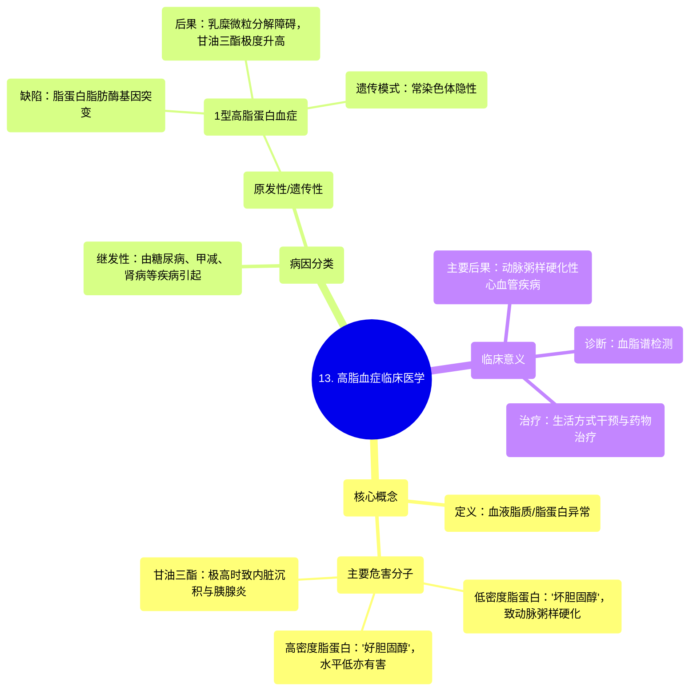

# 13 Hyperlipidemia Clinical Medicine

  <video controls preload="metadata" playsinline>
    <source src="https://helly.s3.bitiful.net/心血管学科/%E4%B8%93%E8%BE%91%2014%EF%BC%9A%E5%BF%83%E8%A1%80%E7%AE%A1%E5%86%85%E7%A7%91%E7%BB%BC%E5%90%88%20%28Cardiovascular%20Medicine%29/13%20Hyperlipidemia%20Clinical%20Medicine.mp4" type="video/mp4">
    
您的浏览器不支持播放，请升级。

  </video>

::: tip ⚡️ 核心考点 (30s速读)
*   **核心考点**：高脂血症的核心病理是血液中脂蛋白异常，主要关注**低密度脂蛋白（LDL）升高**和**高密度脂蛋白（HDL）降低**，两者均促进动脉粥样硬化。此外，**甘油三酯（TG）** 显著升高会导致内脏脂肪沉积。
*   **临床意义**：高脂血症是动脉粥样硬化性心血管疾病（如冠心病、脑卒中）的主要危险因素。早期识别与干预（生活方式及药物治疗）对预防心脑血管事件至关重要。
:::

## 🧠 深度精讲

*   **高脂血症的定义与核心问题**：高脂血症，或称血脂异常，是指血液中脂质（胆固醇、甘油三酯）或脂蛋白（如LDL、HDL）水平异常。其核心危害在于：
    *   **低密度脂蛋白（LDL）**：俗称“坏胆固醇”，水平过高时，其携带的胆固醇易沉积在血管壁，形成动脉粥样硬化斑块，是心血管事件的主要驱动因素。
    *   **高密度脂蛋白（HDL）**：俗称“好胆固醇”，能将外周组织（如血管壁）的胆固醇逆向转运至肝脏进行代谢，具有抗动脉粥样硬化作用。因此，**HDL水平过低**同样是血脂异常的重要表现。
    *   **甘油三酯（TG）**：极度升高（通常>1000 mg/dL）时，不仅增加胰腺炎风险，也会导致脂肪在肝脏、胰腺等内脏器官沉积，并可能通过其他机制间接促进动脉粥样硬化。

*   **高脂血症的病因之一：遗传因素**：部分高脂血症由基因突变导致，称为家族性或遗传性高脂血症。视频中以**1型高脂蛋白血症**为例：
    *   **关键缺陷**：**脂蛋白脂肪酶（LPL）** 基因突变导致功能缺陷或缺失。
    *   **病理生理**：LPL是分解乳糜微粒和极低密度脂蛋白（VLDL）中甘油三酯的关键酶。其缺陷导致富含甘油三酯的乳糜微粒无法被正常分解，从而在血液中大量积聚，引起**极度升高的甘油三酯血症**。
    *   **遗传模式**：该类型为**常染色体隐性遗传**。

## 📚 双语术语表 (Terminology)
| 英文术语 | 中文翻译 | 定义/解释 |
| :--- | :--- | :--- |
| Hyperlipidemia | 高脂血症 | 血液中脂质（胆固醇、甘油三酯）或脂蛋白水平异常升高。 |
| Dyslipidemia | 血脂异常 | 描述脂质代谢紊乱的更广泛术语，包括脂质水平升高、降低或组成异常。 |
| LDL (Low-Density Lipoprotein) | 低密度脂蛋白 | 运输胆固醇至外周组织的主要脂蛋白，水平过高是动脉粥样硬化的关键危险因素。 |
| HDL (High-Density Lipoprotein) | 高密度脂蛋白 | 将外周组织的胆固醇逆向转运至肝脏代谢的脂蛋白，具有心血管保护作用。 |
| Triglycerides (TG) | 甘油三酯 | 一种脂质，是体内能量的储存形式。极度升高可致胰腺炎和内脏脂肪沉积。 |
| Atherosclerosis | 动脉粥样硬化 | 动脉壁内脂质、胆固醇等沉积形成斑块，导致血管狭窄、硬化的疾病过程。 |
| Lipoprotein Lipase (LPL) | 脂蛋白脂肪酶 | 位于毛细血管内皮细胞表面的酶，负责水解乳糜微粒和VLDL核心的甘油三酯。 |
| Chylomicron | 乳糜微粒 | 在小肠合成，负责运输饮食来源的甘油三酯和胆固醇的脂蛋白颗粒。 |
| Autosomal Recessive | 常染色体隐性遗传 | 一种遗传模式，需要从父母双方各继承一个突变基因拷贝，个体才会患病。 |

## 🗺️ 知识图谱

