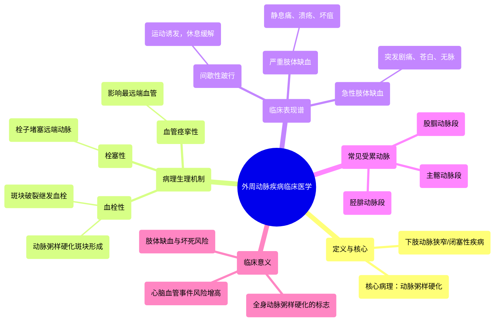

# 14 Peripheral Arterial Disease Clinical Medicine

  <video controls preload="metadata" playsinline>
    <source src="https://helly.s3.bitiful.net/心血管学科/%E4%B8%93%E8%BE%91%2014%EF%BC%9A%E5%BF%83%E8%A1%80%E7%AE%A1%E5%86%85%E7%A7%91%E7%BB%BC%E5%90%88%20%28Cardiovascular%20Medicine%29/14%20Peripheral%20Arterial%20Disease%20Clinical%20Medicine.mp4" type="video/mp4">
    
您的浏览器不支持播放，请升级。

  </video>

::: tip ⚡️ 核心考点 (30s速读)
*   **核心考点**：外周动脉疾病（PAD）是下肢动脉因动脉粥样硬化等原因导致管腔狭窄或闭塞，引起肢体缺血的一组疾病。其临床表现从间歇性跛行到急性肢体缺血不等。
*   **临床意义**：PAD是全身性动脉粥样硬化的标志，患者发生心肌梗死、脑卒中的风险显著增高。早期识别和管理至关重要。
:::

## 🧠 深度精讲

*   **概念1：外周动脉疾病（PAD）的定义与病理生理**
    外周动脉疾病主要指发生在下肢（偶尔为上肢）动脉的狭窄或闭塞性疾病。最常见的病因是**动脉粥样硬化**，导致血管壁形成斑块，使管腔狭窄，血流减少，远端组织供氧不足。在斑块基础上可能继发**血栓形成**，导致血管完全堵塞，引发急性严重缺血。

*   **概念2：PAD的临床表现谱**
    患者的症状取决于缺血的严重程度和速度：
    1.  **间歇性跛行**：运动时肢体（最常见为小腿）出现疼痛、痉挛或乏力，休息后可缓解。这是PAD的典型症状。
    2.  **严重肢体缺血**：静息状态下也出现疼痛，伴有肢体远端溃疡、坏疽或皮肤营养性改变（如毛发脱落、趾甲增厚）。
    3.  **急性肢体缺血**：突发剧痛、苍白、无脉、感觉异常和运动障碍，是血管急症，需紧急处理以防肢体坏死。

*   **概念3：常见的受累动脉节段**
    根据解剖位置，PAD好发于以下动脉节段：
    1.  **主髂动脉段**：腹主动脉下端及髂总动脉分叉处。
    2.  **股腘动脉段**：股动脉至腘动脉。
    3.  **胫腓动脉段**：小腿的胫前、胫后及腓动脉。血管痉挛性疾病（如雷诺现象）也常影响此最远端血管。

## 📚 双语术语表 (Terminology)
| 英文术语 | 中文翻译 | 定义/解释 |
| :--- | :--- | :--- |
| Peripheral Arterial Disease (PAD) | 外周动脉疾病 | 指除冠状动脉和颅内动脉以外的动脉发生的狭窄、闭塞性疾病，以下肢动脉最常见。 |
| Atherosclerosis | 动脉粥样硬化 | 动脉壁内脂质、纤维组织等沉积形成斑块，导致血管壁增厚、变硬、管腔狭窄的病理过程。 |
| Thrombus | 血栓 | 在活体心血管系统内，血液成分凝固形成的固体质块。此处指在动脉粥样硬化斑块表面形成的血凝块。 |
| Claudication | 间歇性跛行 | 肢体运动后因缺血产生的肌肉疼痛、痉挛或无力，休息后缓解的典型症状。 |
| Critical Limb Ischemia (CLI) | 严重肢体缺血 | 指肢体在静息状态下也出现缺血性疼痛，或伴有溃疡、坏疽的严重慢性缺血状态。 |
| Acute Limb Ischemia (ALI) | 急性肢体缺血 | 肢体血流突然中断导致的急性严重缺血，表现为“6P征”（疼痛、苍白、无脉、感觉异常、运动障碍、皮温低），属急症。 |
| Aortoiliac arteries | 主髂动脉 | 指腹主动脉远端及髂总动脉，是PAD的常见受累部位之一。 |
| Femoral popliteal arteries | 股腘动脉 | 指股动脉至腘动脉段，是PAD最常发生的部位。 |
| Tibiofibular arteries | 胫腓动脉 | 指小腿的胫前、胫后及腓动脉，常受累于严重PAD或血管痉挛性疾病。 |

## 🗺️ 知识图谱

