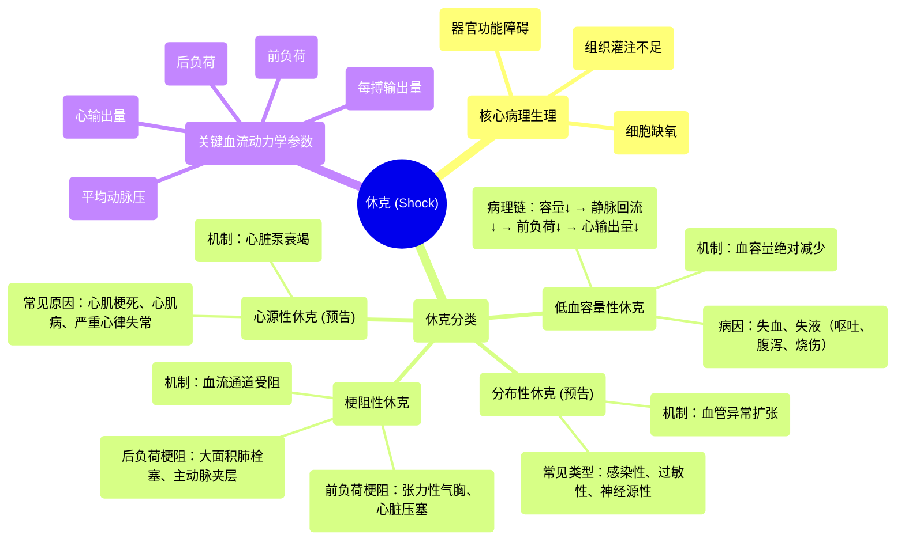

# 15 Shock Clinical Medicine

  <video controls preload="metadata" playsinline>
    <source src="https://helly.s3.bitiful.net/心血管学科/%E4%B8%93%E8%BE%91%2014%EF%BC%9A%E5%BF%83%E8%A1%80%E7%AE%A1%E5%86%85%E7%A7%91%E7%BB%BC%E5%90%88%20%28Cardiovascular%20Medicine%29/15%20Shock%20Clinical%20Medicine.mp4" type="video/mp4">
    
您的浏览器不支持播放，请升级。

  </video>

::: tip ⚡️ 核心考点 (30s速读)
*   **核心考点**：休克的核心是组织灌注不足导致的细胞缺氧和器官功能障碍。其根本机制是心输出量下降和/或外周血管阻力异常。
*   **临床意义**：快速识别休克类型（低血容量性、心源性、分布性、梗阻性）是启动正确抢救治疗（如补液、强心、升压、解除梗阻）的关键，直接决定患者预后。
:::

## 🧠 深度精讲
*   **休克的定义与核心病理生理**：休克并非单一疾病，而是一种危及生命的临床综合征。其本质是全身有效循环血容量锐减，导致组织灌注严重不足，无法满足细胞代谢的氧和营养需求。若不及时纠正，将引发多器官功能障碍综合征（MODS）甚至死亡。所有休克的最终共同通路都是细胞水平的缺氧。
*   **低血容量性休克**：这是最直观的休克类型，核心是**血管内容量绝对减少**。原因包括：
    *   **显性丢失**：如消化道出血、外伤大出血、严重呕吐腹泻。
    *   **非显性丢失**：如大面积烧伤渗出、过度利尿、高热大汗。
    *   **病理生理链条**：血容量减少 → 静脉回心血量减少 → 心脏前负荷降低 → 每搏输出量下降 → 心输出量下降 → 平均动脉压下降 → 组织灌注不足。
*   **梗阻性休克**：核心是**心脏血流通道受阻**，导致心脏“泵不出”或“装不满”。它并非血容量本身减少，而是血流受阻。主要分为两类：
    *   **前负荷梗阻**：阻碍血液回流到心脏。例如：张力性气胸、心脏压塞、巨大肺栓塞。这些情况导致静脉回流严重受阻，心脏无法有效充盈。
    *   **后负荷梗阻**：阻碍心脏向外泵血。例如：大面积肺栓塞（增加右心室后负荷）、主动脉夹层。这些情况导致心脏需要克服异常增高的阻力才能射血，最终导致泵血失败。
*   **分布性休克与心源性休克（预告）**：视频中提到后续会有单独讲座深入讲解。
    *   **分布性休克**：核心是**外周血管异常扩张**，导致血液分布异常。虽然总血容量可能正常，但有效循环血容量相对不足。最常见的类型是感染性休克（脓毒症休克），其他还包括过敏性休克、神经源性休克等。
    *   **心源性休克**：核心是**心脏泵功能衰竭**。心脏本身（如心肌梗死、心肌炎、严重心律失常）无法有效泵出血液，导致心输出量急剧下降。

## 📚 双语术语表 (Terminology)
| 英文术语 | 中文翻译 | 定义/解释 |
| :--- | :--- | :--- |
| Shock | 休克 | 因有效循环血容量减少和组织灌注不足导致的危及生命的临床综合征。 |
| Hypovolemic Shock | 低血容量性休克 | 由于血液、血浆或体液大量丢失，导致血管内容量绝对减少引起的休克。 |
| Obstructive Shock | 梗阻性休克 | 由于心脏或大血管血流通道受阻，导致心输出量严重下降引起的休克。 |
| Distributive Shock | 分布性休克 | 由于外周血管张力丧失，异常扩张，导致血液分布异常和有效循环血容量相对不足引起的休克。 |
| Cardiogenic Shock | 心源性休克 | 由于心脏泵功能严重衰竭，心输出量急剧下降引起的休克。 |
| Preload | 前负荷 | 心脏在舒张末期（收缩前）心室内的血容量或压力，通常反映静脉回心血量。 |
| Afterload | 后负荷 | 心室收缩射血时需要克服的阻力，主要取决于外周血管阻力。 |
| Stroke Volume (SV) | 每搏输出量 | 一次心搏中一侧心室射出的血液量。 |
| Cardiac Output (CO) | 心输出量 | 每分钟一侧心室射出的血液总量，CO = SV × 心率。 |
| Mean Arterial Pressure (MAP) | 平均动脉压 | 一个心动周期中动脉血压的平均值，是反映组织灌注压的关键指标。 |
| Venous Return | 静脉回心血量 | 单位时间内由静脉返回心脏的血量。 |
| Organ Malperfusion | 器官灌注不良 | 流向器官的血液不足以满足其代谢需求的状态，是休克导致器官损伤的直接原因。 |

## 🗺️ 知识图谱

