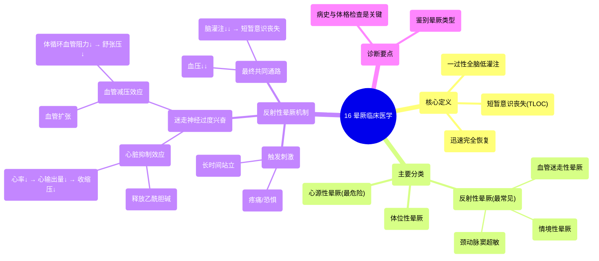

# 16 Syncope Clinical Medicine

  <video controls preload="metadata" playsinline>
    <source src="https://helly.s3.bitiful.net/心血管学科/%E4%B8%93%E8%BE%91%2014%EF%BC%9A%E5%BF%83%E8%A1%80%E7%AE%A1%E5%86%85%E7%A7%91%E7%BB%BC%E5%90%88%20%28Cardiovascular%20Medicine%29/16%20Syncope%20Clinical%20Medicine.mp4" type="video/mp4">
    
您的浏览器不支持播放，请升级。

  </video>

::: tip ⚡️ 核心考点 (30s速读)
*   **核心考点**：晕厥的核心是**一过性全脑低灌注**导致的**短暂意识丧失**，并能**迅速恢复**。诊断的关键在于通过病史和体格检查，区分其三大类型：反射性、体位性和心源性晕厥。
*   **临床意义**：反射性晕厥（如血管迷走性晕厥）是最常见的类型，其机制涉及**迷走神经兴奋**导致的**心脏抑制**（心率↓、心输出量↓）和**血管减压**（血管扩张、血压↓），共同引起脑灌注不足。
:::

## 🧠 深度精讲

*   **概念1：晕厥的定义与核心机制**
    晕厥是指患者因**一过性全脑低灌注**而出现**短暂意识丧失**，并能**迅速恢复到正常基线状态**的临床综合征。其本质是全身性的、短暂的血压下降，导致大脑供血不足。

*   **概念2：晕厥的三大分类**
    1.  **反射性晕厥**：由特定刺激触发的神经反射介导的晕厥，是**最常见**的类型。它是一个总称，包含血管迷走性、情境性和颈动脉窦超敏综合征。
    2.  **体位性晕厥**：由体位改变（如从卧/坐位站起）时，血压调节异常导致的晕厥。
    3.  **心源性晕厥**：由心脏本身疾病（如心律失常、结构性心脏病）导致心输出量骤降引起的晕厥，**危险性最高**。

*   **概念3：反射性晕厥的详细机制（以血管迷走性为例）**
    这是视频讲解的重点。其发生涉及一个异常的神经反射环路：
    1.  **触发刺激**：如疼痛、恐惧、长时间站立等。
    2.  **迷走神经兴奋**：刺激导致**迷走神经背核**过度兴奋，通过**第十对脑神经（迷走神经）** 传出强烈信号。
    3.  **双重效应**：
        *   **心脏抑制效应**：迷走神经末梢释放**乙酰胆碱**，作用于心脏传导系统的毒蕈碱受体，**减慢心率**，从而降低**心输出量**和**收缩压**。
        *   **血管减压效应**：迷走兴奋可能抑制交感或增强副交感活动，导致全身血管**扩张**，**体循环血管阻力下降**，进而降低**舒张压**和整体**血压**。
    4.  **最终结果**：心率和血压的**双重下降**导致**全脑灌注急剧减少**，引发**短暂意识丧失**。刺激移除或身体平卧后，血流恢复，意识迅速清醒。

## 📚 双语术语表 (Terminology)
| 英文术语 | 中文翻译 | 定义/解释 |
| :--- | :--- | :--- |
| Syncope | 晕厥 | 因一过性全脑低灌注导致的短暂意识丧失，并能迅速完全恢复。 |
| Transient global hypoperfusion | 一过性全脑低灌注 | 短暂的全大脑血流灌注不足，是晕厥发生的根本原因。 |
| Reflex syncope | 反射性晕厥 | 由特定刺激触发神经反射环路，导致心率减慢和/或血管扩张而引起的晕厥。 |
| Vasovagal syncope | 血管迷走性晕厥 | 最常见的一种反射性晕厥，由情绪或生理应激触发迷走神经强烈反应所致。 |
| Cardioinhibitory effect | 心脏抑制效应 | 迷走神经兴奋导致心率减慢、心输出量下降的效应。 |
| Vasodepressor effect | 血管减压效应 | 迷走神经兴奋导致血管扩张、外周阻力下降、血压降低的效应。 |
| Vagus nerve (Cranial Nerve X) | 迷走神经（第十对脑神经） | 负责调节心率、血管张力和内脏功能的副交感神经主干。 |
| Acetylcholine | 乙酰胆碱 | 迷走神经末梢释放的神经递质，作用于心脏和血管的毒蕈碱受体。 |
| Orthostatic syncope | 体位性晕厥 | 由体位改变引起的晕厥，通常与自主神经功能失调或血容量不足有关。 |
| Cardiogenic syncope | 心源性晕厥 | 因心脏疾病（如心律失常、瓣膜病）导致心输出量突然减少而引起的晕厥。 |

## 🗺️ 知识图谱

