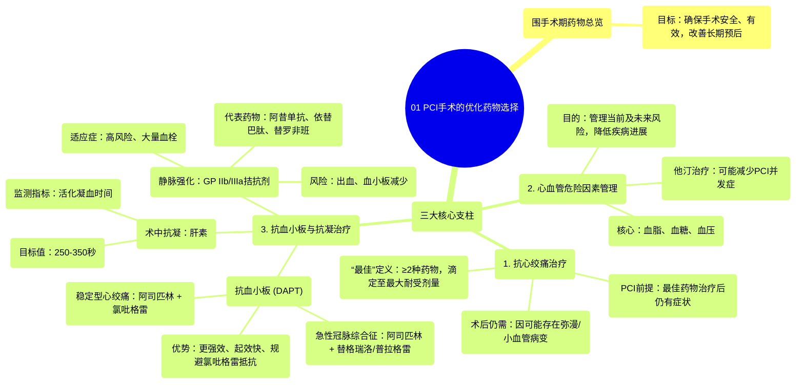

# 01 Optimal Medication Selection for PCI Procedures

  <video controls preload="metadata" playsinline>
    <source src="https://helly.s3.bitiful.net/心血管学科/%E4%B8%93%E8%BE%91%2015%EF%BC%9A%E7%BB%8F%E7%9A%AE%E5%86%A0%E8%84%89%E4%BB%8B%E5%85%A5%E6%89%8B%E6%9C%AF%20%28PCI%20Insights%29/01%20Optimal%20Medication%20Selection%20for%20PCI%20Procedures.mp4" type="video/mp4">
    
您的浏览器不支持播放，请升级。

  </video>

::: tip ⚡️ 核心考点 (30s速读)
*   **核心考点**：掌握PCI围手术期药物选择的三大支柱：抗心绞痛治疗、心血管危险因素管理、抗血小板/抗凝治疗。
*   **临床意义**：正确的术前用药是确保PCI手术安全、有效、改善患者长期预后的基石，并能减少并发症和未来再血管化需求。
:::

## 🧠 深度精讲
*   **抗心绞痛治疗**：这是考虑对稳定型心绞痛患者进行PCI的先决条件。指南要求患者在接受“最佳药物治疗”后仍有症状。所谓“最佳”通常指使用至少两种不同类别的抗心绞痛药物，并滴定至患者可耐受且无副作用的最大剂量。即使成功植入支架，患者仍可能因存在弥漫性、远端或小血管病变而需要继续药物治疗。
*   **心血管危险因素管理**：无论是否进行PCI，都必须全面评估和管理患者的血脂、血糖和血压。这不仅关乎当前症状，更是为了降低未来心血管事件和冠状动脉疾病进展的风险。术前使用高强度他汀治疗可能有助于降低PCI相关并发症。
*   **抗血小板与抗凝治疗**：
    *   **抗血小板**：所有PCI患者均需双重抗血小板治疗。
        *   **稳定型心绞痛**：通常为阿司匹林 + 氯吡格雷。
        *   **急性冠脉综合征**：推荐阿司匹林 + 更强效的P2Y12抑制剂（如替格瑞洛或普拉格雷），因其起效更快、效力更强，且可规避部分患者对氯吡格雷的遗传性抵抗。
    *   **抗凝**：术中必须使用肝素以防止器械操作引起的血栓。剂量需个体化，并通过监测活化凝血时间来调整，目标值通常为250-350秒。
    *   **静脉抗血小板药物**：糖蛋白IIb/IIIa受体拮抗剂（如阿昔单抗、依替巴肽、替罗非班）是强效药物，现仅用于高风险、有大量可见血栓的患者。使用时需密切监测血小板计数，以防血小板减少和出血风险。

## 📚 双语术语表 (Terminology)
| 英文术语 | 中文翻译 | 定义/解释 |
| :--- | :--- | :--- |
| PCI (Percutaneous Coronary Intervention) | 经皮冠状动脉介入治疗 | 一种通过皮肤穿刺血管，用导管等器械疏通狭窄或阻塞冠状动脉的微创手术。 |
| Periprocedural Medication | 围手术期药物 | 围绕手术（此处指PCI）前后所使用的药物，旨在优化手术效果和患者安全。 |
| Anti-anginal Therapy | 抗心绞痛治疗 | 用于缓解或预防心绞痛发作的药物治疗。 |
| Dual Antiplatelet Therapy (DAPT) | 双重抗血小板治疗 | 联合使用两种不同机制的抗血小板药物（通常是阿司匹林加一种P2Y12抑制剂），以更强效地抑制血小板聚集。 |
| Clopidogrel | 氯吡格雷 | 一种P2Y12受体拮抗剂，常用于PCI后的抗血小板治疗。 |
| Ticagrelor / Prasugrel | 替格瑞洛 / 普拉格雷 | 较新一代的强效P2Y12受体拮抗剂，起效更快，抗血小板作用更强，尤其适用于急性冠脉综合征。 |
| Heparin | 肝素 | 一种静脉注射的抗凝剂，在PCI术中用于预防血栓形成。 |
| Activated Clotting Time (ACT) | 活化凝血时间 | 用于监测肝素抗凝效果的血液检验指标，指导术中肝素剂量的调整。 |
| Glycoprotein IIb/IIIa Receptor Antagonists (GPIs) | 糖蛋白IIb/IIIa受体拮抗剂 | 一类强效的静脉抗血小板药物，通过阻断血小板聚集的最后共同通路发挥作用。 |
| Thrombocytopenia | 血小板减少症 | 血液中血小板计数异常降低，是使用GPIs等药物时需要警惕的严重副作用。 |

## 🗺️ 知识图谱

