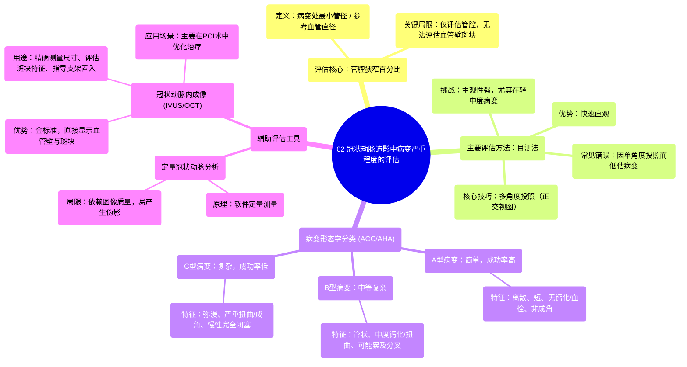

# 02 Assessing Lesion Severity in Coronary Angiography

  <video controls preload="metadata" playsinline>
    <source src="https://helly.s3.bitiful.net/心血管学科/%E4%B8%93%E8%BE%91%2015%EF%BC%9A%E7%BB%8F%E7%9A%AE%E5%86%A0%E8%84%89%E4%BB%8B%E5%85%A5%E6%89%8B%E6%9C%AF%20%28PCI%20Insights%29/02%20Assessing%20Lesion%20Severity%20in%20Coronary%20Angiography.mp4" type="video/mp4">
    
您的浏览器不支持播放，请升级。

  </video>

::: tip ⚡️ 核心考点 (30s速读)
*   **核心考点**：冠状动脉造影评估病变严重程度主要依赖对管腔狭窄的目测，具有主观性，尤其在轻中度病变时。准确评估需多角度投照，并理解其局限性（仅评估管腔，无法评估血管壁斑块）。
*   **临床意义**：准确评估病变严重程度是决定是否引起症状、是否需要血运重建治疗（如PCI）的基础。错误的评估可能导致治疗不足或过度治疗。
:::

## 🧠 深度精讲

*   **概念1：冠状动脉造影评估的本质与局限性**
    冠状动脉造影本质上是一个“管腔造影术”。它只能显示被造影剂填充的血管管腔，而无法直接看到血管壁内的斑块。因此，我们是通过观察斑块对管腔的“侵犯”或“挤压”程度来间接估算病变的严重程度。这带来了一个根本性局限：**相同的管腔狭窄程度，可能对应完全不同的血管壁斑块负荷**（如图中所示，管腔相同，但斑块负荷分别为50%和20%）。这与心脏CT等能直接评估血管壁斑块的成像技术形成鲜明对比。

*   **概念2：狭窄百分比的评估方法**
    在造影上，我们通常用“狭窄百分比”来量化病变。关键点是：**狭窄百分比是病变处最小管腔直径与“参考血管直径”（即病变近端和远端看似正常的血管段直径）的比值**，而不是与相邻病变节段血管直径的比值。如果整条血管弥漫性病变，没有正常的参考段，评估将变得非常困难。

*   **概念3：评估中的主要挑战与实用技巧**
    1.  **主观性与投照角度**：目测评估（“ eyeball”）在严重病变时较准，但在轻中度病变时主观性很强。病变在横截面上常不均匀，而造影只能提供二维投影。**一个核心原则是：病变的严重程度总是由显示狭窄最重的那个投照角度来决定**。因此，必须采集多个（尤其是正交的）投照角度来全面评估，否则极易低估病变。
    2.  **病变长度评估**：血管的扭曲和投照角度造成的血管节段“缩短效应”，会使病变长度的评估变得困难。实践中，可以使用已知长度的物体（如导丝的不透射线标记段、未充气的球囊）作为标尺进行比对。
    3.  **钙化与血栓**：这些斑块特征在普通造影上可能显示不佳，但会显著影响治疗策略（如是否需要旋磨、血栓抽吸）。需要仔细观察影像的“毛玻璃样”改变、充盈缺损等提示性征象。

*   **概念4：病变分类（ACC/AHA分型）的临床意义**
    根据病变的形态学特征进行分类（A型、B型、C型），有助于预测经皮冠状动脉介入治疗的成功率和并发症风险。
    *   **A型病变**：离散（<10mm）、平滑、无成角、无钙化/血栓、无主要分支受累、易于到达。成功率>85%，风险低。
    *   **B型病变**：管状（10-20mm）、中度成角/扭曲、开口或分叉病变、中度钙化/血栓。成功率60-85%，风险中等。
    *   **C型病变**：弥漫（>20mm）、严重成角/扭曲、慢性完全闭塞、退化的大隐静脉桥血管。成功率<60%，风险高。
    **注意**：此分类仅为参考，不能保证绝对安全，复杂情况可能出现在任何类型的病变中。

*   **概念5：辅助评估工具**
    1.  **定量冠状动脉分析**：软件辅助的定量测量，使用指引导管等已知尺寸进行校准，计算狭窄百分比。其准确性依赖于图像质量、校准精确性，且易受血管重叠、弯曲等因素干扰产生伪影，临床应用并不普遍。
    2.  **冠状动脉内成像**：如血管内超声或光学相干断层扫描。这是评估病变的“金标准”工具，优势在于：
        *   直接测量**血管的真实尺寸**（而不仅是管腔），为选择器械型号提供准确依据。
        *   精确评估**病变长度、斑块负荷、分布及特征**（如钙化深度、范围）。
        *   确定**支架着陆区**，避免将支架置入厚重的斑块中。
        *   评估支架置入后的效果（贴壁、扩张是否良好）。
        因其需要将器械送入血管内，通常不单独用于诊断性造影，而是在计划或进行PCI时使用，以优化治疗结果。

## 📚 双语术语表 (Terminology)
| 英文术语 | 中文翻译 | 定义/解释 |
| :--- | :--- | :--- |
| Lesion Severity | 病变严重程度 | 指冠状动脉斑块造成管腔狭窄的程度，是决定临床干预的关键指标。 |
| Angiography | 血管造影术 | 通过注入造影剂使血管在X线下显影的成像技术。 |
| Lumen | 管腔 | 血管中血液流经的中空部分。 |
| Stenosis | 狭窄 | 血管管腔因斑块等病变而变窄。 |
| Plaque Burden | 斑块负荷 | 血管壁内动脉粥样硬化斑块的总体积或比例。 |
| Reference Vessel Diameter | 参考血管直径 | 在造影中，用于计算狭窄百分比的、病变近端和远端看似正常的血管段直径。 |
| Orthogonal Views | 正交投照角度 | 从相互垂直的两个或多个角度进行X线投照，以获得病变的三维空间信息，避免低估。 |
| Foreshortening | 缩短效应 | 由于投照角度原因，使得血管的某一段在影像上看起来比实际长度短。 |
| ACC/AHA Lesion Classification | ACC/AHA病变分型 | 美国心脏病学会/美国心脏协会提出的基于病变形态特征的分类系统，用于预测PCI难度和风险。 |
| Type A/B/C Lesion | A型/B型/C型病变 | ACC/AHA分型中的具体类别，分别代表简单、中等复杂、高度复杂的病变。 |
| Quantitative Coronary Analysis (QCA) | 定量冠状动脉分析 | 利用计算机软件对冠状动脉造影图像进行定量测量，计算狭窄百分比等参数。 |
| Intracoronary Imaging | 冠状动脉内成像 | 将超声或光学探头送入冠状动脉内进行高分辨率成像的技术，如IVUS（血管内超声）和OCT（光学相干断层扫描）。 |
| Landing Zone | 支架着陆区 | 计划放置支架的血管段，理想情况下应为相对健康的血管段，以确保支架稳定和有效。 |

## 🗺️ 知识图谱

