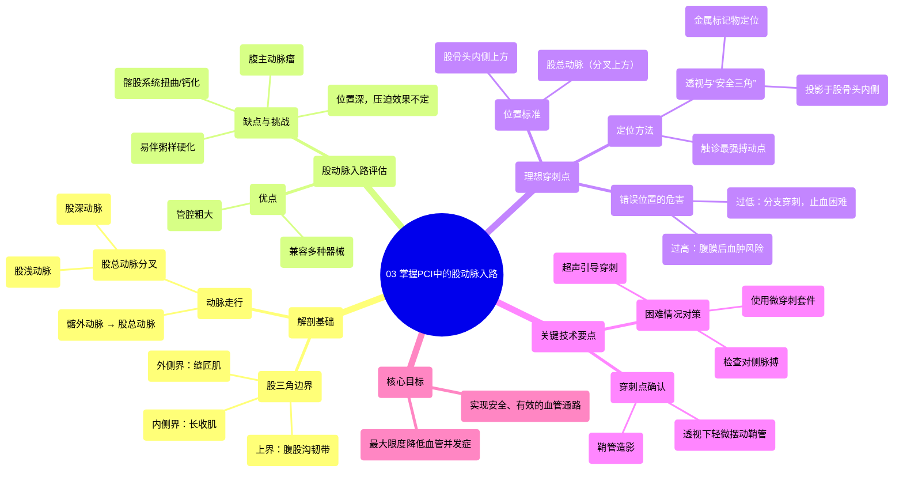

# 03 Mastering Femoral Artery Access in PCI

  <video controls preload="metadata" playsinline>
    <source src="https://helly.s3.bitiful.net/心血管学科/%E4%B8%93%E8%BE%91%2015%EF%BC%9A%E7%BB%8F%E7%9A%AE%E5%86%A0%E8%84%89%E4%BB%8B%E5%85%A5%E6%89%8B%E6%9C%AF%20%28PCI%20Insights%29/03%20Mastering%20Femoral%20Artery%20Access%20in%20PCI.mp4" type="video/mp4">
    
您的浏览器不支持播放，请升级。

  </video>

::: tip ⚡️ 核心考点 (30s速读)
*   **核心考点**：掌握股总动脉穿刺的理想位置（股骨头内侧上方、分叉近端）及其解剖学依据（可压迫性、避开腹膜后间隙）。
*   **临床意义**：精准的股动脉穿刺是经皮冠状动脉介入治疗（PCI）及其他心血管介入操作安全、成功的基础，能有效降低血管并发症（如出血、血肿、腹膜后血肿）风险。
:::

## 🧠 深度精讲

*   **股三角解剖回顾**：股三角是股动脉穿刺的关键区域。其上界为腹股沟韧带，外侧界为缝匠肌，内侧界为长收肌。髂外动脉在腹股沟韧带下方穿过后延续为股总动脉，进入股三角后分为股浅动脉和股深动脉。
*   **股动脉入路的优缺点**：
    *   **优点**：血管管径通常较大，能容纳PCI所需的各种器械及辅助装置（如主动脉内球囊反搏、Impella心室辅助装置）。
    *   **缺点**：在心血管高危患者中常伴有动脉粥样硬化；位置可能较深，压迫止血效果受患者体型和穿刺点影响；存在髂股动脉系统扭曲、钙化或腹主动脉瘤等挑战。
*   **理想穿刺点的定位**：
    *   **目标**：穿刺股总动脉（而非其分支），位置在分叉上方、股骨头内侧头的上方。
    *   **原因**：此处动脉后方有坚硬的股骨头作为支撑，便于术后手动压迫或使用血管闭合装置止血。若穿刺点过高（超过腹股沟韧带），动脉后方无骨性结构，出血易进入腹膜后间隙，风险极高。
    *   **定位方法**：
        1.  **触诊**：最强搏动点通常对应股总动脉可压迫至股骨头的位置，是最安全的穿刺参考点。
        2.  **透视引导**：不可依赖腹股沟皮肤皱褶判断韧带位置。应采用“安全三角”概念：在拟穿刺皮肤处放置金属标记物（如剪刀尖），进行透视，确保标记点投影在股骨头内侧上方。这是确定理想穿刺点的金标准方法。
*   **困难情况下的对策**：
    *   **搏动弱或无法触及**：检查对侧股动脉；强烈建议使用**超声引导**进行直接、可视化穿刺。
    *   **穿刺困难顾虑**：考虑使用**微穿刺套件**，其穿刺针更细，造成的血管损伤和出血风险更小。
*   **穿刺点确认**：置入鞘管后，可通过鞘管行股动脉造影，或在透视下轻轻摆动鞘管，观察其弯曲点（即血管入口），确认其位于股骨头水平及分叉上方。

## 📚 双语术语表 (Terminology)
| 英文术语 | 中文翻译 | 定义/解释 |
| :--- | :--- | :--- |
| Femoral Artery Access | 股动脉入路 | 通过穿刺股动脉建立血管通路，用于介入诊断或治疗。 |
| Femoral Triangle | 股三角 | 腹股沟区的一个三角形区域，内有股动脉、股静脉和股神经通过，是股动脉穿刺的解剖标志区。 |
| Common Femoral Artery (CFA) | 股总动脉 | 髂外动脉在腹股沟韧带下的延续，是股动脉穿刺的理想靶血管。 |
| Superficial Femoral Artery (SFA) | 股浅动脉 | 股总动脉的一个主要分支。 |
| Deep Femoral Artery (Profunda) | 股深动脉 | 股总动脉的另一个主要分支，供应大腿深层肌肉。 |
| Inguinal Ligament | 腹股沟韧带 | 连接髂前上棘和耻骨结节的韧带，构成股三角的上界和腹股沟管的下壁。 |
| Triangle of Safety | 安全三角 | 在透视影像上，指股骨头内侧头上方的区域，在此区域穿刺股总动脉最为安全。 |
| Retroperitoneal Space | 腹膜后间隙 | 位于腹膜后方、腹壁肌肉前方的潜在腔隙。腹股沟韧带以上血管出血易流入此间隙，形成腹膜后血肿。 |
| Ultrasound-guided Puncture | 超声引导穿刺 | 使用超声实时成像来引导穿刺针准确进入目标血管的技术，能提高成功率并减少并发症。 |
| Micropuncture Set | 微穿刺套件 | 一种使用更细穿刺针（如21G）和导丝建立初始通路的器械套装，损伤更小。 |
| Femoral Angiogram | 股动脉造影 | 通过向股动脉内注入造影剂并在X线下显影，以评估血管形态和穿刺点位置。 |

## 🗺️ 知识图谱

