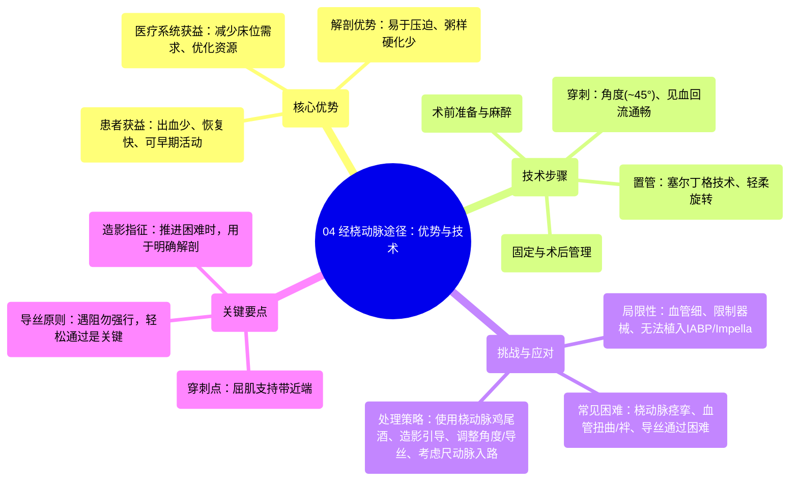

# 04 Radial Artery Access Benefits and Techniques

  <video controls preload="metadata" playsinline>
    <source src="https://helly.s3.bitiful.net/心血管学科/%E4%B8%93%E8%BE%91%2015%EF%BC%9A%E7%BB%8F%E7%9A%AE%E5%86%A0%E8%84%89%E4%BB%8B%E5%85%A5%E6%89%8B%E6%9C%AF%20%28PCI%20Insights%29/04%20Radial%20Artery%20Access%20Benefits%20and%20Techniques.mp4" type="video/mp4">
    
您的浏览器不支持播放，请升级。

  </video>

::: tip ⚡️ 核心考点 (30s速读)
*   **核心考点**：掌握经桡动脉途径（Radial Artery Access）的优势、技术要点、潜在挑战及应对策略。
*   **临床意义**：经桡动脉途径是当前心血管介入的主流入路，能显著减少出血并发症、加速患者术后康复、优化医疗资源利用。熟练掌握其穿刺技巧和并发症处理，对提高介入手术成功率和患者安全性至关重要。
:::

## 🧠 深度精讲

*   **概念1：经桡动脉途径的优势**
    经桡动脉途径相较于传统的经股动脉途径，具有多方面的临床优势。首先，它显著降低了穿刺部位的出血和血管并发症风险，因为桡动脉位置表浅、易于压迫，且远离重要的神经和血管。其次，患者术后无需严格卧床，可以早期下床活动（即“easier mobilisation and ambulation”），这不仅提升了患者的舒适度，也减少了因卧床引起的并发症（如深静脉血栓、肺部感染），并降低了对住院床位的需求（得益于“radial lounges”即桡动脉术后休息室的存在）。此外，桡动脉相对不易受动脉粥样硬化病变影响，穿刺成功率较高。这些优势共同促使其在全球范围内日益普及。

*   **概念2：经桡动脉途径的局限性与挑战**
    尽管优势明显，但经桡动脉途径也存在固有的局限性和操作挑战。主要局限在于桡动脉血管直径较小，尤其在体型较小或女性患者中，这可能限制可使用器械（如大口径指引导管）的尺寸，并且主动脉内球囊反搏（IABP）和Impella等心室辅助装置无法经此路径植入。操作挑战主要包括：**桡动脉痉挛**，即使经验丰富的术者也可能遇到；**血管解剖变异**，如桡动脉侧支、血管袢、扭曲（尤其在锁骨下动脉和头臂干），以及罕见的解剖异常（如迷走右锁骨下动脉）；这些都可能使导管难以顺利进入升主动脉，导致手术失败或并发症。

*   **概念3：经桡动脉穿刺与置管技术要点**
    成功的穿刺是手术的基础。关键步骤包括：1. **麻醉**：在桡骨茎突近端、屈肌支持带（flexor retinaculum）上方进行皮下局部麻醉，剂量需足够镇痛但避免过多导致血管触摸不清或诱发痉挛。2. **穿刺**：建议用手术刀做一小皮肤切口以利操作。穿刺针以大约45度角进针，见到顺畅的动脉血回流后，轻柔送入导丝。3. **置鞘**：采用标准的塞尔丁格技术（Seldinger technique），沿导丝通过旋转动作送入鞘管。4. **固定与造影**：置鞘后妥善固定，通常不常规进行桡动脉造影（因造影剂刺激性强），但若导管推进困难，则需造影以明确是否存在血管袢或进入分支，并指导安全操作。

*   **概念4：困难情况处理与替代方案**
    当遇到困难时，系统性的处理策略至关重要。**导丝通过困难**时，切勿暴力推送。应首先回撤穿刺针少许，尝试调整导丝方向；若失败，可轻微改变针头斜面角度再试；或考虑导丝可能进入了小分支或抵住了血管后壁。**血管严重扭曲或存在袢**时，可在造影引导下，使用冠状动脉成形术导丝小心操控通过扭曲段，并利用导丝的支撑力将血管袢轻柔拉直。如果经桡动脉途径确实无法完成（如严重痉挛、解剖问题），可考虑**经尺动脉途径**作为替代。尺动脉通常更直，但位置更深、更靠近正中神经，因此不作为常规首选。

## 📚 双语术语表 (Terminology)
| 英文术语 | 中文翻译 | 定义/解释 |
| :--- | :--- | :--- |
| Radial Artery Access | 经桡动脉途径 | 通过桡动脉进行血管介入手术的入路方式。 |
| Femoral Artery Access | 经股动脉途径 | 通过股动脉进行血管介入手术的传统入路方式。 |
| Radial Cocktail | 桡动脉鸡尾酒疗法 | 为预防桡动脉痉挛而局部使用的药物混合物，通常包含血管扩张剂和抗痉挛药。 |
| Seldinger Technique | 塞尔丁格技术 | 一种经皮穿刺置管的标准技术，利用穿刺针、导丝和导管/鞘管顺序完成。 |
| Radial Spasm | 桡动脉痉挛 | 桡动脉因刺激（如穿刺、导管操作）而发生的剧烈收缩，导致管腔狭窄或闭塞。 |
| Arteria Lusoria | 迷走右锁骨下动脉 | 一种先天性血管变异，右锁骨下动脉起源于主动脉弓左侧，走行异常。 |
| Ulnar Artery Access | 经尺动脉途径 | 通过尺动脉进行血管介入手术的替代入路方式。 |
| Flexor Retinaculum | 屈肌支持带 | 腕部掌侧的一条坚韧的纤维带，覆盖腕管，是桡动脉穿刺的重要解剖标志。 |
| Hemostatic Valve | 止血阀 | 位于鞘管或导管尾端的阀门，允许器械通过的同时防止血液漏出。 |
| Intra-aortic Balloon Pump (IABP) | 主动脉内球囊反搏 | 一种通过股动脉植入的机械性心脏辅助装置。 |

## 🗺️ 知识图谱

