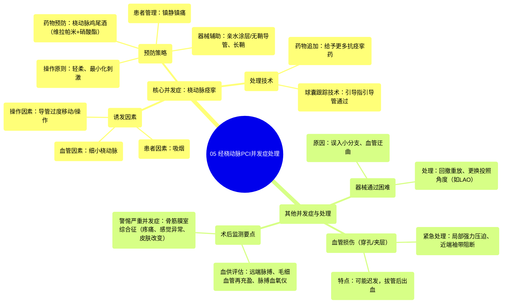

# 05 Addressing Complications in Radial Access PCI

  <video controls preload="metadata" playsinline>
    <source src="https://helly.s3.bitiful.net/心血管学科/%E4%B8%93%E8%BE%91%2015%EF%BC%9A%E7%BB%8F%E7%9A%AE%E5%86%A0%E8%84%89%E4%BB%8B%E5%85%A5%E6%89%8B%E6%9C%AF%20%28PCI%20Insights%29/05%20Addressing%20Complications%20in%20Radial%20Access%20PCI.mp4" type="video/mp4">
    
您的浏览器不支持播放，请升级。

  </video>

::: tip ⚡️ 核心考点 (30s速读)
*   **核心考点**：桡动脉痉挛是经桡动脉介入（TRI）的常见并发症，其预防和处理是手术成功的关键。
*   **临床意义**：掌握痉挛的预防策略（如桡动脉鸡尾酒、轻柔操作）和应对技巧（如球囊跟踪技术），能有效减少手术失败、患者不适及血管损伤风险。
:::

## 🧠 深度精讲

*   **桡动脉痉挛的预防与处理**
    桡动脉痉挛是经桡动脉路径行冠状动脉造影或介入治疗（PCI）时最常见的并发症之一。它更易发生于血管较细的患者（如女性）和吸烟者。痉挛主要由导管在血管内的过度移动或操作（如反复推送、旋转）所诱发。因此，**核心预防原则是“轻柔操作”**，尽可能减少对血管壁的机械刺激。
    *   **药物预防**：常规使用“桡动脉鸡尾酒”，即经鞘管向动脉内注射抗痉挛药物混合物，常用组合包括**维拉帕米**（钙通道阻滞剂，松弛血管平滑肌）和**硝酸酯类药物**（直接扩张血管）。为减轻药物对血管的刺激和患者的不适感，建议将浓缩药物抽取到注射器后，再回抽少量患者自身的血液进行稀释后再注射。
    *   **器械选择**：使用**亲水涂层导管**或**无鞘指引导管**，因其表面遇水或血液后极为光滑，可减少摩擦。**长鞘**理论上能减少导管头端对血管壁的刺激，但并非所有术者的常规选择。
    *   **镇静镇痛**：适当的镇静或镇痛药物可以减轻患者的焦虑和疼痛感，从而降低交感神经兴奋性，有助于预防痉挛。

*   **器械通过困难的解决方案**
    即使使用了预防措施，有时仍会遇到导管通过困难的情况，尤其是在需要换用更大、头端更钝的指引导管时。
    *   **球囊跟踪技术**：当指引导管无法通过痉挛或迂曲的血管段时，可采用此技术。具体方法是将一根血管成形术导丝通过指引导管送至目标血管远端，然后在指引导管头端外（刚出导管口的位置）充盈一个小型球囊。这个充盈的球囊形成了一个光滑的“领头”结构，能够撑开血管并引导指引导管顺利跟踪通过。
    *   **误入分支的处理**：导管（尤其是头端角度小的Judkins右冠导管）可能误入桡动脉的小分支。此时若强行推送更大的指引导管，可能导致分支血管夹层或穿孔。正确的处理是：**首先尝试回撤导管至主干**，给予额外的抗痉挛药物，或在透视下调整导丝方向重新进入主干。

*   **血管路径异常与穿孔的处理**
    *   **路径异常**：导丝/导管可能直接进入降主动脉而非升主动脉。处理方法是：在**左前斜位（LAO）** 投照角度下，回撤导丝和导管，然后利用导管头端的塑形重新将导丝导向主动脉根部。嘱患者深吸气有时有助于拉直血管，方便操作。
    *   **迟发性出血与穿孔封堵**：术中发生的血管穿孔或夹层可能被较大的指引导管本身暂时“封堵”住，术中不易发现。**危险时刻是在术后拔除鞘管或指引导管后**，因为封堵物移除，且患者处于抗凝状态，出血会变得明显。处理原则是**局部强力压迫止血**。若效果不佳或担心血肿扩大，可在上臂近端（肘关节以上）使用血压计袖带充气至高于患者收缩压的水平，以阻断动脉血流，为远端重新定位压迫装置或评估病情争取时间。

*   **术后监测要点**
    术后严密监测至关重要，旨在早期发现循环障碍和严重并发症。
    1.  **评估手部血供**：常规检查**桡动脉、尺动脉搏动**，观察**毛细血管再充盈时间**和手指颜色、温度。使用**脉搏血氧仪**监测指端血氧波形和饱和度，是评估侧支循环是否良好的无创有效方法。
    2.  **警惕骨筋膜室综合征**：这是桡动脉路径术后一种罕见但严重的并发症，因手臂血肿导致筋膜室内压力增高，影响神经和血液供应。需密切观察患者是否有**剧烈、进行性加重的疼痛**（与体格检查不符）、**手指感觉麻木或运动障碍**、皮肤苍白或出现张力性水疱等。一旦怀疑，需紧急处理。

## 📚 双语术语表 (Terminology)
| 英文术语 | 中文翻译 | 定义/解释 |
| :--- | :--- | :--- |
| Radial Access PCI | 经桡动脉路径冠状动脉介入治疗 | 通过手腕部的桡动脉进行冠状动脉造影和支架植入等介入操作。 |
| Radial Artery Spasm | 桡动脉痉挛 | 桡动脉因机械刺激或药物等因素发生的病理性收缩，导致导管通过困难。 |
| Radial Cocktail | 桡动脉鸡尾酒 | 经动脉鞘管注射的抗痉挛药物混合物，通常包含维拉帕米和硝酸酯类药物。 |
| Balloon Tracking | 球囊跟踪技术 | 一种辅助指引导管通过困难血管段的技术，通过在导管头端外充盈小球囊来引导导管前进。 |
| Hydrophilic Catheter | 亲水涂层导管 | 表面涂有亲水润滑层的导管，遇水后极度光滑，能减少血管摩擦和损伤。 |
| Sheathless Guide | 无鞘指引导管 | 一种可直接经皮肤穿刺点送入动脉，无需预先放置鞘管的指引导管，减少了血管开口处的直径和刺激。 |
| Compartment Syndrome | 骨筋膜室综合征 | 因筋膜室内压力增高，导致肌肉、神经缺血坏死的严重并发症，表现为疼痛、感觉异常、麻痹等。 |
| Tamponade | 填塞/压迫止血 | 通过外部施加压力来封闭血管破口，达到止血目的。 |
| Left Anterior Oblique (LAO) | 左前斜位 | X线透视的一种投照角度，常用于显示心脏和大血管的特定解剖关系，利于调整导管方向。 |

## 🗺️ 知识图谱

