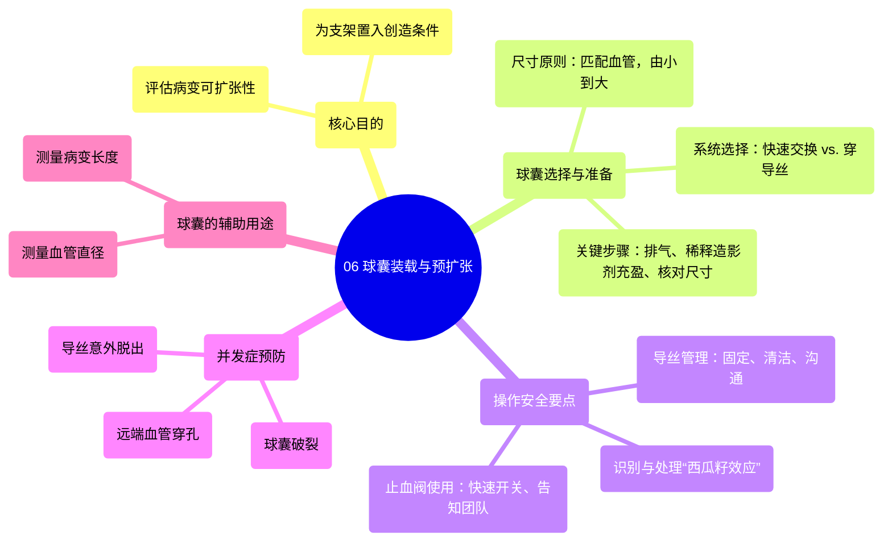

# 06 Balloon Loading & Pre-Dilatation in PCI

  <video controls preload="metadata" playsinline>
    <source src="https://helly.s3.bitiful.net/心血管学科/%E4%B8%93%E8%BE%91%2015%EF%BC%9A%E7%BB%8F%E7%9A%AE%E5%86%A0%E8%84%89%E4%BB%8B%E5%85%A5%E6%89%8B%E6%9C%AF%20%28PCI%20Insights%29/06%20Balloon%20Loading%20%26%20Pre-Dilatation%20in%20PCI.mp4" type="video/mp4">
    
您的浏览器不支持播放，请升级。

  </video>

::: tip ⚡️ 核心考点 (30s速读)
*   **核心考点**：掌握球囊预扩张的目的、球囊选择与准备的关键步骤、以及操作中预防“西瓜籽效应”等并发症的要点。
*   **临床意义**：规范的球囊预扩张是确保支架顺利输送、精准释放和良好贴壁的关键步骤，直接影响经皮冠状动脉介入治疗的成功率和安全性。
:::

## 🧠 深度精讲

*   **概念1：预扩张的目的与时机**
    *   **目的**：预扩张的主要目的是评估病变的“可扩张性”，即确认狭窄处能否被球囊有效撑开，为后续支架的顺利通过和充分膨胀创造条件。它并非为了获得完美的血管造影结果，而是为支架置入“铺路”。
    *   **时机**：并非所有病变都需要预扩张。对于钙化严重、预计支架通过困难或需要评估病变性质的病变，预扩张是必要的。对于相对简单、支架可直接通过的病变，可选择“直接支架置入术”。

*   **概念2：球囊的选择与准备**
    *   **尺寸选择**：初始应选择与参考血管直径匹配的球囊，**切忌初始尺寸过大**。原则是“由小到大”，若预扩张效果不佳，可更换更大尺寸的球囊。同时，避免使用过小的球囊，因其无法有效评估病变的可扩张性。
    *   **系统选择**：为追求操作速度，通常使用**快速交换（单轨）球囊**。当需要更换导丝或在血管远端注射造影剂时，可选用**穿导丝球囊**。
    *   **准备流程**：
        1.  **排气与充盈**：使用稀释的造影剂（通常为生理盐水与造影剂1:1混合）充盈球囊，以便在X线下显影。连接压力泵后，需**完全抽负压**，以排出残余空气、确保球囊处于最小通过外径，并检查球囊是否被无意中提前充盈。
        2.  **尺寸核对**：**必须亲自核对**球囊包装及导管尾端标记的尺寸，绝不能仅凭口头要求就假定正确。这是术者的直接责任。

*   **概念3：操作要点与并发症预防**
    *   **导丝管理**：是手术安全的基础。装载球囊前，需用湿纱布清洁导丝。操作时，**必须用一只手牢固固定导丝近端**，防止导丝在血管内前后移动，导致远端穿孔或从目标血管脱出。与助手保持清晰沟通（如“我固定导丝”）。
    *   **止血阀（如O型环）使用**：打开时需迅速，并告知监护人员，以免其因压力波形突然消失而产生困惑。操作后立即关闭以防失血。
    *   **“西瓜籽效应”**：
        *   **定义**：当球囊在坚硬、有弹性的病变（如支架内再狭窄）处快速充气时，因病变未被撑开，球囊会像西瓜籽一样从病变处向前或向后“跳跃”。
        *   **识别**：在X光透视下，观察指引导管尖端与球囊近端标记之间导丝的长度。若该长度在球囊充盈时缩短，提示球囊向后滑脱。
        *   **处理**：立即放气，将球囊重新定位至病变处，然后**非常缓慢地充气**，必要时对球囊杆施加反向牵引力。若反复发生，可考虑换用**切割球囊或刻痕球囊**以增加抓持力。
    *   **球囊的辅助用途**：
        *   **血管尺寸测量**：将球囊充至标称压力，参照其尺寸图表，可在造影图像上作为标尺，更准确地测量血管直径。
        *   **病变长度测量**：利用球囊两端的不透光标记作为固定长度的“尺子”，在造影图像上测量病变长度，辅助选择支架尺寸。

## 📚 双语术语表 (Terminology)
| 英文术语 | 中文翻译 | 定义/解释 |
| :--- | :--- | :--- |
| Pre-dilatation | 预扩张 | 在支架置入前，使用球囊对冠状动脉狭窄病变进行初步扩张。 |
| Direct stenting | 直接支架置入术 | 不进行预扩张，直接将支架输送并释放到靶病变处。 |
| Monorail / Rapid exchange balloon | 快速交换（单轨）球囊 | 一种球囊导管设计，仅导丝远端部分在导管内穿行，便于快速交换器械。 |
| Over the wire balloon | 穿导丝球囊 | 导丝全程穿过球囊导管内腔的球囊系统，稳定性好，便于交换导丝。 |
| Indeflator | 压力泵 | 用于精确控制球囊或支架充气/放气压力和速度的专用注射装置。 |
| Melon seeding / Pipping | 西瓜籽效应 | 球囊在坚硬病变处充气时，因无法撑开病变而向前或向后滑脱的现象。 |
| Cutting / Scoring balloon | 切割球囊 / 刻痕球囊 | 球囊表面附有微型刀片或金属嵴，用于切割坚硬或弹性病变，以减少弹性回缩和滑脱。 |
| Wire husbandry | 导丝管理 | 指在介入操作中，对已放置在位的导丝进行妥善固定、清洁和维护，确保其位置稳定、通畅。 |
| Nominal pressure | 标称压力 | 球囊达到其标签所示直径时所需的典型压力。 |
| Radio-opaque marker | 不透射线标记 | 植入器械（如球囊、支架）上可在X光下显影的标记点，用于精确定位。 |

## 🗺️ 知识图谱

