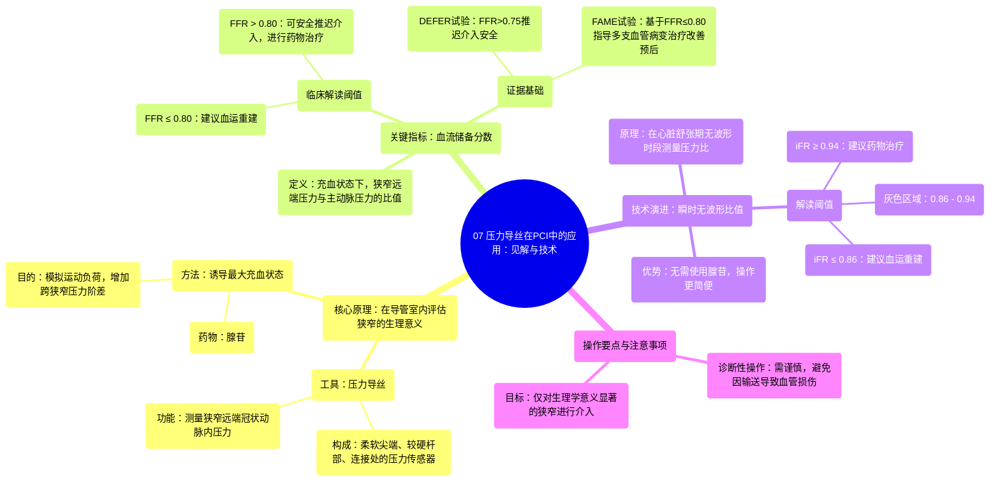

# 07 Utilizing Pressure Wire in PCI Insights & Techniques

  <video controls preload="metadata" playsinline>
    <source src="https://helly.s3.bitiful.net/心血管学科/%E4%B8%93%E8%BE%91%2015%EF%BC%9A%E7%BB%8F%E7%9A%AE%E5%86%A0%E8%84%89%E4%BB%8B%E5%85%A5%E6%89%8B%E6%9C%AF%20%28PCI%20Insights%29/07%20Utilizing%20Pressure%20Wire%20in%20PCI%20Insights%20%26%20Techniques.mp4" type="video/mp4">
    
您的浏览器不支持播放，请升级。

  </video>

::: tip ⚡️ 核心考点 (30s速读)
*   **核心考点**：压力导丝通过测量冠状动脉狭窄前后的压力，计算血流储备分数，用于在导管室内即时评估狭窄的生理学重要性，指导血运重建决策。
*   **临床意义**：基于FFR的决策（如DEFER、FAME试验）可避免对非功能性狭窄进行不必要的介入治疗，优化稳定型冠心病患者的治疗策略，改善长期预后。
:::

## 🧠 深度精讲

*   **压力导丝的原理与操作**：压力导丝是一种尖端带有微型压力传感器的导丝。在导管室中，术者将其送入冠状动脉，并穿过目标狭窄病变。通过指引导管测量主动脉压力，通过导丝传感器测量狭窄远端的冠状动脉内压力。在静息状态下，这两个压力的比值（Pd/Pa）接近1。随后，通过静脉或冠脉内注射腺苷等血管扩张药物，诱发冠状动脉最大充血状态（模拟运动负荷），此时再计算出的Pd/Pa比值即为**血流储备分数**。
*   **血流储备分数的临床解读与证据**：FFR是一个介于0到1之间的数值。**FFR ≤ 0.80** 通常被认为是狭窄具有血流动力学意义的临界值，意味着该病变是导致心肌缺血的“罪犯血管”，应考虑进行血运重建（如支架植入）。这一标准主要基于**FAME系列试验**的结论，该试验证明对FFR≤0.80的病变进行介入治疗，相比单纯造影指导，能显著改善稳定型冠心病患者的临床结局。而对于**FFR > 0.80** 的病变，**DEFER试验**表明，推迟介入治疗、仅进行药物治疗是安全的，且长期预后良好。
*   **技术演进与新指标**：为了简化操作、避免使用腺苷（可能引起胸闷、呼吸困难等副作用），衍生出了**瞬时无波形比值**。iFR在心脏舒张期特定的“无波形”时段测量压力比值，无需药物诱导充血。其判读标准与FFR略有不同：**iFR ≤ 0.86** 建议血运重建，**iFR ≥ 0.94** 建议药物治疗，**0.86-0.94** 为“灰色区域”，需结合临床或其他检查综合判断。iFR因其便捷性正被更广泛地应用，但其长期证据基础目前尚不如FFR坚实。

## 📚 双语术语表 (Terminology)
| 英文术语 | 中文翻译 | 定义/解释 |
| :--- | :--- | :--- |
| Pressure Wire | 压力导丝 | 尖端集成有压力传感器的介入导丝，用于测量冠状动脉内压力。 |
| Fractional Flow Reserve (FFR) | 血流储备分数 | 在冠状动脉最大充血状态下，狭窄远端压力与主动脉压力的比值。用于评估狭窄对血流的影响。 |
| Hyperemia | 充血（状态） | 通过药物（如腺苷）使冠状动脉血管达到最大程度扩张、血流量最大的状态。 |
| Adenosine | 腺苷 | 一种常用于诱发冠状动脉最大充血的血管扩张药物。 |
| Instantaneous Wave-Free Ratio (iFR) | 瞬时无波形比值 | 在心脏舒张期特定的“无波形”时段内，计算狭窄远端与近端的压力比值，无需使用充血药物。 |
| Pd/Pa | 远端压力/主动脉压力比值 | 狭窄远端冠状动脉压力与主动脉压力的比值，静息状态下的基础值。 |
| Physiologically Significant Stenosis | 具有生理学意义的狭窄 | 指在功能上确实限制了心肌血流供应、可能引发缺血的冠状动脉狭窄。 |
| Defer (Revascularization) | 推迟（血运重建） | 基于FFR等生理学评估，决定不对某一狭窄进行介入治疗，转而采用药物治疗。 |
| Grey Zone | 灰色区域 | 指FFR或iFR值处于临界范围（如FFR 0.75-0.80， iFR 0.86-0.94），其临床意义不确定，需要个体化决策。 |

## 🗺️ 知识图谱

