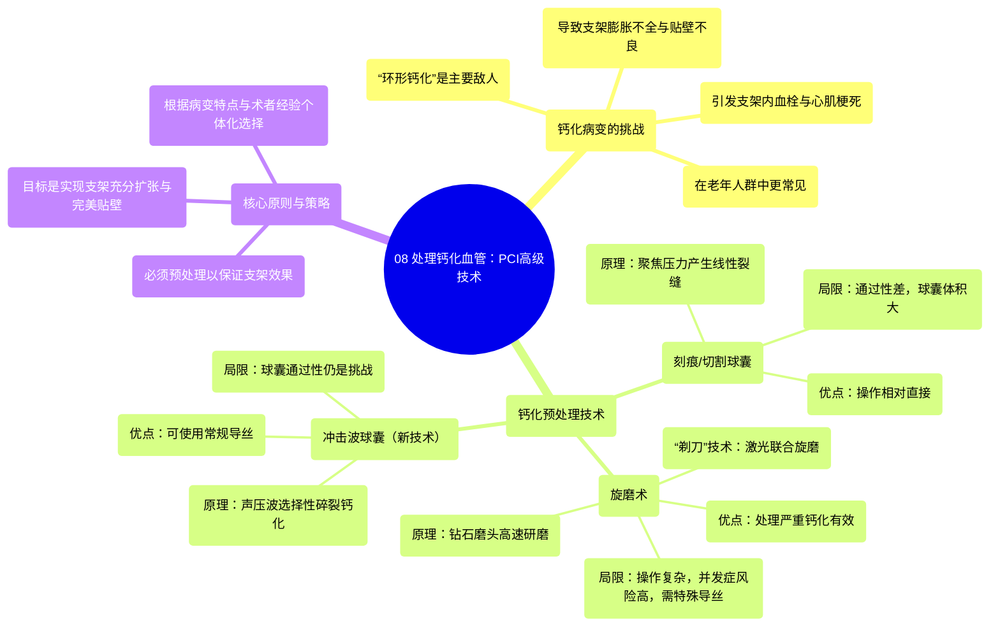

# 08 Handling Calcified Vessels in PCI Advanced Techniques

  <video controls preload="metadata" playsinline>
    <source src="https://helly.s3.bitiful.net/心血管学科/%E4%B8%93%E8%BE%91%2015%EF%BC%9A%E7%BB%8F%E7%9A%AE%E5%86%A0%E8%84%89%E4%BB%8B%E5%85%A5%E6%89%8B%E6%9C%AF%20%28PCI%20Insights%29/08%20Handling%20Calcified%20Vessels%20in%20PCI%20Advanced%20Techniques.mp4" type="video/mp4">
    
您的浏览器不支持播放，请升级。

  </video>

::: tip ⚡️ 核心考点 (30s速读)
*   **核心考点**：严重钙化是PCI的主要障碍，环形钙化尤其棘手，必须通过预处理（如刻痕/切割球囊、旋磨术、冲击波球囊）将其“撑开”或“碎裂”，才能保证支架充分扩张和贴壁，否则会导致支架内血栓、心肌梗死等严重并发症。
*   **临床意义**：随着人口老龄化，钙化病变在PCI中愈发常见。掌握不同钙化预处理技术的原理、适应症和局限性，是成功处理复杂冠脉病变、降低手术失败率和并发症风险的关键。
:::

## 🧠 深度精讲

*   **钙化病变的挑战**：冠状动脉钙化，尤其是“环形钙化”（或称“餐巾环样钙化”），是PCI的“敌人”。它使血管壁变硬，导致球囊难以扩张。如果未经有效预处理就置入支架，支架将无法充分膨胀和贴壁，造成“支架膨胀不全”，这是支架内血栓形成和后续心肌梗死的强风险因素。
*   **预处理技术一：刻痕/切割球囊**：这类球囊表面带有金属刀片或刻痕，能在扩张时将压力聚焦于钙化斑块，产生线性的裂缝，从而为后续的球囊扩张和支架置入创造条件。其优点是操作相对简单，但缺点是球囊体积较大，在极度狭窄的病变中可能难以通过。
*   **预处理技术二：旋磨术**：使用顶端镶有工业钻石的旋磨头，以极高转速（约16万转/分钟）将钙化斑块磨成微颗粒，被远端循环吸收。这是处理严重钙化的“利器”。但其操作复杂，需要丰富经验和特殊器械（如旋磨导丝、大腔指引导管），且并发症风险（如夹层、无复流）相对较高。当旋磨导丝无法通过病变时，可考虑先用激光导管“开路”（“剃刀”技术）。
*   **预处理技术三：冲击波球囊**：较新的技术，原理类似于治疗肾结石的碎石术。通过球囊内的电极产生声压波（冲击波），选择性作用于坚硬的钙化斑块，使其碎裂，而对柔软的血管壁影响较小。其优势在于可使用常规导丝，但球囊通过性在严重狭窄病变中仍是挑战。
*   **策略选择**：处理钙化病变没有“一刀切”的方案。术者需根据钙化的程度、范围、血管解剖特点以及自身经验，个体化选择预处理策略。基本原则是：确保支架能够被安全、有效地置入并达到理想的贴壁效果。

## 📚 双语术语表 (Terminology)
| 英文术语 | 中文翻译 | 定义/解释 |
| :--- | :--- | :--- |
| PCI (Percutaneous Coronary Intervention) | 经皮冠状动脉介入治疗 | 通过皮肤穿刺血管，送入导管等器械，对冠状动脉狭窄或闭塞处进行疏通的治疗方法，俗称“放支架”。 |
| Calcification | 钙化 | 钙盐在冠状动脉壁内沉积，使血管变硬、弹性下降。 |
| Circumferential Calcification / Napkin Ring Calcification | 环形钙化 / 餐巾环样钙化 | 钙化斑块环绕血管壁一整圈，形似餐巾环，是PCI中极具挑战性的病变类型。 |
| Stent Underexpansion / Malapposition | 支架膨胀不全 / 贴壁不良 | 因钙化等原因导致支架未能充分张开或未能紧密贴合血管壁，是血栓形成的重要诱因。 |
| Scoring / Cutting Balloon | 刻痕球囊 / 切割球囊 | 球囊表面附有金属刀片或刻痕，用于在钙化斑块上制造可控的裂缝。 |
| Rotational Atherectomy (Rotablation) | 旋磨术 | 使用高速旋转的钻石磨头将钙化斑块研磨成微小颗粒的技术。 |
| Shockwave Intravascular Lithotripsy | 冲击波球囊（血管内碎石术） | 通过球囊内产生冲击波，选择性碎裂钙化斑块的新技术。 |
| No-Reflow / Slow Flow | 无复流 / 慢血流 | 介入治疗后，尽管心外膜血管已开通，但心肌组织水平血流灌注不足的现象，是严重并发症。 |
| Dissection | 夹层 | 血管内膜被器械损伤撕裂，导致血液进入血管壁中层形成假腔。 |

## 🗺️ 知识图谱

