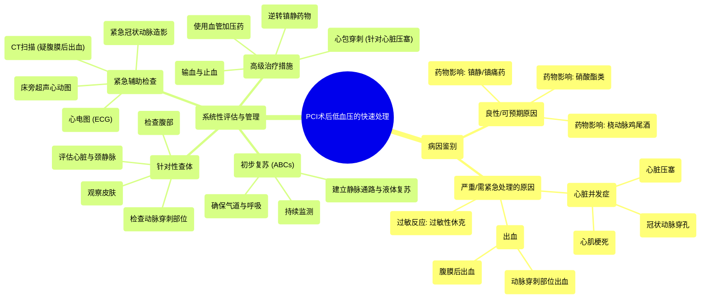

# 10 Rapidly Addressing Hypotension Post-PCI

  <video controls preload="metadata" playsinline>
    <source src="https://helly.s3.bitiful.net/心血管学科/%E4%B8%93%E8%BE%91%2015%EF%BC%9A%E7%BB%8F%E7%9A%AE%E5%86%A0%E8%84%89%E4%BB%8B%E5%85%A5%E6%89%8B%E6%9C%AF%20%28PCI%20Insights%29/10%20Rapidly%20Addressing%20Hypotension%20Post-PCI.mp4" type="video/mp4">
    
您的浏览器不支持播放，请升级。

  </video>

::: tip ⚡️ 核心考点 (30s速读)
*   **核心考点**：PCI术后低血压需快速鉴别良性与严重病因，并采取针对性复苏与诊断措施。
*   **临床意义**：PCI术后低血压是常见但可能致命的并发症。迅速识别并处理严重病因（如心脏压塞、大出血）是改善预后的关键。
:::

## 🧠 深度精讲

*   **概念1：PCI术后低血压的病因分类**
    PCI术后低血压的原因多样，临床处理的第一步是进行快速鉴别。病因可分为两大类：
    1.  **良性/可预期原因**：通常与手术操作和用药直接相关，血流动力学影响相对较轻且可逆。包括：
        *   **药物影响**：术中使用的镇静药、镇痛药、硝酸酯类药物（如硝酸甘油）以及为预防桡动脉痉挛而注射的“桡动脉鸡尾酒”（通常含维拉帕米和硝酸异山梨酯）。这些药物均具有血管扩张或心肌抑制效应，可能导致血压下降。
        *   **迷走神经反射**：血管穿刺、疼痛刺激可能诱发。
    2.  **严重/需紧急处理的原因**：这些病因危及生命，需要立即干预。包括：
        *   **心脏并发症**：**心脏压塞**（心包积液导致心脏舒张受限）、**冠状动脉穿孔**（导丝或球囊导致血管破裂）、新发或加重的**心肌梗死**。
        *   **出血**：**动脉穿刺部位出血**（如股动脉、桡动脉）、**腹膜后血肿**（隐匿且危险）。
        *   **过敏反应**：对造影剂或其他药物产生的**过敏性休克**。

*   **概念2：系统性评估与管理流程**
    面对PCI术后低血压，应遵循一套系统性的评估与处理流程：
    1.  **初步评估与复苏 (ABCs)**：
        *   **确保气道与呼吸**。
        *   **循环支持**：立即建立充足的静脉通路，快速输注晶体液进行液体复苏。
        *   **监测**：持续监测生命体征、血氧饱和度。
    2.  **针对性查体与寻找线索**：
        *   **穿刺部位**：检查桡动脉或股动脉穿刺点有无血肿、活动性出血。
        *   **心脏**：听诊心音是否遥远（提示心脏压塞），注意有无颈静脉怒张。
        *   **腹部**：检查有无压痛、膨隆（提示腹膜后出血可能）。
        *   **皮肤**：观察有无皮疹、荨麻疹（提示过敏）。
    3.  **紧急辅助检查**：
        *   **心电图 (ECG)**：立即获取，评估有无心肌缺血、梗死改变。
        *   **床旁超声心动图**：是鉴别心脏压塞、评估心脏收缩功能及心包积液的首选快速工具。
        *   **紧急冠状动脉造影**：若怀疑冠状动脉穿孔、急性闭塞等，需立即返回导管室复查造影。
        *   **CT扫描**：若高度怀疑腹膜后出血，需行紧急腹部CT确诊。
    4.  **高级治疗措施**：
        *   **血管加压药**：在充分液体复苏后血压仍低，需使用如**去氧肾上腺素（苯肾上腺素）** 或**间羟胺**等药物维持灌注压。
        *   **逆转药物**：如考虑镇静药过量，可使用相应拮抗剂（如氟马西尼拮抗苯二氮䓬类）。
        *   **输血与止血**：对于活动性大出血，需紧急输注红细胞、血浆、血小板等血液制品，并考虑介入或外科止血。
        *   **心包穿刺**：确诊心脏压塞后，立即行心包穿刺引流是挽救生命的措施。

## 📚 双语术语表 (Terminology)
| 英文术语 | 中文翻译 | 定义/解释 |
| :--- | :--- | :--- |
| PCI (Percutaneous Coronary Intervention) | 经皮冠状动脉介入治疗 | 一种通过皮肤穿刺血管，用导管技术疏通狭窄或阻塞冠状动脉的微创手术。 |
| Hypotension | 低血压 | 血压异常降低，通常指收缩压 < 90 mmHg 或较基线下降 > 30 mmHg。 |
| Radial cocktail | 桡动脉鸡尾酒 | 经桡动脉途径行PCI时，为预防动脉痉挛而通过鞘管注射的药物混合液，常含维拉帕米和硝酸酯类。 |
| Cardiac tamponade | 心脏压塞 | 心包腔内液体（如血液）快速积聚，导致心脏舒张受限、心输出量急剧下降的危重状态。 |
| Coronary perforation | 冠状动脉穿孔 | PCI术中导丝、球囊或支架等器械导致冠状动脉壁全层破裂的严重并发症。 |
| Anaphylaxis | 过敏性休克 | 一种严重的、速发的全身性过敏反应，可导致低血压、支气管痉挛、皮疹等，危及生命。 |
| Retroperitoneal haemorrhage | 腹膜后出血 | 血液积聚于腹膜后间隙的出血，常源于股动脉穿刺点高位穿刺，症状隐匿，风险高。 |
| Vasopressors | 血管加压药/升压药 | 一类通过收缩血管来提升血压的药物，用于治疗休克状态下的低血压。 |
| Phenylephrine | 去氧肾上腺素（苯肾上腺素） | 一种纯α受体激动剂，主要收缩血管，用于升高血压。 |
| Metaraminol | 间羟胺 | 一种α和β受体激动剂，具有收缩血管和轻度正性肌力作用，用于抗休克治疗。 |

## 🗺️ 知识图谱

