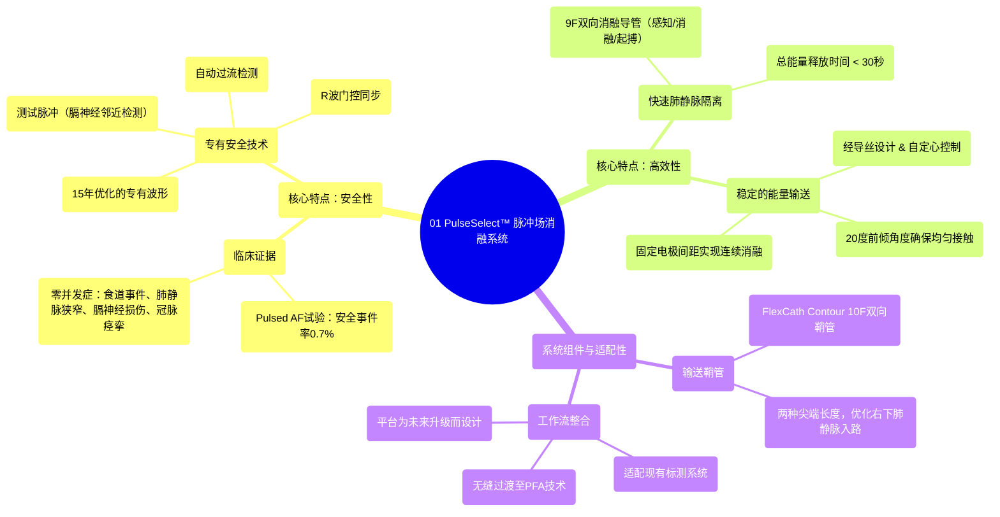

# 01 PulseSelect™ Pulsed Field Ablation System

  <video controls preload="metadata" playsinline>
    <source src="https://helly.s3.bitiful.net/心血管学科/%E4%B8%93%E8%BE%91%2016%EF%BC%9A%E8%84%89%E5%86%B2%E5%9C%BA%E6%B6%88%E8%9E%8D%E6%8A%80%E6%9C%AF%20%28Pulsed%20Field%20Ablation%29/01%20PulseSelect%E2%84%A2%20Pulsed%20Field%20Ablation%20System.mp4" type="video/mp4">
    
您的浏览器不支持播放，请升级。

  </video>

::: tip ⚡️ 核心考点 (30s速读)
*   **核心考点**：PulseSelect™ PFA系统是一款基于15年波形优化研究的脉冲场消融系统，其核心优势在于**无与伦比的安全性**和**高效的手术流程**。
*   **临床意义**：该系统在Pulsed AF临床试验中实现了极低的（0.7%）安全事件率，且**零食道事件、零肺静脉狭窄、零膈神经损伤、零冠状动脉痉挛**，为房颤消融树立了新的安全标杆，同时通过优化的导管设计实现了快速（<30秒）的肺静脉隔离。
:::

## 🧠 深度精讲

*   **核心优势：安全性**
    PulseSelect™ 系统的首要特点是其卓越的安全性，这建立在15年的专有波形优化研究之上。其Pulsed AF临床试验数据极具说服力：总体安全事件率仅为0.7%，是迄今为止所有房颤消融技术中最低的比率之一。更重要的是，它实现了多项关键并发症的“零发生”，包括食道事件、肺静脉狭窄、膈神经损伤和冠状动脉痉挛。系统还集成了多项主动安全特性，如**自动过流检测**（防止能量异常）、**R波门控**（使能量释放与心脏电活动同步，避免在易损期放电）和**测试脉冲**（用于检测导管与膈神经的邻近度，预防膈神经损伤）。

*   **核心优势：高效性**
    在保证安全的前提下，系统设计也追求极致的效率。其**9F双向可调弯消融导管**集感知、消融和起搏功能于一体，配合优化的能量波形，能够在**总计不到30秒的能量释放时间内**完成所有肺静脉的隔离，极大缩短了手术中的“消融时间”。导管的**经导丝设计**和**20度前倾角度**确保了稳定的组织接触和自定心能力，从而能输送**稳定、均匀的双极能量**。固定的电极间距保证了能量释放的**可预测性和连续性**。

*   **系统设计与适配性**
    系统采用**FlexCath Contour 10F双向可调弯鞘管**来增强解剖入路和操控性，并提供两种尖端长度以优化右下肺静脉的到位。该系统设计注重与现有临床工作流的整合，能够适配医生偏好的工作流程和现有的心脏三维标测系统，实现了向脉冲场消融技术的**无缝过渡**。同时，该系统平台为未来的功能增强预留了空间。

## 📚 双语术语表 (Terminology)
| 英文术语 | 中文翻译 | 定义/解释 |
| :--- | :--- | :--- |
| Pulsed Field Ablation (PFA) | 脉冲场消融 | 一种利用微秒级高压电脉冲不可逆地电穿孔（破坏）心肌细胞，从而隔离肺静脉治疗房颤的非热消融技术。 |
| PulseSelect™ PFA System | PulseSelect™ 脉冲场消融系统 | 美敦力公司生产的脉冲场消融系统，强调安全性与高效性。 |
| IDE Trial | 临床试验研究豁免试验 | 在美国，为评估医疗器械安全性和有效性以寻求上市批准而进行的关键性临床试验。 |
| Paroxysmal Atrial Fibrillation | 阵发性心房颤动 | 房颤发作通常在7天内自行终止，可能反复发作。 |
| Persistent Atrial Fibrillation | 持续性心房颤动 | 房颤持续超过7天，或需要药物或电复律才能终止。 |
| Pulmonary Vein Isolation (PVI) | 肺静脉隔离 | 房颤导管消融的基石术式，通过消融在肺静脉与左心房之间形成电学隔离带。 |
| Esophageal Event | 食道事件 | 消融手术中因热量或能量损伤食道导致的并发症，如食道溃疡或心房-食道瘘。 |
| Phrenic Nerve Injury | 膈神经损伤 | 消融过程中损伤控制膈肌运动的神经，可能导致膈肌麻痹、呼吸困难。 |
| Coronary Artery Spasm | 冠状动脉痉挛 | 冠状动脉突然、短暂的收缩，可能导致心肌缺血。 |
| R-wave Gating | R波门控 | 将消融能量释放与心电图的R波同步，避免在心脏复极的易损期（T波）放电，降低心律失常风险。 |
| Over-the-wire Design | 经导丝设计 | 导管沿预先放置的导丝推进，提高到位精确性和稳定性。 |
| Bidirectional Catheter/Sheath | 双向导管/鞘管 | 头端可向两个方向弯曲，以更好地适应心脏解剖结构，实现精准定位。 |

## 🗺️ 知识图谱

