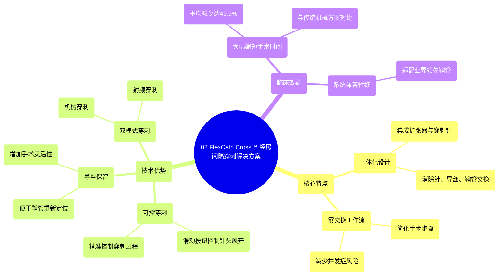

# 02 FlexCath Cross™ transseptal solution

  <video controls preload="metadata" playsinline>
    <source src="https://helly.s3.bitiful.net/心血管学科/%E4%B8%93%E8%BE%91%2016%EF%BC%9A%E8%84%89%E5%86%B2%E5%9C%BA%E6%B6%88%E8%9E%8D%E6%8A%80%E6%9C%AF%20%28Pulsed%20Field%20Ablation%29/02%20FlexCath%20Cross%E2%84%A2%20transseptal%20solution.mp4" type="video/mp4">
    
您的浏览器不支持播放，请升级。

  </video>

::: tip ⚡️ 核心考点 (30s速读)
*   **核心考点**：FlexCath Cross™ 是一个集成了扩张器和穿刺针的一体化系统，用于经房间隔穿刺进入左心房，其核心优势在于实现了“零交换”工作流。
*   **临床意义**：该系统通过减少手术步骤（无需交换穿刺针、导丝和鞘管），平均可将经房间隔穿刺的手术时间缩短高达49.9%，并允许保留导丝进行重新定位，提高了手术的可控性和效率。
:::

## 🧠 深度精讲
*   **概念1：一体化设计与零交换工作流**
    FlexCath Cross™ 系统将经房间隔穿刺所需的扩张器和穿刺针集成于一体。传统方法需要依次使用穿刺针、导丝、扩张器和鞘管，并进行多次交换。而该系统“消除了对穿刺针、导丝和鞘管交换的需求”，术者只需操作一个设备即可完成穿刺和扩张，实现了“零交换工作流”。这不仅简化了步骤，也减少了因交换器械可能带来的并发症风险（如空气栓塞、组织损伤）和手术时间。

*   **概念2：可控穿刺与导丝保留**
    系统配备锋利的穿刺针，通过推动滑动按钮即可展开进行穿刺。这种设计允许术者“在经房间隔入路期间进行可控的穿刺”，精准控制穿刺的时机和力度。此外，其独特设计“允许术者保留导丝以便重新定位”。这意味着在穿刺成功后，导丝可以留在左心房内，如果后续需要调整鞘管位置，可以沿原导丝再次进入，增加了手术的灵活性和安全性。

*   **概念3：双模式穿刺与性能数据**
    FlexCath Cross™ 是“市面上已获批准用于机械和射频穿刺”的经房间隔入路系统。这为术者提供了根据患者解剖特点和个人习惯选择最佳穿刺方式（机械力穿刺或射频能量穿刺）的灵活性。临床数据显示，与传统机械解决方案相比，该系统“有助于将经房间隔入路的手术时间平均减少高达49.9%”，显著提升了手术效率。

*   **概念4：系统兼容性**
    该系统是“专门设计用于与业界领先的鞘管配对”。这确保了其能够无缝接入现有成熟的手术器械平台，方便术者整合使用，无需改变整体手术方案，降低了学习曲线和器械适配风险。

## 📚 双语术语表 (Terminology)
| 英文术语 | 中文翻译 | 定义/解释 |
| :--- | :--- | :--- |
| FlexCath Cross™ transseptal solution | FlexCath Cross™ 经房间隔穿刺解决方案 | 一种集成了扩张器和穿刺针的一体化系统，用于经房间隔穿刺进入左心房。 |
| Integrated transeptal dilator and needle system | 一体化经房间隔扩张器和穿刺针系统 | 将扩张器和穿刺针功能合二为一的器械设计。 |
| Zero-exchange workflow | 零交换工作流 | 一种手术流程，在关键步骤中无需在不同器械（如针、导丝、鞘）之间进行交换。 |
| Left atrium | 左心房 | 心脏的四个腔室之一，接收来自肺静脉的含氧血。 |
| Mechanical crossing | 机械穿刺 | 使用物理机械力（穿刺针尖端压力）穿透房间隔组织。 |
| Radiofrequency crossing | 射频穿刺 | 使用射频能量消融并穿透房间隔组织。 |
| Sheath | 鞘管 | 插入血管或心脏腔室的中空管状器械，为其他导管和器械提供通道。 |
| Guide wire | 导丝 | 细长、柔韧的金属丝，用于引导导管或鞘管到达目标位置。 |
| Repositioning | 重新定位 | 调整导管或鞘管在心脏内的位置。 |

## 🗺️ 知识图谱

