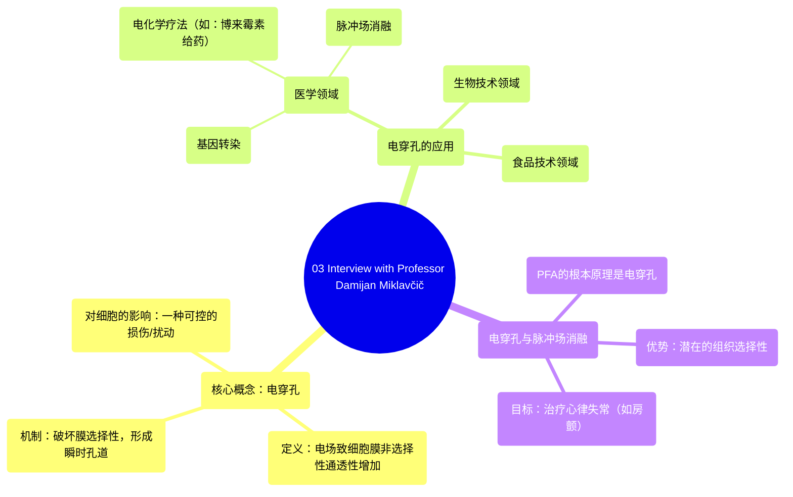

# 03 Interview with Professor Damijan Miklavčič

  <video controls preload="metadata" playsinline>
    <source src="https://helly.s3.bitiful.net/心血管学科/%E4%B8%93%E8%BE%91%2016%EF%BC%9A%E8%84%89%E5%86%B2%E5%9C%BA%E6%B6%88%E8%9E%8D%E6%8A%80%E6%9C%AF%20%28Pulsed%20Field%20Ablation%29/03%20Interview%20with%20Professor%20Damijan%20Miklav%C4%8Di%C4%8D.mp4" type="video/mp4">
    
您的浏览器不支持播放，请升级。

  </video>

::: tip ⚡️ 核心考点 (30s速读)
*   **核心考点**：电穿孔是一种通过施加高强度电脉冲，瞬时、非选择性地增加细胞膜通透性的现象。它既是细胞的一种损伤，也是将药物、基因等导入细胞或消融组织的关键技术。
*   **临床意义**：电穿孔是脉冲场消融（PFA）治疗心律失常的根本原理。理解电穿孔有助于掌握PFA选择性消融心肌细胞、保留周围组织（如血管、神经）的独特优势。
:::

## 🧠 深度精讲

*   **概念1：电穿孔**
    *   **定义**：电穿孔是一种物理现象，指在施加高强度、短时程的电场脉冲后，细胞膜上会形成瞬时的、非选择性的亲水性孔道，导致细胞膜的通透性急剧增加。
    *   **机制与影响**：在正常生理状态下，细胞膜通过离子通道、载体蛋白等结构，以高度受控和选择性的方式调控物质（如离子、分子）的跨膜运输。电穿孔破坏了这种选择性屏障，使得原本无法进入细胞的大分子（如化疗药物博来霉素、DNA质粒）得以进入，同时细胞内的物质也可能外泄。这对细胞而言是一种巨大的扰动和损伤。
    *   **应用领域**：基于其可控的“膜损伤”特性，电穿孔技术被广泛应用于：
        1.  **生物技术**：如基因转染（将外源基因导入细胞）。
        2.  **医学**：如电化学疗法（利用电穿孔增强化疗药物博来霉素的细胞毒性，用于治疗肿瘤）、基因疗法，以及新兴的**脉冲场消融**。
        3.  **食品技术**：用于非热杀菌、提高果汁出汁率等。

*   **概念2：电穿孔与脉冲场消融**
    *   **根本原理**：脉冲场消融（PFA）是一种用于治疗心律失常（如房颤）的新型导管消融技术。其核心作用机制正是**电穿孔**。
    *   **作用特点**：PFA通过导管在心腔内释放微秒级的高压电脉冲，在目标心肌组织区域诱发不可逆的电穿孔，导致心肌细胞凋亡或坏死，从而形成电隔离的疤痕组织，阻断异常电信号传导。由于电穿孔对细胞膜的破坏具有特定的电场强度依赖性，而不同类型细胞（心肌细胞、神经细胞、血管内皮细胞）的膜特性不同，因此PFA理论上可以实现对心肌细胞的**选择性消融**，最大程度地避免损伤食道、膈神经等重要毗邻结构，这是其相较于传统热消融（射频、冷冻）的潜在优势。

## 📚 双语术语表 (Terminology)
| 英文术语 | 中文翻译 | 定义/解释 |
| :--- | :--- | :--- |
| Electroporation | 电穿孔 | 在电场作用下，细胞膜通透性瞬时、非选择性增加的现象。 |
| Cell membrane | 细胞膜 | 包围细胞的脂质双分子层，是控制物质进出细胞的选择性屏障。 |
| Transmembrane transport | 跨膜运输 | 物质通过细胞膜进出细胞的过程。 |
| Permeability | 通透性 | 细胞膜允许物质通过的能力。 |
| Bleomycin | 博来霉素 | 一种化疗药物，在电穿孔辅助下能更有效地进入细胞并破坏DNA。 |
| PFA (Pulsed Field Ablation) | 脉冲场消融 | 一种利用电穿孔原理进行组织消融（特别是心脏消融）的非热能量技术。 |
| Cardiac ablation | 心脏消融 | 通过能量破坏心脏特定部位的心肌组织，以治疗心律失常的介入手术。 |

## 🗺️ 知识图谱

