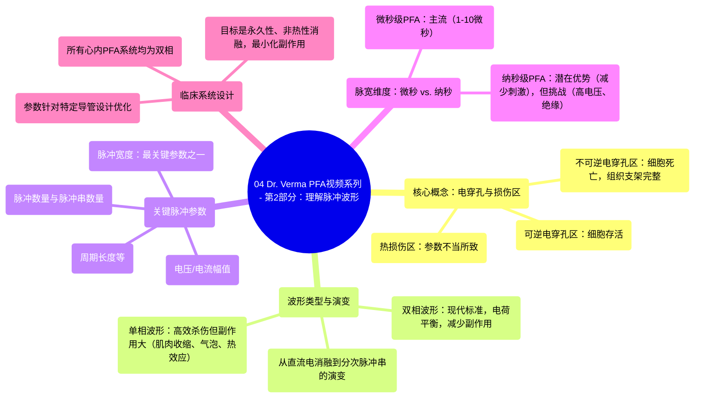

# 04 Dr. Verma PFA Video Series - Pt. 2 Understanding Pulse Waveforms

  <video controls preload="metadata" playsinline>
    <source src="https://helly.s3.bitiful.net/心血管学科/%E4%B8%93%E8%BE%91%2016%EF%BC%9A%E8%84%89%E5%86%B2%E5%9C%BA%E6%B6%88%E8%9E%8D%E6%8A%80%E6%9C%AF%20%28Pulsed%20Field%20Ablation%29/04%20Dr.%20Verma%20PFA%20Video%20Series%20-%20Pt.%202%20Understanding%20Pulse%20Waveforms.mp4" type="video/mp4">
    
您的浏览器不支持播放，请升级。

  </video>

::: tip ⚡️ 核心考点 (30s速读)
*   **核心考点**：理解脉冲场消融中不同波形（单相/双相）与脉冲参数（如脉宽、电压）对消融效果（细胞杀伤效率、神经肌肉刺激、热损伤）的决定性影响。
*   **临床意义**：目前所有心内PFA系统均采用双相波形，以平衡消融效率与安全性（减少肌肉收缩、微气泡和热效应）。脉冲参数（尤其是脉宽）是各系统实现其独特“秘诀”的关键，需根据导管设计进行优化。
:::

## 🧠 深度精讲
*   **概念1：电穿孔与损伤区**：电穿孔是PFA的生物学基础。细胞暴露于强电场后，细胞膜上会形成微孔。根据电场强度和作用时间，可分为“可逆电穿孔区”（细胞存活）和“不可逆电穿孔区”（细胞死亡）。理想PFA旨在最大化不可逆电穿孔区，同时保持组织支架完整。但若脉冲参数控制不当，仍会产生“热损伤区”。
*   **概念2：波形演变与对比**：PFA技术源于20世纪80年代的“直流电消融”，采用单相、高能量方式，但副作用大。现代PFA将其改进为“双相”、分次（脉冲串）的能量输送方式。**单相脉冲**细胞杀伤效率高，但易引起肌肉骨骼收缩、微气泡和热效应。**双相脉冲**通过维持电荷中性，显著减少了上述副作用，成为当前心内PFA系统的标准。
*   **概念3：关键脉冲参数**：脉冲参数共同决定了消融灶是否永久、非热性，以及副作用大小。主要包括：电压/电流幅值、脉冲数量、脉冲串数量、脉冲持续时间（脉宽）、周期长度等。其中，**脉宽**是至关重要的参数之一，微小的变化（如0.1微秒）即可显著影响消融效能和神经肌肉刺激水平。
*   **概念4：微秒级与纳秒级PFA**：当前主流系统使用**微秒级脉宽**（1-10微秒）。所谓**纳秒级PFA**（几百纳秒，即0.1-0.5微秒）在数量级上与微秒级并非天壤之别，其主要潜在优势是进一步降低神经肌肉刺激。但为保持总能量恒定，需要大幅提高电压（可达万伏级），这对导管绝缘和发生器设计提出了严峻挑战。

## 📚 双语术语表 (Terminology)
| 英文术语 | 中文翻译 | 定义/解释 |
| :--- | :--- | :--- |
| Electroporation | 电穿孔 | 细胞在强电场作用下，细胞膜形成可逆或不可逆微孔的现象。 |
| Reversible/Irreversible Zone | 可逆/不可逆电穿孔区 | 电场作用下，细胞可能恢复（可逆）或永久死亡（不可逆）的区域。 |
| Monophasic/Biphasic Waveform | 单相/双相波形 | 单相指电流单向流动；双相指电流正负交替，维持净电荷平衡。 |
| Pulse Field Ablation (PFA) | 脉冲场消融 | 利用超短、高强电脉冲产生不可逆电穿孔以消融组织的技术。 |
| Pulse Width/Duration | 脉宽/脉冲持续时间 | 单个脉冲所持续的时间，是影响PFA效能与安全性的关键参数。 |
| Pulse Train | 脉冲串 | 一组连续输送的脉冲。 |
| Microsecond/Nanosecond PFA | 微秒级/纳秒级PFA | 根据脉冲宽度大致划分的PFA类型，纳秒级通常指脉宽<1微秒。 |
| Thermal Zone | 热损伤区 | 由于脉冲能量控制不当导致的组织热坏死区域。 |
| Musculoskeletal Stimulation | 肌肉骨骼刺激 | 电脉冲引起的肌肉不自主收缩，是PFA需要避免的副作用。 |
| Microbubble Formation | 微气泡形成 | 在组织或电极界面因电或热效应产生的微小气泡。 |

## 🗺️ 知识图谱

