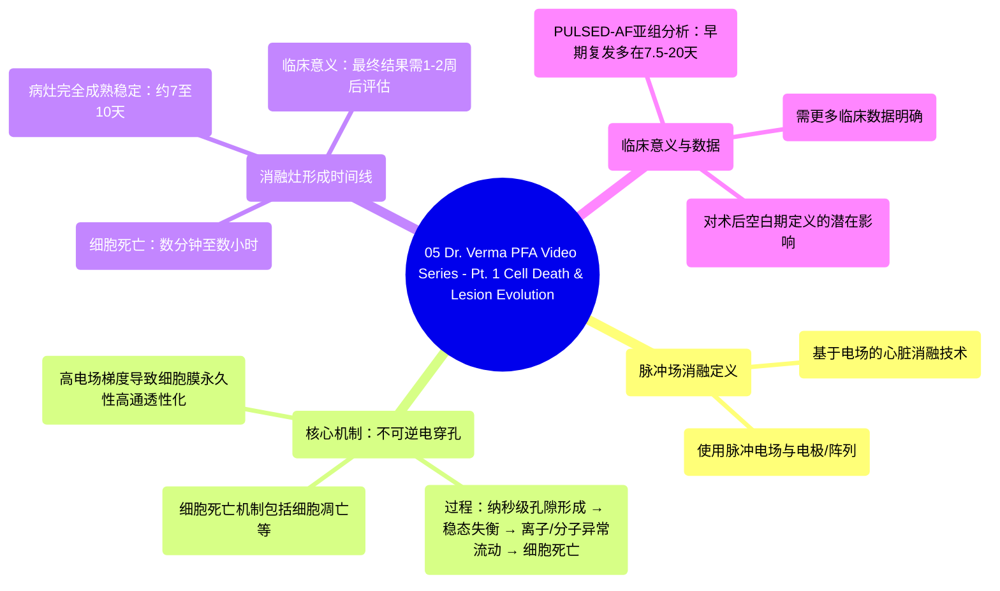

# 05 Dr. Verma PFA Video Series - Pt. 1 Cell Death & Lesion Evolution

  <video controls preload="metadata" playsinline>
    <source src="https://helly.s3.bitiful.net/心血管学科/%E4%B8%93%E8%BE%91%2016%EF%BC%9A%E8%84%89%E5%86%B2%E5%9C%BA%E6%B6%88%E8%9E%8D%E6%8A%80%E6%9C%AF%20%28Pulsed%20Field%20Ablation%29/05%20Dr.%20Verma%20PFA%20Video%20Series%20-%20Pt.%201%20Cell%20Death%20%26%20Lesion%20Evolution.mp4" type="video/mp4">
    
您的浏览器不支持播放，请升级。

  </video>

::: tip ⚡️ 核心考点 (30s速读)
*   **核心考点**：脉冲场消融是一种利用脉冲电场，通过不可逆电穿孔机制导致心肌细胞死亡，最终形成替代性纤维化瘢痕的心脏消融技术。
*   **临床意义**：PFA的消融灶完全成熟需要较长时间（约7-10天），这意味着消融的最终效果可能在术后1-2周才能明确，这可能影响对术后早期心律失常复发的评估（空白期管理）。
:::

## 🧠 深度精讲
*   **概念1：脉冲场消融的工作原理**
    脉冲场消融的核心是利用高强度的脉冲电场作用于心肌组织。当细胞暴露于这种高电场梯度下时，其细胞膜会在纳秒级时间内形成大量瞬时孔隙，导致细胞膜通透性永久性增高，即发生“不可逆电穿孔”。这破坏了细胞维持内部环境稳定的能力（稳态失衡）。随后，钙离子等物质异常内流，而ATP等高能分子外流，最终通过包括细胞凋亡在内的多种机制，导致细胞在数分钟到数小时内死亡。死亡的细胞区域最终被纤维组织替代，形成稳定的消融瘢痕。

*   **概念2：消融灶的形成与演变时间线**
    细胞死亡本身发生较快（分钟至小时），但消融灶的完全形成和稳定需要一个更长的过程。现有数据表明，从消融结束到形成一个成熟的、以纤维化为主的消融灶，可能需要长达7到10天。因此，临床医生在术后1-2周内观察到的早期心律失常复发，可能并非最终消融失败的标志，因为此时消融区域可能仍在演变中。这引发了关于传统术后“空白期”（通常为3个月）是否需要根据PFA特性进行调整的讨论。

*   **概念3：临床意义与待解问题**
    PFA的细胞死亡具体机制和确切时间线尚未完全阐明，可能因脉冲波形、导管设计等因素而异。关键临床意义在于其独特的损伤演变时间。例如，PULSED-AF试验数据显示，PFA术后的早期复发多集中在术后7.5至20天之间。这提示我们，评估PFA手术的最终成功率，需要更关注空白期之后的长期效果。目前，是否需要以及如何调整PFA术后的空白期，仍需更多临床研究数据来明确。

## 📚 双语术语表 (Terminology)
| 英文术语 | 中文翻译 | 定义/解释 |
| :--- | :--- | :--- |
| Pulse Field Ablation (PFA) | 脉冲场消融 | 一种利用脉冲电场，通过不可逆电穿孔机制消融心脏组织的技术。 |
| Irreversible Electroporation (IRE) | 不可逆电穿孔 | 细胞在高强度电场作用下，细胞膜形成永久性孔隙，导致细胞稳态破坏和死亡的过程。 |
| Hyperpermeabilization | 高通透性化 | 细胞膜通透性异常增高的状态，允许正常情况下不能通过的物质进出细胞。 |
| Homeostasis | 稳态 | 生物体或细胞维持其内部环境相对稳定和平衡的状态。 |
| Apoptosis | 细胞凋亡 | 一种受基因调控的、程序性的细胞死亡方式，通常不引发炎症反应。 |
| Replacement Fibrosis / Scar | 替代性纤维化 / 瘢痕 | 组织损伤后，由纤维结缔组织增生修复形成的疤痕，是消融灶成熟的最终形态。 |
| Blanking Period | 空白期 | 心脏消融术后的一段特定时间（通常为3个月），在此期间发生的心律失常复发不被视为手术最终失败，因可能与术后急性炎症、水肿等有关。 |
| Early Recurrence | 早期复发 | 在消融术后空白期内发生的心律失常复发。 |

## 🗺️ 知识图谱

