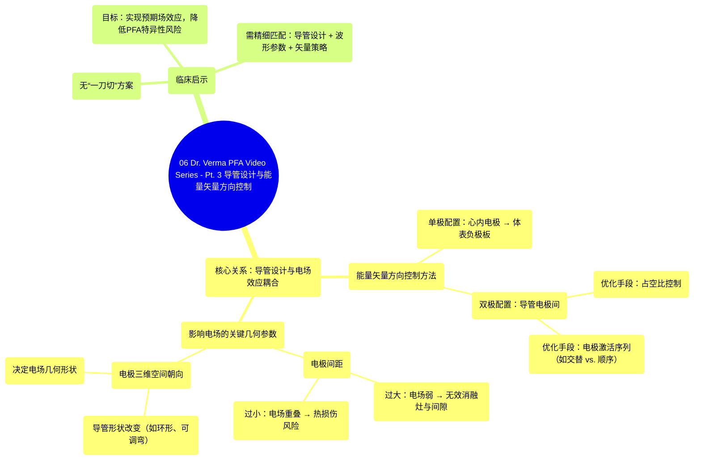

# 06 Dr. Verma PFA Video Series - Pt. 3 Catheter Design & Vectoring

  <video controls preload="metadata" playsinline>
    <source src="https://helly.s3.bitiful.net/心血管学科/%E4%B8%93%E8%BE%91%2016%EF%BC%9A%E8%84%89%E5%86%B2%E5%9C%BA%E6%B6%88%E8%9E%8D%E6%8A%80%E6%9C%AF%20%28Pulsed%20Field%20Ablation%29/06%20Dr.%20Verma%20PFA%20Video%20Series%20-%20Pt.%203%20Catheter%20Design%20%26%20Vectoring.mp4" type="video/mp4">
    
您的浏览器不支持播放，请升级。

  </video>

::: tip ⚡️ 核心考点 (30s速读)
*   **核心考点**：脉冲场消融（PFA）的电场效应不仅取决于波形，还高度依赖于导管设计，特别是电极的配置（单极/双极）、间距和空间朝向。通过优化能量矢量方向控制，可以改变电场的几何形状，从而影响消融灶的深度、宽度和安全性。
*   **临床意义**：理解导管设计与能量矢量方向控制的耦合关系，对于在手术中选择合适的导管、配置参数以避免无效消融、组织间隙或非预期的热损伤至关重要，是实现安全、有效PFA治疗的基础。
:::

## 🧠 深度精讲
*   **能量矢量方向控制与导管设计**：能量矢量方向控制是指引导和控制消融电场方向的方法。它并非独立存在，而是与导管设计紧密耦合。导管上电极的排布方式直接决定了电场如何在组织中分布。
*   **单极与双极配置**：
    *   **单极矢量方向控制**：电场在心内导管电极与患者体表的皮肤负极板之间形成。这种配置产生的电场范围较广，但方向性相对固定。
    *   **双极矢量方向控制**：电场在导管上的多个电极之间形成。这种配置允许更灵活地控制电场的局部方向和形状，是现代PFA导管设计的重点。
*   **双极矢量方向控制的优化**：通过**占空比控制**和特定的**电极激活序列**，可以在不增加电压的情况下，显著改变电场的穿透深度和覆盖范围。例如，采用“交替电极”激活（如激活1、3、5号电极对阵2、4、6号电极）相比“顺序电极”激活（如1对2，2对3），能在相同电压下产生更深、更宽的电场，从而形成更深的消融灶。
*   **电极几何参数的关键影响**：
    *   **电极间距**：间距增大会导致电场强度减弱，可能使目标组织位于有效电场范围之外，造成**无效消融灶和间隙**。间距减小则可能导致电场过度重叠，引起**焦耳热效应**，增加**热损伤**的风险。
    *   **电极三维空间朝向**：导管的形状（如环形、篮状、可调弯）会改变电极之间的相对位置和角度，从而产生完全不同的电场几何形状。这要求术者根据靶点组织的解剖位置，动态调整导管形态以优化电场覆盖。
*   **“耦合”理念**：成功的PFA治疗没有“一刀切”的方案。必须将特定的**导管设计**（电极几何形状）与特定的**波形参数**（如电压、脉冲数）以及**能量矢量方向控制策略**（激活序列）进行精细匹配，才能实现预期的组织效应，同时最大限度地降低PFA相关的特异性风险（如肌肉收缩、冠脉痉挛等）。

## 📚 双语术语表 (Terminology)
| 英文术语 | 中文翻译 | 定义/解释 |
| :--- | :--- | :--- |
| PFA (Pulsed Field Ablation) | 脉冲场消融 | 一种利用微秒至毫秒级的高压电脉冲，通过不可逆电穿孔原理选择性消融心肌组织的非热消融技术。 |
| Vectoring | 能量矢量方向控制 | 指在消融过程中控制和引导电场方向的技术或方法。 |
| Monopolar Configuration | 单极配置 | 一种消融能量传递模式，电流在导管尖端电极与患者体表的负极板之间形成回路。 |
| Bipolar Configuration | 双极配置 | 一种消融能量传递模式，电流在导管上的两个或多个电极之间局部形成回路。 |
| Duty Cycling | 占空比控制 | 在脉冲序列中，调整脉冲开启时间与总周期时间的比例，以控制能量输送和热管理。 |
| Electrode Activation Sequence | 电极激活序列 | 按特定顺序激活导管上不同电极对的编程模式，用于塑造电场分布。 |
| Field Geometry | 电场几何形状 | 电场在三维空间中的强度分布和形态。 |
| Ineffective Lesion | 无效消融灶 | 未能形成透壁性或连续性的损伤，导致心律失常复发。 |
| Gap | 间隙 | 消融线上未被有效损伤的连续心肌组织区域，是心律失常复发的常见原因。 |
| Thermal Heating | 热损伤 | 由于电流产生的焦耳热效应导致组织温度升高而产生的非预期损伤，可能增加并发症风险。 |

## 🗺️ 知识图谱

