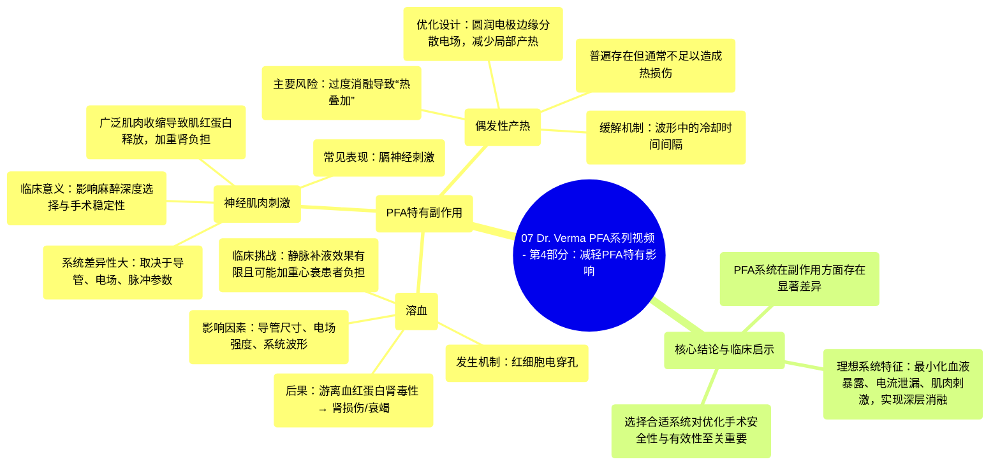

# 07 Dr. Verma PFA Video Series - Pt. 4 Mitigating PFA-Specific Effects

  <video controls preload="metadata" playsinline>
    <source src="https://helly.s3.bitiful.net/心血管学科/%E4%B8%93%E8%BE%91%2016%EF%BC%9A%E8%84%89%E5%86%B2%E5%9C%BA%E6%B6%88%E8%9E%8D%E6%8A%80%E6%9C%AF%20%28Pulsed%20Field%20Ablation%29/07%20Dr.%20Verma%20PFA%20Video%20Series%20-%20Pt.%204%20Mitigating%20PFA-Specific%20Effects.mp4" type="video/mp4">
    
您的浏览器不支持播放，请升级。

  </video>

::: tip ⚡️ 核心考点 (30s速读)
*   **核心考点**：脉冲场消融虽为非热性消融，但仍存在PFA特有的副作用，主要包括溶血、神经肌肉刺激和偶发性产热。这些副作用的发生与严重程度高度依赖于具体的PFA系统设计（如导管、波形）。
*   **临床意义**：理解这些副作用有助于在临床实践中选择合适的PFA系统、优化操作流程（如避免过度消融）并管理患者风险（如对心衰或肾病患者进行液体管理），目标是实现安全、高效且患者体验更佳的消融手术。
:::

## 🧠 深度精讲

*   **概念1：溶血及其临床考量**
    脉冲场消融通过高强度电场使细胞膜发生不可逆电穿孔，从而达到消融目的。然而，消融电极周围的电场同样会对流经的红细胞造成电穿孔，导致**溶血**。溶血释放的游离血红蛋白具有肾毒性，可能引起肾损伤甚至肾衰竭。溶血的程度并非固定，而是**系统特异性**的，主要取决于三个因素：**导管尺寸**（暴露于血池的面积）、**电场特性**（基于导管设计）以及**系统波形**。临床上试图通过静脉输注生理盐水来稀释血红蛋白的方法效果有限，且对老年或心力衰竭患者可能带来容量负荷过重的风险，并非理想解决方案。

*   **概念2：神经肌肉刺激**
    在PFA治疗过程中，尤其是当消融部位靠近膈神经时，几乎不可避免地会引起**膈神经刺激**。更广泛的**神经肌肉刺激**程度则因系统而异，取决于导管设计、电场分布和脉冲参数。强烈的肌肉收缩可导致肌红蛋白释放入血，进一步增加肾脏负担。使用肌松药仅能部分减轻刺激症状，并不能完全阻止肌红蛋白的释放。因此，一个能**最小化神经肌肉刺激**的PFA系统，有助于在镇静而非全身麻醉下进行手术，提高标测稳定性并减少对肌松药的依赖。

*   **概念3：偶发性产热与热损伤风险**
    尽管PFA被归类为非热性消融，但几乎所有的PFA系统在放电时都会产生一定程度的**温度升高**。通常这种温升不足以造成组织热损伤。然而，如果**过度密集地施加消融灶**，可能导致热量累积（热叠加），从而引发意外的热损伤。为此，PFA系统在波形设计中加入了特定的时间间隔，不仅用于电容再充电，也为了让组织和电极得以**冷却**。此外，**电极设计**（如采用圆润边缘以分散电场、减少边缘效应）也能有效降低局部温升和微气泡形成。

*   **概念4：系统差异与优化方向**
    不同的PFA系统在副作用表现上存在显著差异。一个理想的系统应具备以下设计特点以优化临床结果：**最小化血液暴露**的导管设计、减少**电流泄漏**、降低**神经肌肉募集**、以及能够产生**更深、更透壁的消融灶**。认识到这些差异对于术者根据具体病例选择最合适的工具至关重要。

## 📚 双语术语表 (Terminology)
| 英文术语 | 中文翻译 | 定义/解释 |
| :--- | :--- | :--- |
| Pulse Field Ablation (PFA) | 脉冲场消融 | 一种利用高强度、超短脉冲电场使细胞发生不可逆电穿孔，从而达到组织消融目的的非热性技术。 |
| Hemolysis | 溶血 | 红细胞破裂，导致血红蛋白释放到血浆中的过程。在PFA中，由消融电极周围的电场对红细胞造成电穿孔引起。 |
| Electroporation | 电穿孔 | 在外部电场作用下，细胞膜通透性暂时或永久性增加的现象。PFA利用的是不可逆电穿孔。 |
| Phrenic Stimulation | 膈神经刺激 | 在心脏消融手术中，能量（如PFA电场）影响到邻近的膈神经，导致膈肌收缩（呃逆或跳动）。 |
| Musculoskeletal (MSK) Stimulation | 神经肌肉刺激 | PFA治疗中引起的骨骼肌不自主收缩，范围可超出膈肌，涉及其他躯干或肢体肌肉。 |
| Myoglobin | 肌红蛋白 | 存在于肌肉细胞中的一种蛋白质，在肌肉损伤（如强烈收缩）时可释放入血，对肾脏有潜在毒性。 |
| Incidental Heating | 偶发性产热 | 在主要为非热性的消融过程（如PFA）中，伴随发生的局部温度升高现象。 |
| Thermal Stacking | 热叠加 / 热量累积 | 当消融灶过于密集或连续施加时，前一个消融产生的残余热量与后续消融产生的热量累积，可能导致意外热损伤。 |
| Waveform | 波形 | 指PFA系统中电脉冲的电压、脉宽、频率等参数随时间变化的形态，是决定消融效果和副作用的关键因素之一。 |
| Catheter Design | 导管设计 | 指消融导管的物理结构，包括电极形状、大小、排列、绝缘材料等，直接影响电场分布和副作用发生率。 |

## 🗺️ 知识图谱

