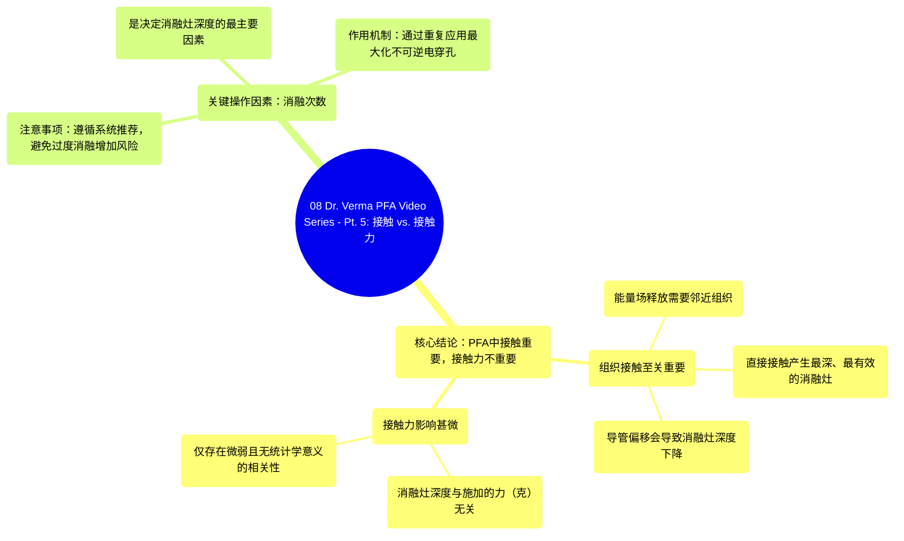

# 08 Dr. Verma PFA Video Series - Pt. 5 Contact vs. Contact Force

  <video controls preload="metadata" playsinline>
    <source src="https://helly.s3.bitiful.net/心血管学科/%E4%B8%93%E8%BE%91%2016%EF%BC%9A%E8%84%89%E5%86%B2%E5%9C%BA%E6%B6%88%E8%9E%8D%E6%8A%80%E6%9C%AF%20%28Pulsed%20Field%20Ablation%29/08%20Dr.%20Verma%20PFA%20Video%20Series%20-%20Pt.%205%20Contact%20vs.%20Contact%20Force.mp4" type="video/mp4">
    
您的浏览器不支持播放，请升级。

  </video>

::: tip ⚡️ 核心考点 (30s速读)
*   **核心考点**：脉冲场消融中，**组织接触**对消融灶深度至关重要，而**接触力**的影响微乎其微。决定消融灶深度的关键因素是**消融次数**。
*   **临床意义**：进行PFA时，操作者应优先确保导管与组织**直接接触**，并完成**推荐次数的消融**，而非过度追求施加高接触力。这有助于实现有效且安全的消融。
:::

## 🧠 深度精讲
*   **概念1：组织接触在PFA中的重要性**
    脉冲场消融通过释放能量场工作。虽然它不依赖接触力，但与组织的**邻近度**至关重要。实验数据显示，导管直接接触组织时产生的消融灶最深、最有效。当导管偏移2毫米或4毫米时，消融灶深度会显著下降。因此，确保导管与目标组织**直接接触**是PFA操作成功的基础。

*   **概念2：接触力在PFA中的有限作用**
    与传统射频消融不同，PFA的消融灶深度基本不受所施加的接触力（克数）影响。研究显示，接触力与消融深度之间仅存在**非常弱且无统计学意义**的相关性。这意味着，在PFA中，用力按压导管并不会带来更深的消融效果。

*   **概念3：消融次数是关键决定因素**
    在PFA中，**消融次数**是决定消融灶深度的最主要因素。理论上，消融深度由组织内的电场分布决定。重复应用PFA脉冲有助于将可逆性电穿孔区域转化为不可逆性损伤，从而**最大化消融灶的永久性和深度**。然而，操作必须遵循特定系统的推荐设置，过度消融不仅不会进一步增加深度，反而可能增加不必要的风险。

## 📚 双语术语表 (Terminology)
| 英文术语 | 中文翻译 | 定义/解释 |
| :--- | :--- | :--- |
| Pulse Field Ablation (PFA) | 脉冲场消融 | 一种利用微秒级高压电脉冲在细胞膜上形成不可逆电穿孔，从而导致细胞凋亡的非热消融技术。 |
| Contact | 接触 / 组织接触 | 指消融导管与心脏组织之间的物理接触程度。在PFA中，直接接触对疗效至关重要。 |
| Contact Force | 接触力 | 消融导管顶端施加在心脏组织上的压力（通常以克为单位）。在PFA中，其对消融深度影响很小。 |
| Lesion Depth | 消融灶深度 | 消融产生的组织损伤在垂直于组织表面方向上的延伸距离。 |
| Electroporation | 电穿孔 | 在外部电场作用下，细胞膜通透性暂时或永久性增加的现象。PFA利用的是不可逆电穿孔。 |
| Application | 消融应用 / 消融次数 | 指单次或多次释放能量脉冲进行消融的过程。在PFA中，次数是影响消融深度的关键参数。 |

## 🗺️ 知识图谱

