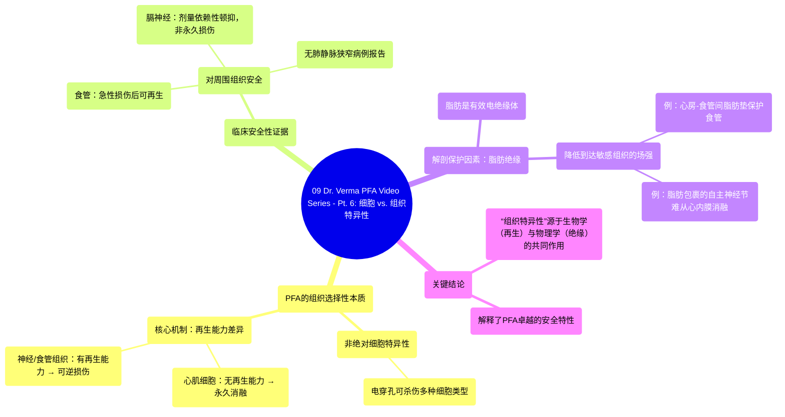

# 09 Dr. Verma PFA Video Series - Pt. 6 Cell vs. Tissue Specificity

  <video controls preload="metadata" playsinline>
    <source src="https://helly.s3.bitiful.net/心血管学科/%E4%B8%93%E8%BE%91%2016%EF%BC%9A%E8%84%89%E5%86%B2%E5%9C%BA%E6%B6%88%E8%9E%8D%E6%8A%80%E6%9C%AF%20%28Pulsed%20Field%20Ablation%29/09%20Dr.%20Verma%20PFA%20Video%20Series%20-%20Pt.%206%20Cell%20vs.%20Tissue%20Specificity.mp4" type="video/mp4">
    
您的浏览器不支持播放，请升级。

  </video>

::: tip ⚡️ 核心考点 (30s速读)
*   **核心考点**：脉冲场消融（PFA）的“组织特异性”本质上是**组织选择性**，其基础是不同组织（如心肌、神经、食管）的**再生能力差异**，而非单纯的细胞敏感性差异。心肌细胞无法再生，而神经、食管等组织可以，这构成了PFA安全性的关键。
*   **临床意义**：PFA的组织选择性解释了其在临床应用中**对食管、膈神经等关键结构的安全性**，避免了肺静脉狭窄等严重并发症。脂肪组织的绝缘保护作用是实现这种安全性的另一重要物理机制。
:::

## 🧠 深度精讲
*   **概念1：PFA的组织选择性机制**
    脉冲场消融（PFA）常被称为具有“组织特异性”，但更准确的描述是**组织选择性**或**组织偏好性**。其机制包含两个层面：
    1.  **细胞电穿孔的普遍性与组织再生能力的差异性**：电穿孔本身能杀死多种类型的细胞（心肌细胞、神经细胞、食管上皮细胞等）。PFA的关键优势在于它能**选择性破坏细胞，同时完整保留细胞外基质和局部微血管**。这为组织的修复与再生创造了条件。**心肌细胞缺乏再生能力**，因此消融效果是永久性的；而**神经（髓鞘）、食管等组织具有再生能力**，急性损伤后可在一至数周内修复，从而避免了永久性功能损害。临床观察到的膈神经“顿抑”现象（暂时性功能抑制后恢复）正是这一原理的体现。
    2.  **解剖结构的保护作用——脂肪绝缘**：脂肪组织是电的不良导体，能有效衰减脉冲电场的强度。例如，位于左心房和食管之间的**脂肪垫**，以及包裹自主神经节的脂肪层，都能显著降低到达这些敏感组织的场强，从而起到**物理隔离和保护作用**。这解释了为何从心内膜面进行PFA时，有时难以消融被脂肪包裹的自主神经节。

## 📚 双语术语表 (Terminology)
| 英文术语 | 中文翻译 | 定义/解释 |
| :--- | :--- | :--- |
| PFA (Pulsed Field Ablation) | 脉冲场消融 | 一种利用超短、高强度的电脉冲在细胞膜上形成不可逆纳米级孔隙（电穿孔），从而导致细胞凋亡或坏死的非热消融技术。 |
| Tissue Specificity / Selectivity | 组织特异性 / 选择性 | 指PFA优先或选择性地永久性损伤某一类组织（如心肌），而对其他组织（如神经、食管）仅造成可逆性损伤或影响较小的特性。 |
| Electroporation | 电穿孔 | 在外部电场作用下，细胞膜磷脂双分子层的通透性暂时或永久性增加，形成亲水性孔隙的现象。PFA利用的是不可逆电穿孔。 |
| Extracellular Matrix | 细胞外基质 | 由细胞分泌到细胞外空间的蛋白质和多糖构成的复杂网络结构，为组织提供支持和连接。PFA可保留其完整性。 |
| Regeneration | 再生 | 组织或器官在受损后，由剩余细胞生长和分化以修复或替换受损部分的过程。神经髓鞘和食管黏膜具有此能力。 |
| Phrenic Nerve | 膈神经 | 支配膈肌运动的重要神经，在心房颤动消融手术中易受损伤，导致膈肌麻痹。 |
| Stunning (of nerve) | （神经）顿抑 | 指神经功能出现暂时性、可逆性的抑制或丧失，但神经结构并未发生永久性损伤，功能可随时间自行恢复。 |
| Ganglionated Plexus | 自主神经节丛 | 心脏自主神经系统（主要含副交感神经）的神经细胞团簇，与房颤的发生和维持有关。 |
| PV Stenosis | 肺静脉狭窄 | 肺静脉开口处因消融损伤后过度愈合、瘢痕挛缩而变窄，是传统热消融（如射频消融）的一种严重并发症。 |
| Fat Pad | 脂肪垫 | 位于心脏周围特定解剖位置（如心外膜、心房与食管之间）的脂肪组织团块，具有绝缘、缓冲和保护作用。 |

## 🗺️ 知识图谱

