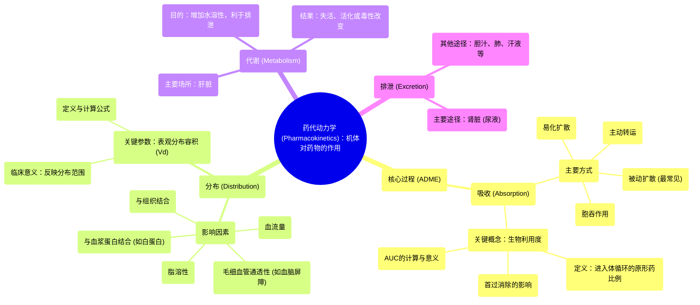

# 01 Pharmacology - PHARMACOKINETICS (MADE EASY)

  <video controls preload="metadata" playsinline>
    <source src="https://helly.s3.bitiful.net/心血管学科/%E4%B8%93%E8%BE%91%2017%EF%BC%9A%E8%8D%AF%E7%90%86%E5%AD%A6%E5%A4%A7%E5%B8%88%E8%AF%BE%20%28Speed%20Pharmacology%29/01%20Pharmacology%20-%20PHARMACOKINETICS%20%28MADE%20EASY%29.mp4" type="video/mp4">
    
您的浏览器不支持播放，请升级。

  </video>

::: tip ⚡️ 核心考点 (30s速读)
*   **核心考点**：药代动力学研究“机体对药物的作用”，即药物在体内的吸收、分布、代谢和排泄（ADME）过程。理解这四个关键步骤是掌握药物如何进入、在体内移动、被转化以及最终被清除的基础。
*   **临床意义**：药代动力学决定了药物的起效时间、作用强度和持续时间。它指导着临床给药方案（如剂量、给药途径、给药间隔）的设计，是确保药物安全有效、实现个体化治疗的关键。
:::

## 🧠 深度精讲

*   **概念1：药代动力学 (Pharmacokinetics)**
    药代动力学，简称药动学，是研究药物在体内吸收、分布、代谢和排泄的动态变化规律的科学。其核心思想是 **“机体对药物做了什么”**。这决定了药物在作用部位的浓度随时间变化的规律，从而直接影响药效和毒性。

*   **概念2：吸收 (Absorption)**
    吸收是指药物从给药部位进入体循环的过程。除非是静脉注射（直接进入血液），否则药物必须穿过生物膜（如胃肠道黏膜、皮肤）才能被吸收。吸收的主要方式有：
    1.  **被动扩散**：大多数药物的吸收方式。药物顺浓度梯度，从高浓度区域向低浓度区域移动。脂溶性药物可直接穿过细胞膜脂质双分子层，水溶性小分子可通过膜上的水通道。
    2.  **易化扩散**：需要载体蛋白协助，但同样顺浓度梯度，不消耗能量。适用于一些较大的极性分子。
    3.  **主动转运**：需要载体蛋白并消耗能量（ATP），可逆浓度梯度转运。适用于与内源性物质结构相似的药物。
    4.  **胞吞作用**：细胞膜内陷包裹大分子药物（如蛋白质、多肽）进入细胞。

*   **概念3：生物利用度 (Bioavailability)**
    生物利用度是指给药后，药物以原形进入体循环的相对量和速度。它是衡量药物吸收程度的重要指标。
    *   **静脉注射 (IV)** 的生物利用度为100%，因为药物直接进入血液循环。
    *   **口服给药** 的生物利用度通常小于100%，因为药物在胃肠道可能被破坏、未被完全吸收，或在进入体循环前经过肝脏时被部分代谢（**首过消除**）。
    *   **计算公式**：生物利用度 (F) = (口服给药后的药时曲线下面积 AUC_oral / 静脉给药后的药时曲线下面积 AUC_IV) × 100%。

*   **概念4：分布 (Distribution)**
    分布是指药物从血液循环系统向各组织、器官和体液转运的过程。影响分布的因素包括：
    1.  **脂溶性**：脂溶性高的药物更容易穿过细胞膜，分布更广泛。
    2.  **血流量**：心、肝、肾、脑等血流丰富的器官，药物初始分布快。
    3.  **毛细血管通透性**：不同器官的毛细血管结构不同（如肝血窦缝隙大，血脑屏障紧密），影响药物通过。
    4.  **与血浆蛋白结合**：药物常与血浆蛋白（主要是白蛋白）结合。结合型药物暂时失活、不易分布和代谢，游离型药物才有药理活性。结合是可逆的，处于动态平衡。
    5.  **与组织结合**：某些药物对特定组织（如脂肪、骨骼）有高亲和力，形成“储库”。
    6.  **表观分布容积 (Vd)**：一个理论容积，表示按血药浓度推算，药物均匀分布所需的体液容积。Vd大，提示药物广泛分布到组织中或与组织结合；Vd小，提示药物主要分布在血液中。

*   **概念5：代谢 (Metabolism) 与 排泄 (Excretion)**
    1.  **代谢 (生物转化)**：药物在体内（主要在肝脏）经酶催化发生化学结构改变的过程。主要目的是将脂溶性药物转化为水溶性更高的产物，便于经肾脏排泄。代谢可能使药物失活、活化，或毒性改变。
    2.  **排泄**：药物及其代谢产物排出体外的过程。主要途径是**肾脏（尿液）**，其次是胆汁（粪便）、肺、唾液、乳汁等。肾脏排泄涉及肾小球滤过、肾小管分泌和重吸收。

## 📚 双语术语表 (Terminology)
| 英文术语 | 中文翻译 | 定义/解释 |
| :--- | :--- | :--- |
| Pharmacokinetics | 药代动力学 / 药物代谢动力学 | 研究机体对药物处置（吸收、分布、代谢、排泄）动态规律的科学。 |
| Absorption | 吸收 | 药物从给药部位进入体循环的过程。 |
| Distribution | 分布 | 药物从血液循环向全身各组织、器官和体液转运的过程。 |
| Metabolism | 代谢 / 生物转化 | 药物在体内发生化学结构改变的过程，主要在肝脏进行。 |
| Excretion | 排泄 | 药物及其代谢产物排出体外的过程。 |
| Bioavailability | 生物利用度 | 给药后，药物以原形到达体循环的相对量和相对速度。 |
| Passive Diffusion | 被动扩散 | 药物顺浓度梯度穿过生物膜的过程，不消耗能量，是大多数药物的吸收方式。 |
| Facilitated Diffusion | 易化扩散 | 药物在载体蛋白帮助下顺浓度梯度转运的过程，不消耗能量。 |
| Active Transport | 主动转运 | 药物在载体蛋白帮助下逆浓度梯度转运的过程，需要消耗能量（ATP）。 |
| Endocytosis | 胞吞作用 | 细胞膜内陷包裹大分子物质进入细胞的过程。 |
| First-Pass Effect | 首过消除 / 首关效应 | 口服药物在经肠道吸收后，通过门静脉进入肝脏，部分被肝脏代谢，使进入体循环的原形药量减少的现象。 |
| Area Under Curve (AUC) | 药时曲线下面积 | 血药浓度-时间曲线下的面积，反映进入体循环药物的总量。 |
| Volume of Distribution (Vd) | 表观分布容积 | 按血药浓度推算，药物均匀分布所需的体液理论容积。 |
| Plasma Protein Binding | 血浆蛋白结合 | 药物与血浆中的蛋白质（主要是白蛋白）可逆性结合，影响其分布和活性。 |

## 🗺️ 知识图谱

