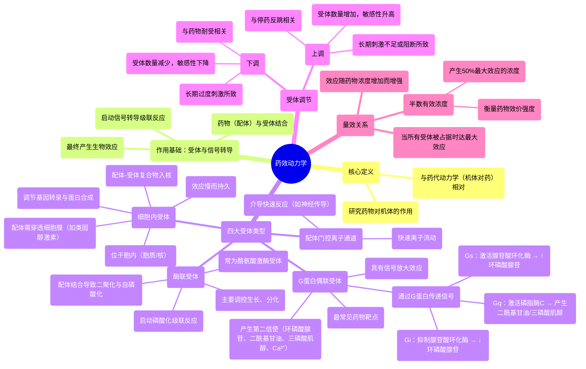

# 02 Pharmacology - PHARMACODYNAMICS (MADE EASY)

  <video controls preload="metadata" playsinline>
    <source src="https://helly.s3.bitiful.net/心血管学科/%E4%B8%93%E8%BE%91%2017%EF%BC%9A%E8%8D%AF%E7%90%86%E5%AD%A6%E5%A4%A7%E5%B8%88%E8%AF%BE%20%28Speed%20Pharmacology%29/02%20Pharmacology%20-%20PHARMACODYNAMICS%20%28MADE%20EASY%29.mp4" type="video/mp4">
    
您的浏览器不支持播放，请升级。

  </video>

::: tip ⚡️ 核心考点 (30s速读)
*   **核心考点**：药效动力学研究药物对机体的作用，核心是药物与受体（配体门控离子通道、G蛋白偶联受体、酶联受体、细胞内受体）的相互作用，通过信号转导产生生物效应。理解四种受体的作用机制、G蛋白（Gs, Gi, Gq）的功能以及受体上调/下调的调节机制是关键。
*   **临床意义**：理解药效动力学是合理用药的基础。它解释了药物如何起效（作用机制）、为何不同剂量产生不同效果（量效关系，如EC50），以及长期用药可能产生耐受（受体下调）或停药后反跳（受体上调）等现象的根本原因。
:::

## 🧠 深度精讲

*   **概念1：药效动力学 vs. 药代动力学**
    药效动力学研究的是**药物对机体**的作用，即药物如何与靶点（主要是受体）结合，引发一系列生物化学和生理学变化，最终产生治疗效应或不良反应。与之相对，药代动力学研究的是**机体对药物**的作用，即药物的吸收、分布、代谢和排泄过程。简单记：药动学是“机体对药”，药效学是“药对机体”。

*   **概念2：受体与信号转导**
    药物（配体）通过与细胞上的特定**受体**结合而发挥作用。结合后，受体被激活，启动**信号转导**过程，将外部化学信号转化为细胞内部的生化反应，最终导致特定的生物效应（如DNA复制抑制、肌肉收缩、激素分泌等）。

*   **概念3：四种主要受体类型及其机制**
    1.  **配体门控离子通道**：配体结合后，通道瞬间打开，允许特定离子（如Na⁺, K⁺, Ca²⁺）跨膜流动，快速改变细胞膜电位，主要介导快速反应（如神经信号传递）。
    2.  **G蛋白偶联受体**：最常见的药物靶点。配体结合后，激活与之偶联的**G蛋白**（由α、β、γ亚基组成）。激活的G蛋白亚基（尤其是α亚基）进而调节下游效应器（如腺苷酸环化酶、磷脂酶C），产生**第二信使**（如环磷酸腺苷、二酰基甘油、三磷酸肌醇），引发级联反应。**Gs**（激活腺苷酸环化酶，升高环磷酸腺苷）、**Gi**（抑制腺苷酸环化酶，降低环磷酸腺苷）、**Gq**（激活磷脂酶C，产生二酰基甘油和三磷酸肌醇）是三类关键G蛋白。
    3.  **酶联受体**：通常为跨膜蛋白，其细胞内部分具有酶活性（最常见的是**酪氨酸激酶**）。配体（如生长因子）结合导致受体二聚化并自磷酸化，为下游信号蛋白提供停泊点，启动复杂的磷酸化级联反应，主要调控细胞生长、分化。
    4.  **细胞内受体**：位于细胞质或核内。配体（通常为脂溶性小分子，如类固醇激素）需先穿过细胞膜，与受体结合形成复合物，进入细胞核，直接与DNA结合，调控特定基因的转录和蛋白质合成，效应产生较慢但持久。

*   **概念4：受体的调节**
    细胞能根据刺激强度动态调节受体数量，以维持内环境稳定。
    *   **下调**：长期、过度刺激 → 受体被内吞、降解 → 膜上受体数量减少 → 细胞对信号敏感性下降（可解释**药物耐受**）。
    *   **上调**：长期缺乏刺激或受体被阻断 → 受体合成增加、膜插入增多 → 膜上受体数量增加 → 细胞对信号敏感性增强（可解释**停药反跳**现象）。

*   **概念5：量效关系与半数有效浓度**
    药物效应随其浓度增加而增强，直至达到最大效应。**半数有效浓度**是指能产生**最大效应50%** 时的药物浓度，是衡量药物**效价强度**的指标（EC50越小，效价强度越高）。当所有受体被占据时，即达到最大效应。

## 📚 双语术语表 (Terminology)
| 英文术语 | 中文翻译 | 定义/解释 |
| :--- | :--- | :--- |
| Pharmacodynamics | 药效动力学 / 药物效应动力学 | 研究药物对机体的生化、生理效应及其作用机制的学科。 |
| Receptor | 受体 | 细胞上能与特定配体（如药物、激素）结合并引发生物效应的蛋白质大分子。 |
| Ligand | 配体 | 能与受体特异性结合的分子（如药物、神经递质、激素）。 |
| Ligand-gated ion channel | 配体门控离子通道 | 一种受体类型，配体结合后直接控制离子通道的开闭。 |
| G-protein-coupled receptor (GPCR) | G蛋白偶联受体 | 一种与G蛋白偶联的受体，配体结合后通过G蛋白激活下游效应器。 |
| G-protein | G蛋白 | 由α、β、γ亚基组成的异源三聚体蛋白，在GPCR信号转导中起分子开关作用。 |
| Second messenger | 第二信使 | 细胞内传递信号的小分子物质（如环磷酸腺苷、三磷酸肌醇、钙离子）。 |
| Adenylate cyclase | 腺苷酸环化酶 | 一种膜结合酶，被Gs激活后催化ATP生成环磷酸腺苷。 |
| cAMP (Cyclic AMP) | 环磷酸腺苷 | 一种重要的第二信使，由腺苷酸环化酶产生。 |
| Phospholipase C (PLC) | 磷脂酶C | 一种酶，被Gq激活后水解膜磷脂产生二酰基甘油和三磷酸肌醇。 |
| DAG (Diacylglycerol) | 二酰基甘油 | 磷脂酶C产生的第二信使，能激活蛋白激酶C。 |
| IP3 (Inositol triphosphate) | 三磷酸肌醇 | 磷脂酶C产生的第二信使，能促使内质网释放钙离子。 |
| Enzyme-linked receptor | 酶联受体 | 具有内在酶活性（常为酪氨酸激酶）的受体。 |
| Tyrosine kinase receptor | 酪氨酸激酶受体 | 酶联受体的一种，激活后可磷酸化自身及下游蛋白的酪氨酸残基。 |
| Intracellular receptor | 细胞内受体 | 位于细胞质或细胞核内的受体，配体通常为脂溶性分子。 |
| Down-regulation | 下调 | 长期刺激导致细胞表面受体数量减少，敏感性降低。 |
| Up-regulation | 上调 | 长期缺乏刺激或阻断导致细胞表面受体数量增加，敏感性升高。 |
| Dose-response relationship | 量效关系 | 药物效应随剂量或浓度变化的规律。 |
| EC50 (Median Effective Concentration) | 半数有效浓度 | 能产生最大效应50%的药物浓度，用于衡量药物的效价强度。 |
| Efficacy | 效能 | 药物与受体结合后产生最大效应的能力。 |
| Potency | 效价强度 | 药物产生一定效应所需剂量或浓度的大小，常用EC50表示。 |

## 🗺️ 知识图谱

