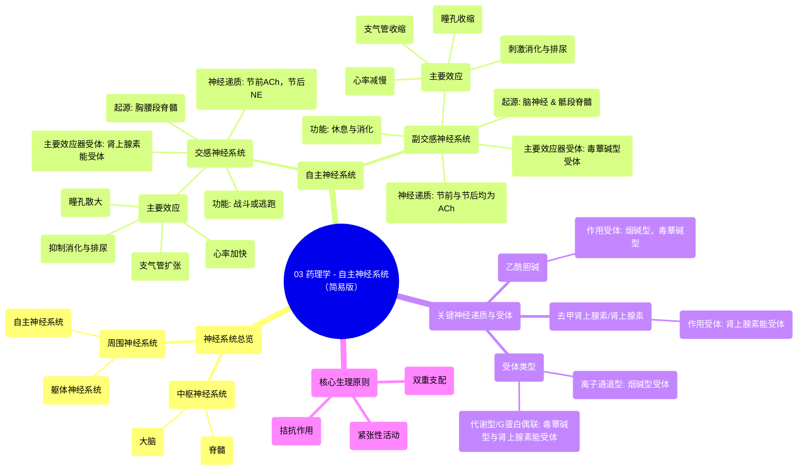

# 03 Pharmacology - AUTONOMIC NERVOUS SYSTEM (MADE EASY)

  <video controls preload="metadata" playsinline>
    <source src="https://helly.s3.bitiful.net/心血管学科/%E4%B8%93%E8%BE%91%2017%EF%BC%9A%E8%8D%AF%E7%90%86%E5%AD%A6%E5%A4%A7%E5%B8%88%E8%AF%BE%20%28Speed%20Pharmacology%29/03%20Pharmacology%20-%20AUTONOMIC%20NERVOUS%20SYSTEM%20%28MADE%20EASY%29.mp4" type="video/mp4">
    
您的浏览器不支持播放，请升级。

  </video>

::: tip ⚡️ 核心考点 (30s速读)
*   **核心考点**：自主神经系统分为“战斗或逃跑”的交感神经系统和“休息与消化”的副交感神经系统，两者通过不同的神经递质和受体作用于同一器官，产生拮抗效应。
*   **临床意义**：理解自主神经系统的功能是掌握相关药物（如降压药、平喘药）作用机制的基础，例如β受体阻滞剂通过阻断肾上腺素能受体来减慢心率。
:::

## 🧠 深度精讲

*   **神经系统概述**：神经系统是一个复杂的网络，负责协调身体的随意和不随意动作，并在身体不同部位之间传递信号。它分为中枢神经系统（CNS，包括大脑和脊髓）和周围神经系统（PNS，包括CNS之外的所有神经和神经元）。
*   **神经元类型**：在脊髓层面，有三种重要神经元：**传入神经元**（感觉神经元，将外周感觉信号传至CNS）、**传出神经元**（运动神经元，将CNS指令传至效应器官如肌肉）和**中间神经元**（整合信息）。例如，触摸滚烫物体时，信号通过传入神经元到脊髓，再通过传出神经元引发手部肌肉的反射性回缩。
*   **自主神经系统**：是周围神经系统的一部分，控制非随意功能（如心率、消化）。它分为交感神经和副交感神经两个分支。
*   **交感神经系统**：
    *   **功能**：负责“战斗或逃跑”反应，在应激状态下激活。
    *   **起源**：神经元起源于脊髓的胸段和腰段。
    *   **通路**：节前神经元（短，胆碱能，释放乙酰胆碱）→ 在交感神经节与节后神经元（长，肾上腺素能，主要释放去甲肾上腺素）形成突触 → 作用于效应器官。
    *   **主要效应**：瞳孔散大、心率加快、支气管扩张、抑制消化和排尿、促进糖原分解、刺激肾上腺髓质释放肾上腺素/去甲肾上腺素、促进射精。
*   **副交感神经系统**：
    *   **功能**：负责“休息与消化”反应，在放松状态下占主导。
    *   **起源**：神经元起源于脑神经（第3、7、9、10对）和脊髓骶段（S2-S4）。
    *   **通路**：节前神经元（长，胆碱能）→ 在靶器官附近的神经节与节后神经元（短，胆碱能）形成突触 → 两者均释放乙酰胆碱作用于效应器官。
    *   **主要效应**：瞳孔收缩、心率减慢、支气管收缩、刺激消化液分泌和胃肠蠕动、刺激膀胱收缩、促进勃起。
*   **神经递质与受体**：
    *   **胆碱能神经元**：释放乙酰胆碱。
        *   **烟碱型受体**：位于所有自主神经节的节后神经元上以及骨骼肌上。属于离子通道型受体，结合后直接导致离子通道开放。
    *   **肾上腺素能神经元**：释放去甲肾上腺素（和肾上腺素）。
        *   **肾上腺素能受体**：位于交感神经支配的效应器官上（如心脏、血管平滑肌）。属于代谢型受体（G蛋白偶联受体），通过第二信使系统发挥作用。
    *   **毒蕈碱型受体**：位于副交感神经支配的效应器官上（如心脏、平滑肌、腺体）。也属于代谢型受体（G蛋白偶联受体），由乙酰胆碱激活。
*   **核心原则**：大多数内脏器官同时接受交感神经和副交感神经的双重支配，两者作用通常相互拮抗，从而实现对器官功能的精细调节。

## 📚 双语术语表 (Terminology)
| 英文术语 | 中文翻译 | 定义/解释 |
| :--- | :--- | :--- |
| Nervous System | 神经系统 | 协调身体活动并在身体各部分间传递信号的复杂网络。 |
| Central Nervous System (CNS) | 中枢神经系统 | 由大脑和脊髓组成，是神经系统的控制中心。 |
| Peripheral Nervous System (PNS) | 周围神经系统 | 包括中枢神经系统之外的所有神经和神经元。 |
| Afferent Neuron | 传入神经元 | 将感觉信息从外周传向中枢神经系统的神经元（感觉神经元）。 |
| Efferent Neuron | 传出神经元 | 将指令从中枢神经系统传向效应器官的神经元（运动神经元）。 |
| Interneuron | 中间神经元 | 位于传入和传出神经元之间，负责整合信息的神经元。 |
| Autonomic Nervous System (ANS) | 自主神经系统 | 控制非随意身体功能（如心率、消化）的神经系统部分。 |
| Sympathetic Nervous System | 交感神经系统 | 负责“战斗或逃跑”反应的自主神经分支。 |
| Parasympathetic Nervous System | 副交感神经系统 | 负责“休息与消化”反应的自主神经分支。 |
| Cholinergic Neuron | 胆碱能神经元 | 释放神经递质乙酰胆碱的神经元。 |
| Adrenergic Neuron | 肾上腺素能神经元 | 释放神经递质去甲肾上腺素（和肾上腺素）的神经元。 |
| Acetylcholine (ACh) | 乙酰胆碱 | 胆碱能神经元释放的神经递质。 |
| Norepinephrine (NE) | 去甲肾上腺素 | 肾上腺素能神经元释放的主要神经递质。 |
| Epinephrine (Adrenaline) | 肾上腺素 | 主要由肾上腺髓质释放的激素和神经递质。 |
| Nicotinic Receptor | 烟碱型受体 | 一种乙酰胆碱受体，位于自主神经节和骨骼肌，属于离子通道型受体。 |
| Muscarinic Receptor | 毒蕈碱型受体 | 一种乙酰胆碱受体，位于副交感神经效应器官，属于G蛋白偶联受体。 |
| Adrenergic Receptor | 肾上腺素能受体 | 与去甲肾上腺素和肾上腺素结合的受体，位于交感神经效应器官，属于G蛋白偶联受体。 |
| Preganglionic Neuron | 节前神经元 | 自主神经系统中，从中枢发出、在神经节形成突触的神经元。 |
| Postganglionic Neuron | 节后神经元 | 自主神经系统中，从神经节发出、支配效应器官的神经元。 |
| Fight or Flight Response | 战斗或逃跑反应 | 交感神经系统激活后产生的生理反应模式，以应对压力或危险。 |
| Rest and Digest Response | 休息与消化反应 | 副交感神经系统激活后产生的生理反应模式，促进放松和营养吸收。 |

## 🗺️ 知识图谱

