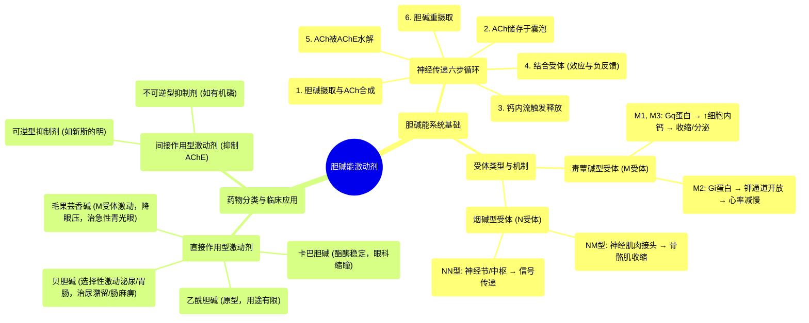

# 04 Pharmacology - CHOLINERGIC DRUGS (MADE EASY)

  <video controls preload="metadata" playsinline>
    <source src="https://helly.s3.bitiful.net/心血管学科/%E4%B8%93%E8%BE%91%2017%EF%BC%9A%E8%8D%AF%E7%90%86%E5%AD%A6%E5%A4%A7%E5%B8%88%E8%AF%BE%20%28Speed%20Pharmacology%29/04%20Pharmacology%20-%20CHOLINERGIC%20DRUGS%20%28MADE%20EASY%29.mp4" type="video/mp4">
    
您的浏览器不支持播放，请升级。

  </video>

::: tip ⚡️ 核心考点 (30s速读)
*   **核心考点**：胆碱能激动剂通过模拟或增强乙酰胆碱作用，主要影响副交感神经系统。分为直接作用型（激动受体）和间接作用型（抑制胆碱酯酶）。
*   **临床意义**：主要用于眼科（缩瞳、降眼压）和泌尿/胃肠道（治疗尿潴留、肠麻痹）。需警惕胆碱能危象（过度兴奋）。
:::

## 🧠 深度精讲

*   **胆碱能神经传递六步**：视频将乙酰胆碱的合成、储存、释放、作用及灭活过程分解为六个清晰步骤：1. 胆碱摄取与合成；2. 储存于囊泡；3. 钙内流触发释放；4. 与突触后/前受体结合（产生效应与负反馈）；5. 被乙酰胆碱酯酶水解；6. 胆碱重摄取。理解此循环是掌握后续药物作用机制的基础。
*   **胆碱能受体分型与机制**：这是药理学的核心。受体主要分两类：
    *   **毒蕈碱型受体 (M受体)**：G蛋白偶联受体。**M1、M3** 受体偶联 **Gq蛋白**，激活后升高细胞内钙，引起**收缩、分泌**（如腺体分泌、平滑肌收缩）。**M2** 受体偶联 **Gi蛋白**，激活后导致钾外流、细胞超极化，**减慢心率**。
    *   **烟碱型受体 (N受体)**：配体门控离子通道。**NM** 型位于神经肌肉接头，介导**骨骼肌收缩**；**NN** 型位于自主神经节与中枢，介导神经节信号传递。
*   **胆碱能激动剂分类与代表药**：
    *   **直接作用型**：直接激动M和/或N受体。
        *   **乙酰胆碱**：原型药物，但作用广泛、易被水解，**临床用途有限**（偶用于眼科手术）。
        *   **卡巴胆碱**：结构类似乙酰胆碱，但**不易被酯酶水解**，作用持久，主要用于**眼科手术缩瞳**。
        *   **毛果芸香碱**：**选择性激动M受体**，尤其用于**眼科**：收缩瞳孔（缩瞳）、增加房水流出，**快速降低眼压**，是治疗**急性闭角型青光眼**的关键药物。
        *   **贝胆碱**：**选择性激动泌尿和胃肠道平滑肌的M受体**，用于治疗术后**尿潴留**和**胃肠张力缺乏**。
    *   **间接作用型**：通过**抑制乙酰胆碱酯酶**，减少乙酰胆碱水解，从而增强内源性乙酰胆碱作用。视频提及可逆型（如新斯的明）和不可逆型（如有机磷农药），这部分内容在字幕中未完全展开，但它们是重要的一类，临床用于治疗重症肌无力、阿尔茨海默病等。

## 📚 双语术语表 (Terminology)
| 英文术语 | 中文翻译 | 定义/解释 |
| :--- | :--- | :--- |
| Cholinergic agonists | 胆碱能激动剂 | 一类能模拟或增强乙酰胆碱作用的药物。 |
| Acetylcholine (ACh) | 乙酰胆碱 | 主要的胆碱能神经递质。 |
| Cholinergic neurotransmission | 胆碱能神经传递 | 乙酰胆碱在突触间传递信号的过程。 |
| Acetylcholinesterase (AChE) | 乙酰胆碱酯酶 | 水解乙酰胆碱、终止其作用的酶。 |
| Muscarinic receptors (M) | 毒蕈碱型受体 (M受体) | 一类G蛋白偶联的胆碱能受体，对毒蕈碱敏感。 |
| Nicotinic receptors (N) | 烟碱型受体 (N受体) | 一类配体门控离子通道型胆碱能受体，对烟碱敏感。 |
| Direct-acting agonists | 直接作用型激动剂 | 直接与胆碱能受体结合并激活它们的药物。 |
| Indirect-acting agonists | 间接作用型激动剂 | 通过抑制乙酰胆碱酯酶来增加突触间隙乙酰胆碱浓度的药物。 |
| Pilocarpine | 毛果芸香碱 | 一种直接作用的M受体激动剂，主要用于降低眼压。 |
| Carbachol | 卡巴胆碱 | 一种直接作用的胆碱能激动剂，对酯酶稳定，主要用于眼科。 |
| Bethanechol | 贝胆碱 | 一种选择性作用于泌尿和胃肠道M受体的激动剂。 |

## 🗺️ 知识图谱

