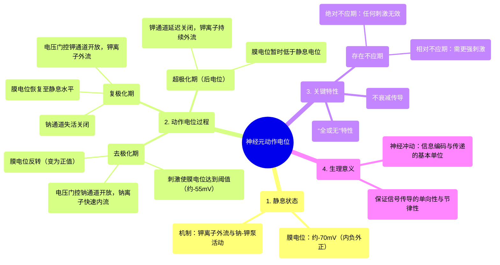

# 05 NEURON ACTION POTENTIAL (MADE EASY)

  <video controls preload="metadata" playsinline>
    <source src="https://helly.s3.bitiful.net/心血管学科/%E4%B8%93%E8%BE%91%2017%EF%BC%9A%E8%8D%AF%E7%90%86%E5%AD%A6%E5%A4%A7%E5%B8%88%E8%AF%BE%20%28Speed%20Pharmacology%29/05%20NEURON%20ACTION%20POTENTIAL%20%28MADE%20EASY%29.mp4" type="video/mp4">
    
您的浏览器不支持播放，请升级。

  </video>

::: tip ⚡️ 核心考点 (30s速读)
*   **核心考点**：动作电位是神经元细胞膜上由电压门控离子通道介导的、快速而短暂的电位变化，其本质是去极化与复极化的波动，而非电流流动。
*   **临床意义**：动作电位是神经系统信息编码和传递的基础。其异常与癫痫、心律失常、神经性疼痛等多种疾病相关。理解其产生机制是理解神经功能及药物（如局部麻醉药、抗癫痫药）作用原理的关键。
:::

## 🧠 深度精讲

*   **概念1：静息电位**
    神经元在未受刺激时，细胞膜内外存在稳定的电位差，称为静息电位。此时，膜内电位约为-70mV（膜内相对膜外为负），膜处于“极化”状态。这主要由膜上非门控钾离子通道的持续开放和钠-钾泵的活动共同维持。

*   **概念2：去极化与阈值**
    当刺激（如压力）使膜电位从-70mV去极化（即负值减小）达到一个临界值（约-55mV，称为“阈值”）时，会触发电压门控钠离子通道大量、快速开放。钠离子（Na⁺）在浓度梯度和电位梯度的双重驱动下迅速内流，导致膜电位急剧反转，变为正值（如+30mV），此过程即为“去极化”。

*   **概念3：复极化与超极化**
    钠通道迅速失活关闭后，电压门控钾离子通道延迟开放。钾离子（K⁺）外流，使膜电位迅速下降，恢复至静息电位水平，此过程称为“复极化”。在复极化末期，钾通道关闭较慢，导致钾离子持续外流，使膜电位暂时低于静息电位（如-80mV），称为“超极化”。

*   **概念4：不应期**
    在动作电位发生后的短暂时间内，神经元兴奋性发生规律性变化。**绝对不应期**（对应于动作电位上升支和大部分下降支）内，无论多强的刺激都不能再次引发动作电位，这保证了神经冲动的单向传导和频率上限。**相对不应期**（对应于超极化早期）内，需要更强的刺激才能引发动作电位。

*   **概念5：动作电位的“全或无”特性与传导**
    动作电位一旦被触发，其幅度和形状不随刺激强度改变（“全或无”）。它通过局部电流刺激相邻未兴奋区域达到阈值，从而沿细胞膜不衰减地传导开去，形成“神经冲动”。

## 📚 双语术语表 (Terminology)
| 英文术语 | 中文翻译 | 定义/解释 |
| :--- | :--- | :--- |
| Action Potential | 动作电位 | 神经元或肌肉细胞膜上发生的一次快速、可传导的电位变化，是神经冲动的基础。 |
| Resting Potential | 静息电位 | 细胞未受刺激时，膜内外存在的稳定电位差（通常内负外正）。 |
| Depolarization | 去极化 | 膜电位向零值方向变化的过程（即负值减小或变为正值）。 |
| Repolarization | 复极化 | 膜电位从去极化状态恢复到静息电位水平的过程。 |
| Hyperpolarization | 超极化 | 膜电位比静息电位更负（即负值增大）的状态。 |
| Threshold | 阈值 | 能够触发动作电位的最小膜电位变化值（约-55mV）。 |
| Refractory Period | 不应期 | 动作电位发生后，细胞兴奋性暂时丧失或降低的时期，包括绝对不应期和相对不应期。 |
| Sodium-Potassium Pump | 钠-钾泵 | 一种主动转运蛋白，消耗ATP将3个Na⁺泵出细胞，同时将2个K⁺泵入细胞，维持膜内外离子浓度梯度。 |
| Voltage-Gated Channel | 电压门控通道 | 其开放或关闭受膜电位变化调控的离子通道，如电压门控钠通道、钾通道。 |

## 🗺️ 知识图谱

