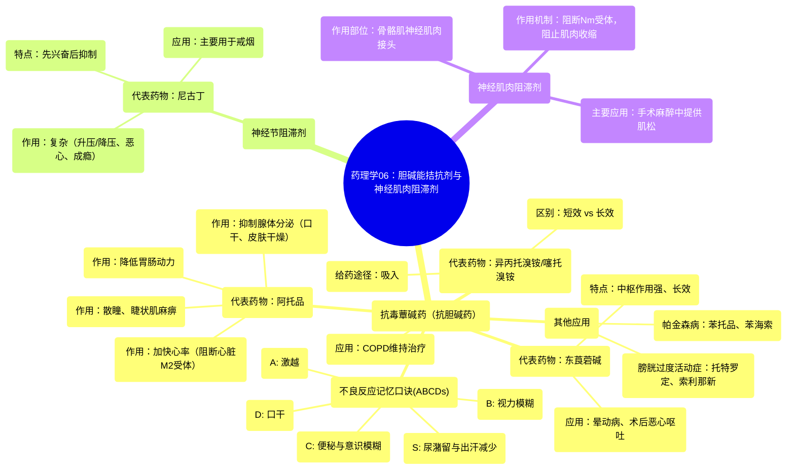

# 06 Pharmacology - ANTICHOLINERGIC & NEUROMUSCULAR BLOCKING AGENTS (MADE EASY)

  <video controls preload="metadata" playsinline>
    <source src="https://helly.s3.bitiful.net/心血管学科/%E4%B8%93%E8%BE%91%2017%EF%BC%9A%E8%8D%AF%E7%90%86%E5%AD%A6%E5%A4%A7%E5%B8%88%E8%AF%BE%20%28Speed%20Pharmacology%29/06%20Pharmacology%20-%20ANTICHOLINERGIC%20%26%20NEUROMUSCULAR%20BLOCKING%20AGENTS%20%28MADE%20EASY%29.mp4" type="video/mp4">
    
您的浏览器不支持播放，请升级。

  </video>

::: tip ⚡️ 核心考点 (30s速读)
*   **核心考点**：胆碱能拮抗剂通过阻断乙酰胆碱的作用，分为抗毒蕈碱药、神经节阻滞剂和神经肌肉阻滞剂三大类。掌握其代表药物、作用机制、主要临床应用及典型不良反应是学习关键。
*   **临床意义**：广泛应用于麻醉（肌松）、眼科（散瞳）、呼吸科（COPD）、消化科（解痉）、泌尿科（膀胱过度活动症）及帕金森病治疗，是临床药理学的重要组成部分。
:::

## 🧠 深度精讲

*   **概念1：胆碱能拮抗剂分类与概述**
    胆碱能拮抗剂是一类能阻断乙酰胆碱（ACh）与其受体结合，从而抑制胆碱能神经传递的药物。根据其作用靶点的不同，主要分为三类：
    1.  **抗毒蕈碱药（抗胆碱药）**：主要阻断分布于平滑肌、心肌、腺体及中枢神经系统的**毒蕈碱受体（M受体）**。
    2.  **神经节阻滞剂**：阻断自主神经节（交感和副交感）上的**烟碱样受体（Nn受体）**。
    3.  **神经肌肉阻滞剂**：阻断骨骼肌神经肌肉接头处的**烟碱样受体（Nm受体）**。

*   **概念2：抗毒蕈碱药（抗胆碱药）**
    这是最重要的一类，通过阻断M受体发挥作用。
    *   **代表药物与临床应用**：
        *   **阿托品**：经典代表药。作用广泛：① **眼科**：引起瞳孔散大（散瞳）、调节麻痹（睫状肌麻痹），用于检查及炎症治疗，但因作用持久（数天），现多用**环喷托酯、托吡卡胺**（作用数小时）替代。② **内脏平滑肌**：降低胃肠动力，缓解痉挛。③ **心脏**：阻断心脏M2受体，引起心动过速。④ **腺体**：抑制唾液、汗液等分泌，导致口干、皮肤干燥、体温升高。
        *   **东莨菪碱**：中枢作用强，持续时间长。主要用于**预防晕动病**及**术后恶心呕吐**，常用透皮贴剂。
        *   **异丙托溴铵 & 噻托溴铵**：吸入给药，用于**COPD的维持治疗**。异丙托溴铵短效（日4次），噻托溴铵长效（日1次）。异丙托溴铵鼻喷雾剂可治疗流涕。
        *   **膀胱过度活动症治疗药**：如**托特罗定、索利那新、奥昔布宁**等，选择性阻断膀胱M3受体，减少逼尿肌过度活动。
        *   **中枢性抗胆碱药**：如**苯托品、苯海索**，用于治疗**帕金森病**，通过抑制中枢胆碱能活性，改善运动症状。
    *   **不良反应记忆口诀（ABCDs）**：
        *   **A**：激越 (Agitation)
        *   **B**：视力模糊 (Blurred vision)
        *   **C**：便秘 (Constipation) 和意识模糊 (Confusion)
        *   **D**：口干 (Dry mouth)
        *   **S**：尿潴留 (Stasis of urine) 和出汗减少 (Sweating decreased)

*   **概念3：神经节阻滞剂**
    主要作用于自主神经节的Nn受体，因作用缺乏选择性，副作用多，临床已少用。
    *   **代表药物：尼古丁**。它既是激动剂也是功能性拮抗剂，小剂量兴奋，大剂量阻断神经节。
    *   **作用复杂**：可刺激中枢（惊厥）、升高血压心率（兴奋交感）、增加胃肠动力（恶心呕吐），并具有高度成瘾性。目前主要用于**戒烟辅助**。

*   **概念4：神经肌肉阻滞剂**
    选择性作用于骨骼肌神经肌肉接头的Nm受体，阻断神经肌肉传递，导致肌肉松弛。主要用于**外科手术麻醉**，便于气管插管和提供良好的肌松条件。
    *   **作用机制**：药物与ACh竞争结合Nm受体，阻止离子通道开放，钠离子无法内流，从而不能触发肌肉动作电位，导致肌肉麻痹。
    *   **分类**：视频中虽未详述，但通常分为**去极化型（如琥珀胆碱）**和**非去极化型（如罗库溴铵、维库溴铵）**两大类，其作用机制和特点不同。

## 📚 双语术语表 (Terminology)
| 英文术语 | 中文翻译 | 定义/解释 |
| :--- | :--- | :--- |
| Cholinergic antagonists | 胆碱能拮抗剂 | 能阻断乙酰胆碱与其受体结合，从而抑制胆碱能神经效应的药物。 |
| Anti-muscarinic agents | 抗毒蕈碱药 | 特异性阻断毒蕈碱受体（M受体）的药物，又称抗胆碱药。 |
| Ganglionic blockers | 神经节阻滞剂 | 阻断自主神经节上烟碱样受体（Nn受体）的药物。 |
| Neuromuscular blockers | 神经肌肉阻滞剂 | 阻断骨骼肌神经肌肉接头处烟碱样受体（Nm受体），导致肌肉松弛的药物。 |
| Atropine | 阿托品 | 经典的抗毒蕈碱药，作用广泛，用于解痉、散瞳、抑制腺体分泌等。 |
| Mydriasis | 瞳孔散大 | 瞳孔扩大的状态。 |
| Cycloplegia | 睫状肌麻痹 | 睫状肌麻痹导致眼睛失去调节能力，视近物模糊。 |
| Scopolamine | 东莨菪碱 | 中枢作用较强的抗毒蕈碱药，主要用于预防晕动病和术后恶心呕吐。 |
| Ipratropium | 异丙托溴铵 | 短效吸入性抗胆碱药，用于COPD和流涕。 |
| Tiotropium | 噻托溴铵 | 长效吸入性抗胆碱药，用于COPD的每日一次维持治疗。 |
| Nicotine | 尼古丁 | 烟草中的主要生物碱，是神经节阻滞剂的代表，具有兴奋和抑制双重作用，成瘾性强。 |
| Neuromuscular junction | 神经肌肉接头 | 运动神经末梢与骨骼肌细胞之间的突触连接，是神经肌肉阻滞剂的作用部位。 |

## 🗺️ 知识图谱

