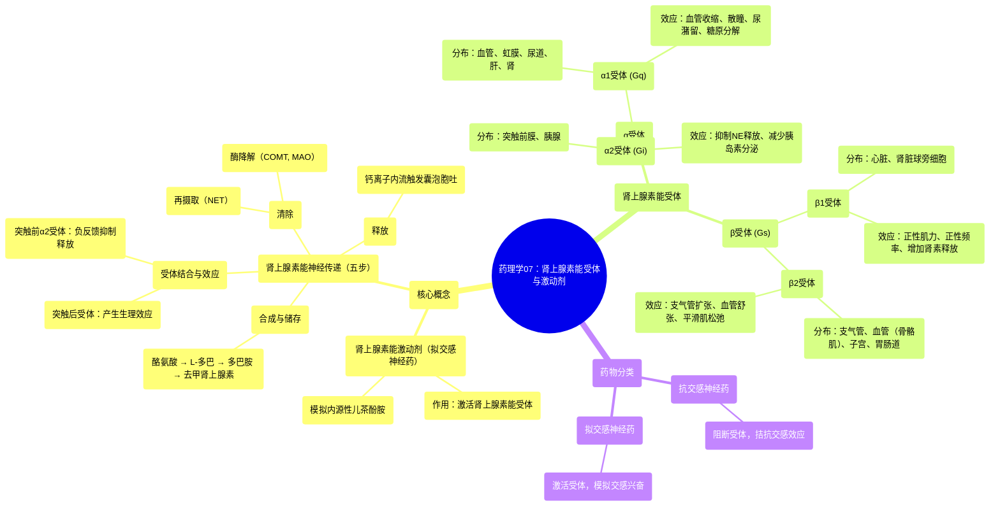

# 07 Pharmacology - ADRENERGIC RECEPTORS & AGONISTS (MADE EASY)

  <video controls preload="metadata" playsinline>
    <source src="https://helly.s3.bitiful.net/心血管学科/%E4%B8%93%E8%BE%91%2017%EF%BC%9A%E8%8D%AF%E7%90%86%E5%AD%A6%E5%A4%A7%E5%B8%88%E8%AF%BE%20%28Speed%20Pharmacology%29/07%20Pharmacology%20-%20ADRENERGIC%20RECEPTORS%20%26%20AGONISTS%20%28MADE%20EASY%29.mp4" type="video/mp4">
    
您的浏览器不支持播放，请升级。

  </video>

::: tip ⚡️ 核心考点 (30s速读)
*   **核心考点**：肾上腺素能激动剂（拟交感神经药）模拟去甲肾上腺素和肾上腺素的作用，通过激活α和β受体产生效应。理解神经递质合成与释放的五个步骤，以及α1、α2、β1、β2受体的主要分布和生理效应，是掌握此类药物的关键。
*   **临床意义**：基于不同受体的选择性激活，肾上腺素能激动剂可用于治疗休克（升压）、哮喘（支气管扩张）、过敏性休克、心脏骤停等。同时，其副作用（如高血压、心动过速、尿潴留）也源于对非靶向受体的激活。
:::

## 🧠 深度精讲

*   **概念1：肾上腺素能神经传递**：这是去甲肾上腺素在神经元内合成、储存、释放和失活的全过程。包含五个关键步骤：1) 酪氨酸摄入并转化为多巴胺；2) 多巴胺进入囊泡转化为去甲肾上腺素；3) 钙离子内流触发囊泡释放；4) 去甲肾上腺素与突触后/前受体结合；5) 通过再摄取（NET）和酶解（COMT, MAO）清除。药物可通过影响任一环节发挥作用（如可卡因抑制再摄取）。
*   **概念2：肾上腺素能受体分类与功能**：受体分为α和β两大类，均为G蛋白偶联受体。
    *   **α1受体**：位于血管、虹膜开大肌、尿道括约肌、肝脏。激活导致血管收缩、瞳孔散大、尿潴留、肝糖原分解。介导典型的“战斗或逃跑”兴奋反应。
    *   **α2受体**：主要位于突触前膜和胰腺。激活抑制去甲肾上腺素进一步释放（负反馈）并减少胰岛素分泌。
    *   **β1受体**：主要位于心脏和肾脏球旁细胞。激活增加心率、心肌收缩力、传导速度及肾素释放。
    *   **β2受体**：主要位于支气管、血管（骨骼肌）、子宫及胃肠道平滑肌。激活导致支气管扩张、血管舒张、子宫松弛。
*   **概念3：拟交感神经药与抗交感神经药**：这是基于药物对肾上腺素能系统作用的分类。**拟交感神经药**（激动剂）激活受体，模拟交感神经兴奋效应；**抗交感神经药**（拮抗剂）阻断受体，产生相反作用。这是药理学中“激动”与“拮抗”核心原理的典型体现。

## 📚 双语术语表 (Terminology)
| 英文术语 | 中文翻译 | 定义/解释 |
| :--- | :--- | :--- |
| Adrenergic Agonists | 肾上腺素能激动剂 | 一类模拟内源性去甲肾上腺素和肾上腺素作用的药物。 |
| Norepinephrine (NE) | 去甲肾上腺素 | 主要的肾上腺素能神经递质，由肾上腺素能神经元释放。 |
| Epinephrine (Epi) | 肾上腺素 | 主要由肾上腺髓质分泌的激素，少量为神经递质。 |
| Sympathomimetics | 拟交感神经药 | 激活肾上腺素能受体，产生类似交感神经兴奋效应的药物总称。 |
| Sympatholytics | 抗交感神经药 | 阻断肾上腺素能受体，拮抗交感神经效应的药物总称。 |
| Tyrosine Hydroxylase | 酪氨酸羟化酶 | 将酪氨酸转化为L-多巴的限速酶，是儿茶酚胺合成的关键步骤。 |
| Dopamine-beta-hydroxylase | 多巴胺-β-羟化酶 | 位于突触囊泡内，将多巴胺转化为去甲肾上腺素的酶。 |
| Norepinephrine Transporter (NET) | 去甲肾上腺素转运体 | 位于神经元膜上，负责将突触间隙的去甲肾上腺素再摄取回神经元内的蛋白质。 |
| Catechol-O-methyltransferase (COMT) | 儿茶酚-O-甲基转移酶 | 降解循环中儿茶酚胺（如去甲肾上腺素、肾上腺素）的主要酶之一。 |
| Monoamine Oxidase (MAO) | 单胺氧化酶 | 位于神经元线粒体膜上，降解胞内儿茶酚胺的主要酶。 |
| Alpha-1 (α1) receptor | α1受体 | Gq蛋白偶联，激活引起血管收缩、瞳孔散大、尿潴留等兴奋效应。 |
| Alpha-2 (α2) receptor | α2受体 | Gi蛋白偶联，主要位于突触前膜，激活抑制去甲肾上腺素释放（负反馈）。 |
| Beta-1 (β1) receptor | β1受体 | Gs蛋白偶联，主要位于心脏，激活增加心率、心肌收缩力和传导。 |
| Beta-2 (β2) receptor | β2受体 | Gs蛋白偶联，主要位于支气管和血管平滑肌，激活引起支气管扩张和血管舒张。 |

## 🗺️ 知识图谱

