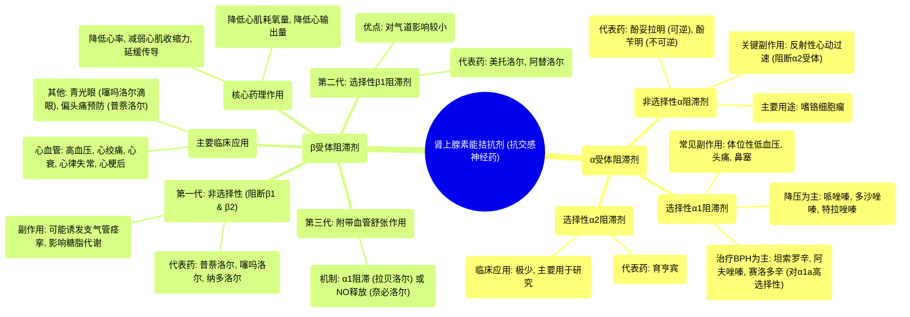

# 08 Pharmacology - ALPHA & BETA BLOCKERS - ADRENERGIC ANTAGONISTS ( MADE EASY)

  <video controls preload="metadata" playsinline>
    <source src="https://helly.s3.bitiful.net/心血管学科/%E4%B8%93%E8%BE%91%2017%EF%BC%9A%E8%8D%AF%E7%90%86%E5%AD%A6%E5%A4%A7%E5%B8%88%E8%AF%BE%20%28Speed%20Pharmacology%29/08%20Pharmacology%20-%20ALPHA%20%26%20BETA%20BLOCKERS%20-%20ADRENERGIC%20ANTAGONISTS%20%28%20MADE%20EASY%29.mp4" type="video/mp4">
    
您的浏览器不支持播放，请升级。

  </video>

::: tip ⚡️ 核心考点 (30s速读)
*   **核心考点**：肾上腺素能拮抗剂（抗交感神经药）通过阻断α或β受体，抑制交感神经系统活性。α受体阻滞剂主要用于降压和缓解前列腺增生症状；β受体阻滞剂主要用于治疗心血管疾病（如高血压、心绞痛、心衰）和青光眼。
*   **临床意义**：理解药物的选择性（α1/α2， β1/β2）是预测其疗效和副作用的关键。非选择性药物副作用更多（如α阻滞剂致心动过速，β阻滞剂诱发支气管痉挛）。药物命名（如“-osin”结尾）和“代次”分类有助于快速识别药物类别。
:::

## 🧠 深度精讲

*   **概念1：肾上腺素能拮抗剂概述**
    肾上腺素能拮抗剂，也称为抗交感神经药，其作用机制是与肾上腺素能受体结合，但不激活受体，反而阻止内源性激动剂（如去甲肾上腺素、肾上腺素）与之结合，从而抑制交感神经系统的效应。根据其对不同受体的亲和力，主要分为α受体阻滞剂和β受体阻滞剂两大类。

*   **概念2：α受体阻滞剂**
    *   **作用机制**：阻断α受体，特别是α1受体，导致血管平滑肌舒张，外周阻力下降，血压降低。
    *   **分类与代表药**：
        1.  **非选择性α阻滞剂**：同时阻断α1和α2受体。代表药：**酚妥拉明**（可逆，短效）、**酚苄明**（不可逆，长效）。主要用于嗜铬细胞瘤引起的高血压。副作用包括反射性心动过速（因阻断突触前α2受体，负反馈失灵，导致去甲肾上腺素释放增加）。
        2.  **选择性α1阻滞剂**：主要阻断α1受体。代表药：**哌唑嗪、多沙唑嗪、特拉唑嗪**（降压为主）；**坦索罗辛、阿夫唑嗪、赛洛多辛**（对前列腺α1a受体选择性高，主要用于治疗良性前列腺增生引起的排尿困难）。常见副作用：首剂体位性低血压、头痛、鼻塞。
        3.  **选择性α2阻滞剂**：如**育亨宾**，临床应用极少，主要用于研究或兽医学。

*   **概念3：β受体阻滞剂**
    *   **作用机制**：竞争性拮抗β受体，抑制儿茶酚胺的心脏兴奋（β1）和支气管舒张（β2）等作用。
    *   **临床应用**：广泛用于心血管系统：高血压、心绞痛、心肌梗死、心力衰竭、心律失常。其他用途：青光眼（如噻吗洛尔滴眼液）、偏头痛预防（如普萘洛尔）。
    *   **分类与代表药**：
        1.  **第一代（非选择性β阻滞剂）**：同时阻断β1和β2受体。代表药：**普萘洛尔**、纳多洛尔、噻吗洛尔。阻断β2受体可能引起支气管收缩（哮喘患者禁用）、外周血管收缩。
        2.  **第二代（选择性β1阻滞剂）**：对心脏β1受体选择性更高。代表药：**美托洛尔、阿替洛尔**。对气道和代谢影响较小，但大剂量时选择性可能消失。
        3.  **第三代（附带血管舒张作用的β阻滞剂）**：在阻断β受体的同时，通过α1阻滞（如**拉贝洛尔**）或促进一氧化氮释放（如**奈必洛尔**）等机制扩张血管。

## 📚 双语术语表 (Terminology)
| 英文术语 | 中文翻译 | 定义/解释 |
| :--- | :--- | :--- |
| Adrenergic antagonists | 肾上腺素能拮抗剂 | 能阻断肾上腺素能受体，抑制交感神经效应的药物。 |
| Sympatholytics | 抗交感神经药 | 与“肾上腺素能拮抗剂”同义。 |
| Alpha blockers | α受体阻滞剂 | 选择性或非选择性地阻断α肾上腺素能受体的药物。 |
| Beta blockers | β受体阻滞剂 | 选择性或非选择性地阻断β肾上腺素能受体的药物。 |
| Pheochromocytoma | 嗜铬细胞瘤 | 一种分泌过量儿茶酚胺的肾上腺肿瘤，是α阻滞剂的适应症之一。 |
| Benign Prostatic Hypertrophy (BPH) | 良性前列腺增生 | 前列腺非癌性增大，选择性α1阻滞剂可缓解其排尿症状。 |
| Orthostatic hypotension | 体位性低血压 | 从卧位或坐位突然站立时血压显著下降，是α阻滞剂的常见副作用。 |
| Competitive antagonist | 竞争性拮抗剂 | 与激动剂竞争同一受体结合位点的拮抗剂，其作用可被高浓度激动剂逆转。 |

## 🗺️ 知识图谱

