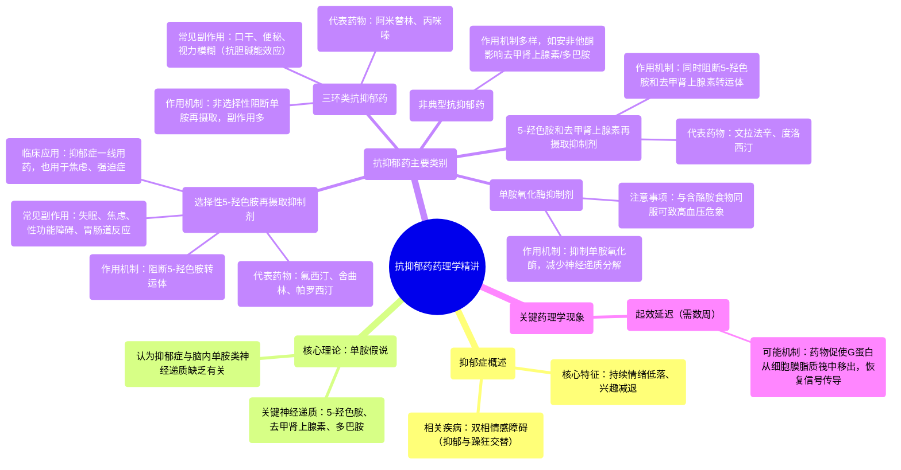

# 09 Pharmacology - ANTIDEPRESSANTS - SSRIs, SNRIs, TCAs, MAOIs, Lithium ( MADE EASY)

  <video controls preload="metadata" playsinline>
    <source src="https://helly.s3.bitiful.net/心血管学科/%E4%B8%93%E8%BE%91%2017%EF%BC%9A%E8%8D%AF%E7%90%86%E5%AD%A6%E5%A4%A7%E5%B8%88%E8%AF%BE%20%28Speed%20Pharmacology%29/09%20Pharmacology%20-%20ANTIDEPRESSANTS%20-%20SSRIs%2C%20SNRIs%2C%20TCAs%2C%20MAOIs%2C%20Lithium%20%28%20MADE%20EASY%29.mp4" type="video/mp4">
    
您的浏览器不支持播放，请升级。

  </video>

::: tip ⚡️ 核心考点 (30s速读)
*   **核心考点**：抗抑郁药通过提高大脑中单胺类神经递质（5-羟色胺、去甲肾上腺素、多巴胺）水平来起效，主要分为SSRIs、SNRIs、TCAs、MAOIs和非典型抗抑郁药五大类。
*   **临床意义**：SSRIs（如氟西汀）是治疗抑郁症的一线药物，因其副作用相对较少。所有抗抑郁药通常需要数周才能达到最大疗效，可能与G蛋白从细胞膜脂质筏中移出有关。
:::

## 🧠 深度精讲

*   **抑郁症与单胺假说**：抑郁症的特征是持续的情绪低落和兴趣减退。其生物学基础主要基于“单胺假说”，即认为抑郁症与大脑中关键单胺类神经递质（5-羟色胺、去甲肾上腺素、多巴胺）的缺乏有关。抗抑郁药的作用机制大多围绕提升这些神经递质的突触间隙水平。
*   **抗抑郁药分类与作用机制**：
    1.  **选择性5-羟色胺再摄取抑制剂**：通过选择性阻断5-羟色胺转运体，增加突触间隙5-羟色胺浓度。代表药物有氟西汀、舍曲林、帕罗西汀等。是当前治疗抑郁症的首选药物。
    2.  **5-羟色胺和去甲肾上腺素再摄取抑制剂**：同时阻断5-羟色胺和去甲肾上腺素的再摄取。代表药物有文拉法辛、度洛西汀。
    3.  **三环类抗抑郁药**：非选择性地阻断5-羟色胺和去甲肾上腺素的再摄取，同时也会阻断其他受体（如胆碱能受体），导致口干、便秘等副作用较多。代表药物有阿米替林、丙咪嗪。
    4.  **单胺氧化酶抑制剂**：通过抑制单胺氧化酶，减少神经递质的分解，从而提高其水平。因与食物（如奶酪）相互作用可能引发高血压危象，现已较少作为一线用药。
    5.  **非典型抗抑郁药**：作用机制各异，不严格属于以上四类。例如安非他酮主要影响去甲肾上腺素和多巴胺。
*   **起效延迟的可能机制**：抗抑郁药需要数周才能显效，一个较新的理论是：在抑郁症患者中，负责信号传递的G蛋白被困在细胞膜的“脂质筏”中。抗抑郁药（如SSRIs）在脂质筏中逐渐积累，促使G蛋白移出，使其能够正常传递5-羟色胺信号，这个过程需要时间。
*   **SSRIs的常见副作用**：由于增强了5-羟色胺能信号，可能导致失眠、焦虑、易怒、性功能障碍（如勃起困难、性欲减退）以及胃肠道不适（如恶心）。

## 📚 双语术语表 (Terminology)
| 英文术语 | 中文翻译 | 定义/解释 |
| :--- | :--- | :--- |
| Antidepressants | 抗抑郁药 | 用于治疗抑郁症和相关情绪障碍的药物。 |
| Depression | 抑郁症 | 一种以持续情绪低落、兴趣丧失为核心特征的精神障碍。 |
| Bipolar Disorder | 双相情感障碍 | 一种情绪在抑郁和躁狂（或轻躁狂）之间交替波动的精神障碍。 |
| Monoamine Hypothesis | 单胺假说 | 解释抑郁症的经典理论，认为其与大脑中单胺类神经递质（如5-羟色胺、去甲肾上腺素）功能不足有关。 |
| Serotonin (5-HT) | 5-羟色胺 | 一种重要的单胺类神经递质，与情绪、睡眠、食欲等调节有关。 |
| Norepinephrine (NE) | 去甲肾上腺素 | 一种重要的单胺类神经递质，与警觉、注意力、应激反应有关。 |
| Selective Serotonin Reuptake Inhibitors (SSRIs) | 选择性5-羟色胺再摄取抑制剂 | 一类通过选择性抑制5-羟色胺再摄取来发挥抗抑郁作用的药物。 |
| Serotonin and Norepinephrine Reuptake Inhibitors (SNRIs) | 5-羟色胺和去甲肾上腺素再摄取抑制剂 | 一类同时抑制5-羟色胺和去甲肾上腺素再摄取的抗抑郁药。 |
| Tricyclic Antidepressants (TCAs) | 三环类抗抑郁药 | 一类老式抗抑郁药，非选择性抑制单胺再摄取，副作用较多。 |
| Monoamine Oxidase Inhibitors (MAOIs) | 单胺氧化酶抑制剂 | 一类通过抑制单胺氧化酶来减少神经递质分解的抗抑郁药。 |
| Reuptake | 再摄取 | 神经递质释放后，被突触前神经元重新吸收的过程。 |
| Lipid Rafts | 脂质筏 | 细胞膜上富含胆固醇和鞘脂的微结构域，参与细胞信号转导。 |

## 🗺️ 知识图谱

