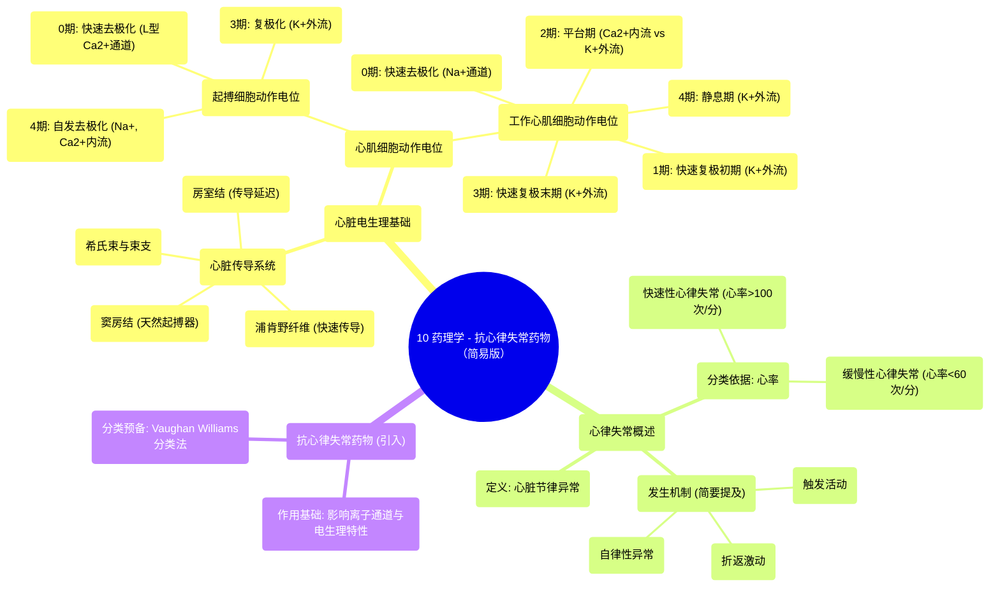

# 10 Pharmacology - ANTIARRHYTHMIC DRUGS (MADE EASY)

  <video controls preload="metadata" playsinline>
    <source src="https://helly.s3.bitiful.net/心血管学科/%E4%B8%93%E8%BE%91%2017%EF%BC%9A%E8%8D%AF%E7%90%86%E5%AD%A6%E5%A4%A7%E5%B8%88%E8%AF%BE%20%28Speed%20Pharmacology%29/10%20Pharmacology%20-%20ANTIARRHYTHMIC%20DRUGS%20%28MADE%20EASY%29.mp4" type="video/mp4">
    
您的浏览器不支持播放，请升级。

  </video>

::: tip ⚡️ 核心考点 (30s速读)
*   **核心考点**：抗心律失常药通过影响心肌细胞的电生理特性（如自律性、传导速度、不应期）来恢复正常心律。其分类（Vaughan Williams分类法）基于主要作用机制。
*   **临床意义**：理解正常心脏电传导系统（窦房结→房室结→希氏束→束支→浦肯野纤维）及心肌细胞动作电位各期（0-4期）的离子基础，是掌握抗心律失常药物作用靶点（如钠、钾、钙通道）的关键。
:::

## 🧠 深度精讲
*   **心脏电传导系统**：心脏的规律收缩由特化的电传导系统控制。正常心律始于**窦房结**（天然起搏器），电信号依次经**房室结**（产生生理性延迟，保证心房血液充分充盈心室）、**希氏束**、**左右束支**，最终通过**浦肯野纤维**网迅速传遍心室，引发协调收缩。心电图（ECG）的P波、PR段、QRS波群、T波分别对应此过程的各个阶段。
*   **心肌细胞类型与动作电位**：
    *   **传导细胞（起搏细胞）**：主要位于窦房结、房室结等，具有**自律性**，可自发产生动作电位。其动作电位特征为：4期自发缓慢去极化（钠内流、T型钙通道开放）→ 0期快速去极化（L型钙通道开放，钙内流）→ 3期复极化（钾外流）。无明显的1期和2期。
    *   **工作心肌细胞**：构成心房、心室壁，负责收缩。其动作电位分为：4期静息期（钾外流维持静息电位）→ 0期快速去极化（钠通道开放，钠快速内流）→ 1期快速复极初期（钾外流）→ 2期平台期（钙缓慢内流与钾外流平衡）→ 3期快速复极末期（钙通道失活，钾持续外流）→ 返回4期。
*   **心律失常的基本概念**：指心脏搏动的频率、节律、起源部位、传导速度或激动次序的异常。可分为：
    *   **快速性心律失常**：心率 > 100次/分，如房颤、室上速、室速。
    *   **缓慢性心律失常**：心率 < 60次/分，如病态窦房结综合征、房室传导阻滞。
    *   发生机制主要与**自律性异常**、**触发活动**（后除极）及**折返激动**有关。

## 📚 双语术语表 (Terminology)
| 英文术语 | 中文翻译 | 定义/解释 |
| :--- | :--- | :--- |
| Antiarrhythmic drugs | 抗心律失常药物 | 用于治疗心脏节律紊乱的药物。 |
| Cardiac conduction system | 心脏电传导系统 | 心脏内产生和传导电脉冲的特化组织，控制心肌收缩顺序。 |
| Sinoatrial (SA) node | 窦房结 | 位于右心房，是心脏的正常起搏点，自发产生节律性电冲动。 |
| Atrioventricular (AV) node | 房室结 | 位于心房与心室交界处，延迟电冲动传导，确保心房收缩先于心室。 |
| Bundle of His | 希氏束 | 房室结的延续，将电冲动从心房传至心室。 |
| Purkinje fibers | 浦肯野纤维 | 希氏束的细小终末分支，将电冲动快速传导至整个心室肌。 |
| Action potential | 动作电位 | 细胞膜电位快速、短暂的反转和恢复过程，是电信号的基础。 |
| Automaticity | 自律性 | 心肌传导细胞在无外界刺激条件下自动产生节律性兴奋的能力。 |
| Pacemaker cells | 起搏细胞 | 具有自律性的细胞，如窦房结细胞。 |
| Contractile cells | 收缩细胞/工作心肌细胞 | 构成心房和心室壁的主体，负责执行收缩功能。 |
| Depolarization | 去极化 | 细胞膜内电位向正方向变化的过程（如从-90mV到+40mV）。 |
| Repolarization | 复极化 | 去极化后，细胞膜电位恢复至静息状态的过程。 |
| Refractory period | 不应期 | 动作电位发生后，细胞对新的刺激暂时无反应或反应能力下降的时期。 |
| Arrhythmia | 心律失常 | 心脏跳动的频率或节律异常。 |
| Bradyarrhythmia | 缓慢性心律失常 | 心率低于正常范围（通常<60次/分）的心律失常。 |
| Tachyarrhythmia | 快速性心律失常 | 心率高于正常范围（通常>100次/分）的心律失常。 |

## 🗺️ 知识图谱

