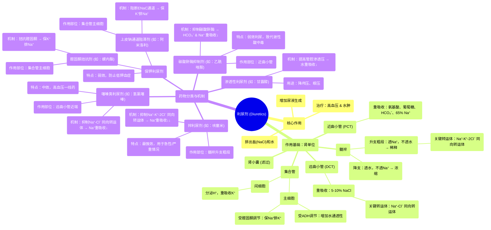

# 11 Pharmacology - DIURETICS (MADE EASY)

  <video controls preload="metadata" playsinline>
    <source src="https://helly.s3.bitiful.net/心血管学科/%E4%B8%93%E8%BE%91%2017%EF%BC%9A%E8%8D%AF%E7%90%86%E5%AD%A6%E5%A4%A7%E5%B8%88%E8%AF%BE%20%28Speed%20Pharmacology%29/11%20Pharmacology%20-%20DIURETICS%20%28MADE%20EASY%29.mp4" type="video/mp4">
    
您的浏览器不支持播放，请升级。

  </video>

::: tip ⚡️ 核心考点 (30s速读)
*   **核心考点**：利尿剂通过抑制肾单位不同部位对钠、氯等离子的重吸收，增加尿液生成，用于治疗高血压和水肿。
*   **临床意义**：不同类别利尿剂作用强度、部位和副作用各异，需根据病情（如心衰、高血压、青光眼）和电解质状况（如血钾水平）选择。
:::

## 🧠 深度精讲

*   **肾单位生理学回顾**：利尿剂的作用基础是肾单位的功能。肾单位是肾脏的基本功能单位，包括肾小囊（滤过）、近曲小管（重吸收大部分营养物质和部分钠）、髓袢（浓缩和稀释尿液）、远曲小管（进一步调节钠）以及集合管（受激素精细调节水钠平衡）。理解钠、氯、水的重吸收路径是掌握利尿剂机制的关键。
*   **利尿剂分类与机制**：
    *   **碳酸酐酶抑制剂**（如乙酰唑胺）：作用于**近曲小管**，抑制碳酸酐酶，减少碳酸氢盐和钠的重吸收，导致**轻度利尿**。主要副作用是代谢性酸中毒和低钾血症。临床更多用于治疗青光眼、高山病，而非作为主要利尿剂。
    *   **袢利尿剂**（如呋塞米）：作用于**髓袢升支粗段**，抑制钠-钾-2-氯协同转运蛋白，阻止高达25%的滤过钠重吸收，产生**最强效的利尿作用**。用于急性肺水肿、严重心衰等需要快速强力利尿的情况。主要副作用是电解质紊乱（低钾、低钠、低氯）、耳毒性。
    *   **噻嗪类利尿剂**（如氢氯噻嗪）：作用于**远曲小管近端**，抑制氯化钠协同转运蛋白，产生**中效利尿**。是治疗**原发性高血压**的一线药物之一。主要副作用是低钾血症、高血糖、高尿酸血症。
    *   **保钾利尿剂**：作用于**集合管**。
        *   **醛固酮受体拮抗剂**（如螺内酯）：竞争性拮抗醛固酮，减少钠重吸收和钾分泌。
        *   **上皮钠通道阻滞剂**（如阿米洛利）：直接阻断主细胞管腔膜的上皮钠通道。
        两者均产生**弱效利尿**，但可**避免钾丢失**，常与排钾利尿剂联用以平衡血钾。
    *   **渗透性利尿剂**（如甘露醇）：不被肾小管重吸收，在管腔内形成高渗透压，“吸引”水分进入管腔，产生利尿。主要用于降低颅内压和眼内压，而非治疗高血压或心源性水肿。

## 📚 双语术语表 (Terminology)
| 英文术语 | 中文翻译 | 定义/解释 |
| :--- | :--- | :--- |
| Diuretics | 利尿剂 | 促进水和电解质（尤其是钠）从肾脏排出，增加尿量的药物。 |
| Nephron | 肾单位 | 肾脏的结构和功能基本单位，负责尿液的生成。 |
| Proximal Convoluted Tubule (PCT) | 近曲小管 | 肾单位中紧接肾小囊的部分，负责重吸收大部分葡萄糖、氨基酸、碳酸氢盐及约65%的钠和水。 |
| Loop of Henle | 髓袢 | 呈U形的肾小管部分，分为降支和升支，负责建立髓质渗透梯度，对尿液浓缩至关重要。 |
| Distal Convoluted Tubule (DCT) | 远曲小管 | 位于髓袢之后的肾小管部分，进一步重吸收钠和氯，并对甲状旁腺激素敏感以调节钙的重吸收。 |
| Collecting Duct | 集合管 | 汇集多个肾单位滤液的管道，是抗利尿激素和醛固酮作用的主要部位，最终决定尿液的浓缩程度和钠钾平衡。 |
| Carbonic Anhydrase Inhibitors | 碳酸酐酶抑制剂 | 一类通过抑制碳酸酐酶，减少近曲小管对碳酸氢盐和钠重吸收的利尿剂，利尿作用较弱。 |
| Loop Diuretics | 袢利尿剂 | 作用最强效的利尿剂，通过抑制髓袢升支粗段的Na-K-2Cl同向转运体，显著增加钠、氯和水的排泄。 |
| Thiazide Diuretics | 噻嗪类利尿剂 | 中效利尿剂，通过抑制远曲小管近端的Na-Cl同向转运体起作用，是高血压的常用治疗药物。 |
| Potassium-Sparing Diuretics | 保钾利尿剂 | 一类弱效利尿剂，通过拮抗醛固酮或阻断钠通道来减少钾的排泄，常用于防止其他利尿剂导致的低钾血症。 |
| Aldosterone | 醛固酮 | 由肾上腺皮质分泌的激素，作用于集合管的主细胞，促进钠重吸收和钾分泌。 |
| Antidiuretic Hormone (ADH) | 抗利尿激素 | 由垂体后叶分泌的激素，增加集合管对水的通透性，促进水重吸收，浓缩尿液。 |

## 🗺️ 知识图谱

