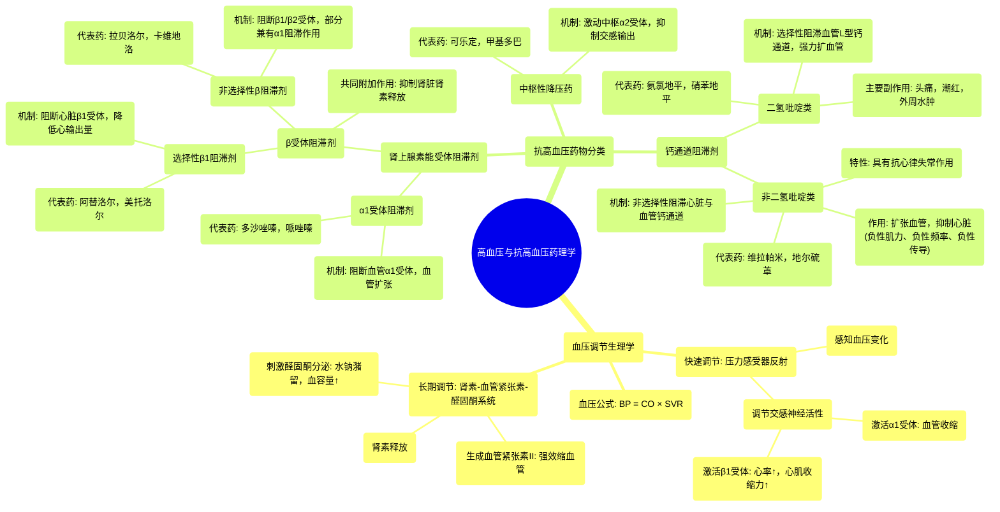

# 12 Pharmacology - HYPERTENSION & ANTIHYPERTENSIVES (MADE EASY)

  <video controls preload="metadata" playsinline>
    <source src="https://helly.s3.bitiful.net/心血管学科/%E4%B8%93%E8%BE%91%2017%EF%BC%9A%E8%8D%AF%E7%90%86%E5%AD%A6%E5%A4%A7%E5%B8%88%E8%AF%BE%20%28Speed%20Pharmacology%29/12%20Pharmacology%20-%20HYPERTENSION%20%26%20ANTIHYPERTENSIVES%20%28MADE%20EASY%29.mp4" type="video/mp4">
    
您的浏览器不支持播放，请升级。

  </video>

::: tip ⚡️ 核心考点 (30s速读)
*   **核心考点**：血压（BP）由心输出量（CO）与体循环血管阻力（SVR）的乘积决定。抗高血压药通过干预调节血压的两大核心系统——交感神经系统（SNS）和肾素-血管紧张素-醛固酮系统（RAAS）——来降低血压。
*   **临床意义**：理解不同类别药物的作用靶点（如α/β受体、钙通道、RAAS），是合理选择药物、预测疗效与副作用（如β阻滞剂减慢心率、二氢吡啶类引起水肿）的基础。
:::

## 🧠 深度精讲

*   **血压的生理调节**：血压的维持依赖于心输出量和外周血管阻力。身体通过两大系统精细调节：1) **压力感受器反射**：位于主动脉弓和颈动脉窦，感知血压变化，通过调节交感神经活性（释放儿茶酚胺，激活α1和β1受体）来快速调整心率和血管张力。2) **肾素-血管紧张素-醛固酮系统（RAAS）**：肾脏感知血压下降或肾血流减少时，释放肾素，最终生成血管紧张素II（强效缩血管物质）和醛固酮（保钠保水，增加血容量），共同升高血压。

*   **抗高血压药物分类与机制**：药物通过阻断上述调节通路的不同环节发挥作用。
    *   **肾上腺素能受体阻滞剂**：
        *   **α1受体阻滞剂**（如多沙唑嗪、哌唑嗪）：阻断血管平滑肌α1受体，导致血管扩张，降低外周阻力。
        *   **β受体阻滞剂**：
            *   **选择性β1阻滞剂**（如阿替洛尔、美托洛尔）：主要阻断心脏β1受体，降低心率和心肌收缩力，减少心输出量。
            *   **非选择性β阻滞剂**（如拉贝洛尔、卡维地洛）：同时阻断β1和β2受体，部分药物（如拉贝洛尔）还能阻断α1受体，兼具降低心输出量和扩张血管的作用。所有β阻滞剂均可抑制肾脏β1受体，减少肾素释放，间接抑制RAAS。
    *   **中枢性降压药**（如可乐定、甲基多巴）：作用于脑干，激动α2受体，抑制交感神经传出，降低外周交感张力，从而减少心输出量和血管阻力。
    *   **钙通道阻滞剂（CCB）**：
        *   **二氢吡啶类**（如氨氯地平、硝苯地平）：选择性阻滞血管平滑肌L型钙通道，抑制血管收缩，强力扩张外周动脉，降低血压。主要副作用源于血管扩张（头痛、潮红、踝部水肿）。
        *   **非二氢吡啶类**（如维拉帕米、地尔硫䓬）：非选择性阻滞心脏和血管的钙通道。除扩张血管外，显著抑制心脏窦房结和房室结功能及心肌收缩力，具有抗心律失常作用。
    *   **血管紧张素转换酶抑制剂（ACEI）与血管紧张素II受体阻滞剂（ARB）**：（视频未详述，但为重要类别）分别通过抑制血管紧张素II的生成或阻断其受体，来拮抗RAAS，产生扩血管、排钠利尿作用。
    *   **利尿剂**：（视频未详述，但为重要类别）通过促进肾脏排钠、排水，减少血容量，降低心输出量。

## 📚 双语术语表 (Terminology)
| 英文术语 | 中文翻译 | 定义/解释 |
| :--- | :--- | :--- |
| Hypertension | 高血压 | 动脉血压持续升高的病理状态。 |
| Antihypertensive agents | 抗高血压药 | 用于治疗高血压的药物。 |
| Blood Pressure (BP) | 血压 | 血液对单位面积血管壁的侧压力。 |
| Cardiac Output (CO) | 心输出量 | 每分钟一侧心室射出的血液总量，等于每搏输出量×心率。 |
| Systemic Vascular Resistance (SVR) | 体循环血管阻力 | 血液在体循环血管系统中流动所遇到的总阻力。 |
| Baroreceptor | 压力感受器 | 位于主动脉弓和颈动脉窦，能感知血压变化的特殊神经末梢。 |
| Sympathetic Nervous System (SNS) | 交感神经系统 | 自主神经系统的一部分，兴奋时释放儿茶酚胺，可增快心率、增强心肌收缩、收缩血管。 |
| Catecholamines | 儿茶酚胺 | 一类含有儿茶酚结构的胺类物质，如去甲肾上腺素、肾上腺素，是交感神经的主要递质。 |
| Renin-Angiotensin-Aldosterone System (RAAS) | 肾素-血管紧张素-醛固酮系统 | 调节血压、血容量和电解质平衡的重要激素系统。 |
| Vasoconstriction | 血管收缩 | 血管管径变小，导致血流阻力增加。 |
| Vasodilation | 血管舒张 | 血管管径变大，导致血流阻力降低。 |
| Alpha-1 blocker (α1 blocker) | α1受体阻滞剂 | 能阻断α1肾上腺素能受体的药物，导致血管扩张。 |
| Beta-blocker (β-blocker) | β受体阻滞剂 | 能阻断β肾上腺素能受体的药物，根据选择性可分为β1选择性或非选择性。 |
| Centrally acting adrenergic drug | 中枢性降压药 | 作用于中枢神经系统（主要是脑干）以降低交感神经活性的降压药。 |
| Calcium Channel Blocker (CCB) | 钙通道阻滞剂 | 通过阻滞细胞膜上的钙离子通道，减少钙离子内流而发挥作用的药物，主要用于心血管疾病。 |
| Dihydropyridines (DHPs) | 二氢吡啶类 | 一类主要作用于血管平滑肌的钙通道阻滞剂。 |
| Non-dihydropyridines (Non-DHPs) | 非二氢吡啶类 | 一类对心脏和血管均有作用的钙通道阻滞剂。 |

## 🗺️ 知识图谱

