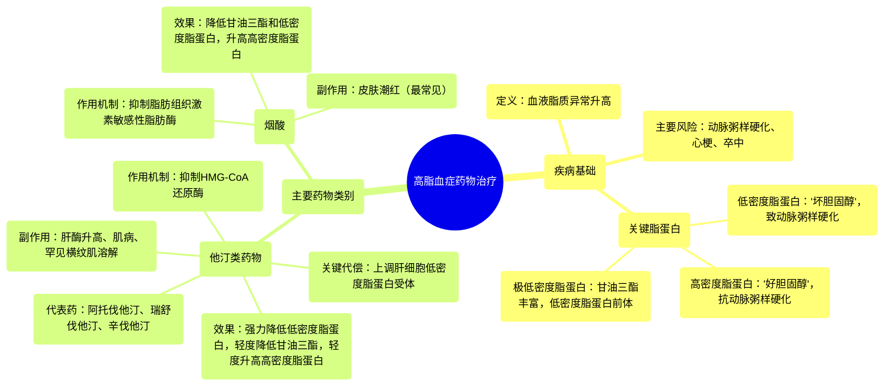

# 13 Pharmacology - DRUGS FOR HYPERLIPIDEMIA (MADE EASY)

  <video controls preload="metadata" playsinline>
    <source src="https://helly.s3.bitiful.net/心血管学科/%E4%B8%93%E8%BE%91%2017%EF%BC%9A%E8%8D%AF%E7%90%86%E5%AD%A6%E5%A4%A7%E5%B8%88%E8%AF%BE%20%28Speed%20Pharmacology%29/13%20Pharmacology%20-%20DRUGS%20FOR%20HYPERLIPIDEMIA%20%28MADE%20EASY%29.mp4" type="video/mp4">
    
您的浏览器不支持播放，请升级。

  </video>

::: tip ⚡️ 核心考点 (30s速读)
*   **核心考点**：高脂血症是血液中脂质（胆固醇、甘油三酯）水平异常升高，主要风险是导致动脉粥样硬化，增加心梗和卒中风险。治疗核心是降低“坏胆固醇”（低密度脂蛋白）和甘油三酯，同时提升“好胆固醇”（高密度脂蛋白）。
*   **临床意义**：他汀类药物是降脂治疗的基石，通过抑制肝脏胆固醇合成，上调低密度脂蛋白受体，强力降低低密度脂蛋白。烟酸则通过抑制脂肪分解，减少肝脏极低密度脂蛋白合成，从而降低低密度脂蛋白和甘油三酯，并升高高密度脂蛋白。
:::

## 🧠 深度精讲

*   **高脂血症与脂蛋白**：高脂血症的本质是血液中脂质（脂肪颗粒）水平过高。由于脂质不溶于水，它们必须与蛋白质结合形成**脂蛋白**才能在血液中运输。脂蛋白就像一个“运输船”，其核心装载着疏水的胆固醇和甘油三酯，外壳则由亲水的磷脂和**载脂蛋白**构成。
*   **“好”与“坏”的胆固醇**：这是理解高脂血症的关键。
    *   **低密度脂蛋白**：主要负责将胆固醇从肝脏运送到全身细胞。当其水平过高时，胆固醇会沉积在动脉壁，形成粥样斑块，因此被称为“**坏胆固醇**”。
    *   **高密度脂蛋白**：负责将外周组织多余的胆固醇逆向转运回肝脏进行代谢，具有抗动脉粥样硬化作用，因此被称为“**好胆固醇**”。
*   **他汀类药物**：这是目前最重要、应用最广的一类降脂药。
    *   **作用机制**：在肝细胞内，**HMG-CoA还原酶**是胆固醇合成的限速酶。他汀类药物通过竞争性抑制该酶，减少肝细胞内胆固醇的合成。
    *   **代偿反应**：肝细胞感知到内部胆固醇减少，会做出两个关键反应：1) 增加细胞膜表面的**低密度脂蛋白受体**数量，从而从血液中摄取更多的低密度脂蛋白，使其水平下降；2) 减少**极低密度脂蛋白**的合成和分泌，这也有助于降低甘油三酯。
    *   **代表药物**：阿托伐他汀、瑞舒伐他汀、辛伐他汀、普伐他汀等。
    *   **主要副作用**：1) **肝毒性**：可能引起转氨酶升高；2) **肌病**：包括肌肉疼痛、无力，罕见但严重的并发症是**横纹肌溶解症**（肌肉细胞破坏）。
*   **烟酸**：
    *   **作用机制**：主要在脂肪组织起作用，抑制**激素敏感性脂肪酶**，减少甘油三酯分解为游离脂肪酸。流入肝脏的游离脂肪酸减少，导致肝脏合成**极低密度脂蛋白**的原料不足，从而降低极低密度脂蛋白及其代谢产物低密度脂蛋白的水平。同时，它也能通过多种机制升高高密度脂蛋白。
    *   **主要副作用**：最典型且常见的是**皮肤潮红**（面部、颈部发红、发热感），这与前列腺素介导的血管扩张有关。

## 📚 双语术语表 (Terminology)
| 英文术语 | 中文翻译 | 定义/解释 |
| :--- | :--- | :--- |
| Hyperlipidemia | 高脂血症 | 血液中脂质（如胆固醇、甘油三酯）水平异常升高的疾病状态。 |
| Lipids | 脂质 | 不溶于水的脂肪分子，包括胆固醇、甘油三酯和磷脂。 |
| Lipoprotein | 脂蛋白 | 由脂质核心和蛋白质外壳组成的复合体，负责在血液中运输脂质。 |
| LDL (Low-Density Lipoprotein) | 低密度脂蛋白 | 主要携带胆固醇至外周组织的脂蛋白，水平过高易致动脉粥样硬化，俗称“坏胆固醇”。 |
| HDL (High-Density Lipoprotein) | 高密度脂蛋白 | 将外周胆固醇逆向转运回肝脏的脂蛋白，具有保护作用，俗称“好胆固醇”。 |
| VLDL (Very Low-Density Lipoprotein) | 极低密度脂蛋白 | 主要由肝脏合成，富含甘油三酯，是低密度脂蛋白的前体。 |
| Statins | 他汀类药物 | HMG-CoA还原酶抑制剂，通过抑制肝脏胆固醇合成来降低低密度脂蛋白。 |
| HMG-CoA Reductase | HMG-CoA还原酶 | 胆固醇生物合成途径中的限速酶，是他汀类药物的作用靶点。 |
| Niacin (Nicotinic Acid) | 烟酸 | B族维生素之一，大剂量使用时可通过抑制脂肪分解来降低甘油三酯和低密度脂蛋白，并升高高密度脂蛋白。 |
| Myopathy | 肌病 | 肌肉疾病的统称，他汀类药物可能引起的副作用，表现为肌肉疼痛或无力。 |
| Rhabdomyolysis | 横纹肌溶解症 | 严重的肌肉损伤，导致肌细胞内容物（如肌红蛋白）释放入血，可导致肾损伤，是他汀类药物罕见但严重的副作用。 |

## 🗺️ 知识图谱

