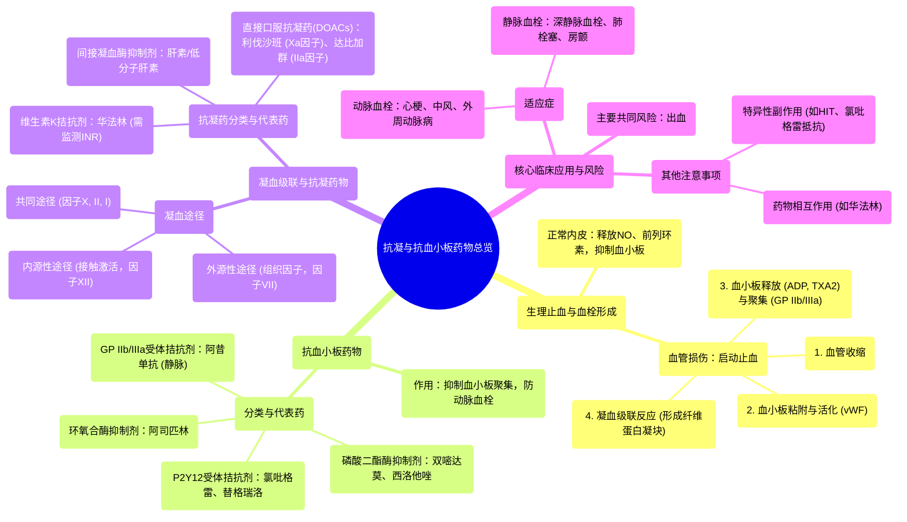

# 14 Pharmacology - ANTICOAGULANTS & ANTIPLATELET DRUGS (MADE EASY)

  <video controls preload="metadata" playsinline>
    <source src="https://helly.s3.bitiful.net/心血管学科/%E4%B8%93%E8%BE%91%2017%EF%BC%9A%E8%8D%AF%E7%90%86%E5%AD%A6%E5%A4%A7%E5%B8%88%E8%AF%BE%20%28Speed%20Pharmacology%29/14%20Pharmacology%20-%20ANTICOAGULANTS%20%26%20ANTIPLATELET%20DRUGS%20%28MADE%20EASY%29.mp4" type="video/mp4">
    
您的浏览器不支持播放，请升级。

  </video>

::: tip ⚡️ 核心考点 (30s速读)
*   **核心考点**：抗凝药与抗血小板药通过不同机制抑制血栓形成。抗血小板药（如阿司匹林、氯吡格雷）主要抑制血小板活化和聚集；抗凝药（如华法林、肝素）主要抑制凝血级联反应，阻止纤维蛋白形成。
*   **临床意义**：用于预防和治疗动脉血栓（如心梗、中风）和静脉血栓（如深静脉血栓、肺栓塞）。主要风险是出血。
:::

## 🧠 深度精讲

*   **概念1：生理性止血与血栓形成**
    在血管未受损时，内皮细胞释放一氧化氮和前列环素，维持血管舒张并抑制血小板活化。当血管损伤时，这些物质减少，启动止血过程：1) **血管收缩**；2) **血小板粘附与活化**（依赖vWF因子与胶原结合）；3) **血小板释放与聚集**（释放ADP、血栓素A2等，激活更多血小板，并通过糖蛋白IIb/IIIa受体与纤维蛋白原交联形成聚集体）；4) **凝血级联反应**形成坚固的纤维蛋白凝块加固血小板栓。

*   **概念2：抗血小板药物分类与作用机制**
    1.  **环氧合酶(COX-1)抑制剂**：代表药**阿司匹林**。不可逆抑制COX-1，减少血栓素A2生成，从而抑制血小板活化和聚集。
    2.  **P2Y12 ADP受体拮抗剂**：代表药**氯吡格雷、替格瑞洛**。阻断ADP与P2Y12受体结合，抑制糖蛋白IIb/IIIa受体激活，从而阻止血小板聚集。
    3.  **糖蛋白IIb/IIIa受体拮抗剂**：代表药**阿昔单抗、依替巴肽、替罗非班**。直接阻断血小板最终的聚集通路（纤维蛋白原结合位点），静脉给药，起效快。
    4.  **磷酸二酯酶抑制剂**：代表药**双嘧达莫、西洛他唑**。通过抑制磷酸二酯酶，增加血小板内cAMP，降低钙离子浓度，抑制血小板活化。同时有扩张血管作用。

*   **概念3：凝血级联反应与抗凝药物作用点**
    凝血过程涉及**内源性**（接触激活，因子XII）、**外源性**（组织因子释放，因子VII）和**共同**途径（因子X、II、I）。抗凝药作用于不同环节：
    1.  **间接凝血酶抑制剂**：如**肝素/低分子肝素**，需抗凝血酶III辅助，主要灭活因子Xa和IIa。
    2.  **维生素K拮抗剂**：如**华法林**，抑制维生素K依赖的凝血因子（II, VII, IX, X）合成。
    3.  **直接口服抗凝药(DOACs)**：如**直接Xa因子抑制剂**（利伐沙班）、**直接凝血酶抑制剂**（达比加群），直接抑制关键凝血因子。

*   **概念4：主要副作用与注意事项**
    *   **共同主要风险**：**出血**。
    *   **药物特异性问题**：阿司匹林有胃肠道刺激和雷耶综合征风险；氯吡格雷存在基因多态性导致的“氯吡格雷抵抗”；华法林治疗窗窄，需频繁监测INR，且受食物药物相互作用影响大；肝素可能导致肝素诱导的血小板减少症。

## 📚 双语术语表 (Terminology)
| 英文术语 | 中文翻译 | 定义/解释 |
| :--- | :--- | :--- |
| Anticoagulants | 抗凝剂/抗凝药 | 通过抑制凝血因子，阻止纤维蛋白形成，从而抑制血液凝固的药物。 |
| Antiplatelet agents | 抗血小板药 | 通过抑制血小板粘附、活化和聚集，防止动脉血栓形成的药物。 |
| Thrombosis | 血栓形成 | 血管内形成血凝块的过程。 |
| Platelet aggregation | 血小板聚集 | 血小板相互粘附形成团块的过程，是血栓形成的早期关键步骤。 |
| Cyclooxygenase-1 (COX-1) | 环氧合酶-1 | 一种酶，催化花生四烯酸生成前列腺素和血栓素A2。阿司匹林的作用靶点。 |
| Thromboxane A2 (TXA2) | 血栓素A2 | 一种由血小板产生的强效促聚集和血管收缩物质。 |
| P2Y12 receptor | P2Y12受体 | 血小板表面的ADP受体，其激活是血小板聚集的重要信号。氯吡格雷的作用靶点。 |
| Glycoprotein IIb/IIIa (GP IIb/IIIa) | 糖蛋白IIb/IIIa | 血小板表面的纤维蛋白原受体，是血小板聚集的最终共同通路。 |
| Clotting cascade | 凝血级联反应 | 一系列凝血因子顺序激活，最终导致纤维蛋白形成的过程，包括内源、外源和共同途径。 |
| Intrinsic pathway | 内源性途径 | 由血管内膜损伤接触激活（因子XII）启动的凝血途径。 |
| Extrinsic pathway | 外源性途径 | 由组织损伤释放组织因子（激活因子VII）启动的凝血途径。 |
| Common pathway | 共同途径 | 内源性和外源性途径汇合后的通路（从因子X激活开始）。 |
| Fibrin | 纤维蛋白 | 由纤维蛋白原经凝血酶切割形成的不溶性蛋白，交织成网，构成血凝块的骨架。 |
| Heparin | 肝素 | 一种间接抗凝药，通过增强抗凝血酶III的活性来抑制凝血因子Xa和IIa。 |
| Warfarin | 华法林 | 一种口服维生素K拮抗剂，抑制维生素K依赖的凝血因子合成。 |
| Direct Oral Anticoagulants (DOACs) | 直接口服抗凝药 | 直接抑制特定凝血因子（如Xa或IIa）的新型口服抗凝药。 |
| International Normalized Ratio (INR) | 国际标准化比值 | 用于标准化监测华法林抗凝效果的实验室指标。 |

## 🗺️ 知识图谱

