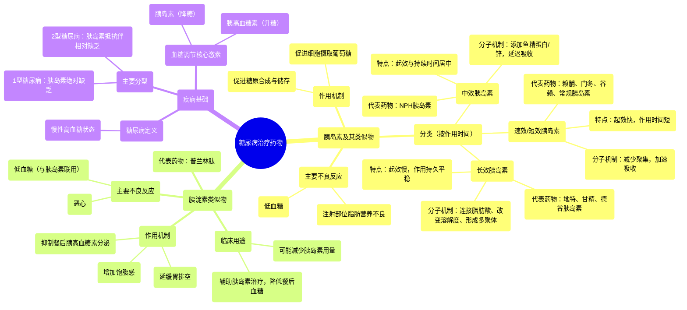

# 15 Pharmacology - DRUGS FOR DIABETES (MADE EASY)

  <video controls preload="metadata" playsinline>
    <source src="https://helly.s3.bitiful.net/心血管学科/%E4%B8%93%E8%BE%91%2017%EF%BC%9A%E8%8D%AF%E7%90%86%E5%AD%A6%E5%A4%A7%E5%B8%88%E8%AF%BE%20%28Speed%20Pharmacology%29/15%20Pharmacology%20-%20DRUGS%20FOR%20DIABETES%20%28MADE%20EASY%29.mp4" type="video/mp4">
    
您的浏览器不支持播放，请升级。

  </video>

::: tip ⚡️ 核心考点 (30s速读)
*   **核心考点**：糖尿病药物主要分为胰岛素及其类似物、胰淀素类似物等。胰岛素制剂根据起效和作用时间分为速效/短效、中效、长效三类，其差异源于分子结构修饰。胰淀素类似物（如普兰林肽）通过延缓胃排空、抑制胰高血糖素等机制辅助降糖。
*   **临床意义**：理解不同胰岛素制剂的作用特点（起效、达峰、持续时间）是制定个体化降糖方案、预防低血糖等不良反应的关键。胰淀素类似物可作为辅助治疗，有助于减少胰岛素用量。
:::

## 🧠 深度精讲
*   **概念1：糖尿病与胰岛素的作用机制**
    糖尿病是一种以高血糖为特征的慢性疾病，主要分为1型（胰岛素绝对缺乏）和2型（胰岛素抵抗伴相对缺乏）。胰岛素是由胰腺β细胞分泌的肽类激素，是调节血糖的关键。餐后血糖升高，刺激胰岛素分泌。胰岛素像一把“钥匙”，与细胞表面的胰岛素受体结合，促进细胞（尤其是肝脏和骨骼肌细胞）摄取葡萄糖。葡萄糖进入细胞后，要么被立即分解产生能量（ATP），要么以糖原的形式储存起来，以备未来之需。当血糖过低时，胰腺α细胞会分泌胰高血糖素，其作用与胰岛素相反，主要促进肝糖原分解，将葡萄糖释放入血，以升高血糖。

*   **概念2：胰岛素及其类似物的分类与特点**
    临床使用的胰岛素主要通过重组DNA技术生产。根据起效速度和作用持续时间，可分为三大类：
    1.  **速效和短效胰岛素**：如赖脯胰岛素、门冬胰岛素、谷赖胰岛素（速效）和常规胰岛素（短效）。它们起效快（数分钟至半小时），作用时间短（5-8小时）。其“速效”的秘诀在于科学家改变了胰岛素分子的氨基酸序列，使其不易聚集成六聚体，从而能更快地从皮下组织吸收入血。
    2.  **中效胰岛素**：如NPH胰岛素（鱼精蛋白锌胰岛素）。它在普通胰岛素中加入锌和鱼精蛋白，形成溶解度较低的复合物，从而延迟吸收，起效较慢，作用持续时间延长（约18小时）。
    3.  **长效胰岛素**：如地特胰岛素、甘精胰岛素、德谷胰岛素。它们起效缓慢，作用持久（超过24小时），且甘精胰岛素和德谷胰岛素无明显的血药浓度峰值，能提供更平稳的基础胰岛素水平。这些长效特性是通过对胰岛素分子进行特殊修饰实现的，例如连接脂肪酸侧链（地特胰岛素）、改变pH溶解度形成沉淀（甘精胰岛素）或形成多聚体储库（德谷胰岛素）。

*   **概念3：胰淀素类似物**
    胰淀素是与胰岛素共同由胰腺β细胞分泌的激素。其类似物普兰林肽是目前唯一上市的此类药物。它的作用机制包括：延缓胃排空（减慢食物中葡萄糖的吸收）、抑制餐后胰高血糖素分泌（减少肝脏葡萄糖输出）以及增加饱腹感。因此，它主要用于辅助胰岛素治疗，有助于降低餐后血糖，并可能减少胰岛素用量。主要副作用包括低血糖（与胰岛素联用时风险增加）和恶心。

## 📚 双语术语表 (Terminology)
| 英文术语 | 中文翻译 | 定义/解释 |
| :--- | :--- | :--- |
| Diabetes Mellitus | 糖尿病 | 一种以高血糖为特征的慢性代谢性疾病。 |
| Insulin | 胰岛素 | 由胰腺β细胞分泌的肽类激素，主要功能是促进细胞摄取和利用葡萄糖，降低血糖。 |
| Glucagon | 胰高血糖素 | 由胰腺α细胞分泌的激素，作用与胰岛素相反，促进肝糖原分解，升高血糖。 |
| Insulin Analogue | 胰岛素类似物 | 通过对人胰岛素氨基酸序列进行修饰而得到的药物，具有更理想的药代动力学特性（如起效更快或作用更持久）。 |
| Hypoglycemia | 低血糖 | 血液中葡萄糖水平过低的病理状态，是胰岛素治疗最常见的不良反应。 |
| Amylin | 胰淀素 | 与胰岛素共同由胰腺β细胞分泌的激素，能延缓胃排空、抑制胰高血糖素分泌。 |
| Pramlintide | 普兰林肽 | 一种合成的胰淀素类似物，用于辅助治疗糖尿病。 |
| Lipodystrophy | 脂肪营养不良 | 皮下脂肪组织的异常改变（萎缩或增生），可发生在胰岛素反复注射的部位。 |
| Postprandial | 餐后的 | 指进餐之后发生的。 |
| Subcutaneous Injection | 皮下注射 | 将药物注射到皮肤与肌肉之间的脂肪组织中的给药方式，是胰岛素的主要给药途径。 |

## 🗺️ 知识图谱

