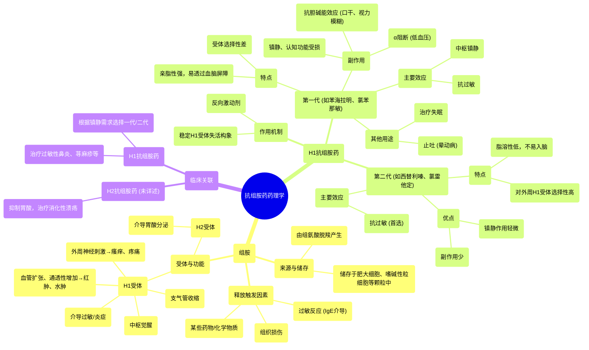

# 16 Pharmacology - ANTIHISTAMINES (MADE EASY)

  <video controls preload="metadata" playsinline>
    <source src="https://helly.s3.bitiful.net/心血管学科/%E4%B8%93%E8%BE%91%2017%EF%BC%9A%E8%8D%AF%E7%90%86%E5%AD%A6%E5%A4%A7%E5%B8%88%E8%AF%BE%20%28Speed%20Pharmacology%29/16%20Pharmacology%20-%20ANTIHISTAMINES%20%28MADE%20EASY%29.mp4" type="video/mp4">
    
您的浏览器不支持播放，请升级。

  </video>

::: tip ⚡️ 核心考点 (30s速读)
*   **核心考点**：抗组胺药通过阻断组胺受体（主要是H1和H2受体）发挥作用。第一代药物脂溶性强，易入脑，导致镇静等副作用；第二代药物选择性高、不易入脑，副作用更少。
*   **临床意义**：H1抗组胺药主要用于治疗过敏症状（如鼻炎、荨麻疹），第一代药物因镇静作用也用于失眠、晕动病；H2抗组胺药（如雷尼替丁）则用于抑制胃酸分泌，治疗消化性溃疡。
:::

## 🧠 深度精讲

*   **组胺的来源与释放**：组胺是由组氨酸脱羧产生的小分子，主要储存在肥大细胞、嗜碱性粒细胞等细胞的颗粒中。其释放主要受三种情况触发：**过敏反应**（过敏原与肥大细胞上的IgE抗体结合）、**组织损伤**（物理或化学损伤）以及**某些药物/化学物质**（如吗啡、某些抗生素）的直接刺激。
*   **组胺受体的类型与功能**：组胺通过结合四种受体（H1-H4）发挥作用。**H1受体**主要介导炎症和过敏反应，如血管扩张（导致红肿）、血管通透性增加（导致水肿）、支气管收缩、中枢觉醒以及外周神经刺激（导致瘙痒和疼痛）。**H2受体**主要表达于胃壁细胞，介导胃酸分泌。
*   **H1抗组胺药的分类与特点**：
    *   **第一代H1抗组胺药**（如苯海拉明、氯苯那敏）：结构亲脂，易透过血脑屏障，产生**中枢镇静**作用。对受体选择性差，还能阻断胆碱能受体（导致口干、视力模糊）、α-肾上腺素能受体（导致低血压）和5-羟色胺受体（可能增加食欲）。因此除抗过敏外，也用于治疗失眠、恶心呕吐（如晕动病）。
    *   **第二代H1抗组胺药**（如西替利嗪、氯雷他定、非索非那定）：结构更庞大、脂溶性低，**不易透过血脑屏障**，因此**镇静作用轻微**。对外周H1受体选择性高，副作用少，是治疗过敏性疾病的**首选**。
*   **作用机制**：H1抗组胺药作为**反向激动剂**，与H1受体结合并稳定其失活构象，从而拮抗组胺的作用，缓解过敏症状。

## 📚 双语术语表 (Terminology)
| 英文术语 | 中文翻译 | 定义/解释 |
| :--- | :--- | :--- |
| Histamine | 组胺 | 一种由组氨酸脱羧产生的生物胺，是重要的炎症和过敏介质。 |
| Mast cell | 肥大细胞 | 存在于组织中的免疫细胞，内含组胺等炎症介质颗粒，在过敏反应中起核心作用。 |
| IgE (Immunoglobulin E) | 免疫球蛋白E | 一种抗体类型，在过敏个体中产生，可结合于肥大细胞表面，介导过敏反应。 |
| H1 receptor | H1受体 | 组胺受体的一种，主要介导血管扩张、支气管收缩、瘙痒等过敏和炎症反应。 |
| H2 receptor | H2受体 | 组胺受体的一种，主要表达于胃壁细胞，刺激胃酸分泌。 |
| First-generation antihistamines | 第一代抗组胺药 | 亲脂性强、易透过血脑屏障、具有镇静等较多副作用的H1受体拮抗剂。 |
| Second-generation antihistamines | 第二代抗组胺药 | 脂溶性低、不易透过血脑屏障、镇静作用轻微、选择性高的H1受体拮抗剂。 |
| Inverse agonist | 反向激动剂 | 一种配体，与受体结合后稳定其失活构象，产生与激动剂相反的效应。 |
| Sedation | 镇静 | 药物引起的中枢神经系统抑制状态，表现为嗜睡、困倦。 |
| Bronchoconstriction | 支气管收缩 | 支气管平滑肌收缩，导致气道变窄。 |

## 🗺️ 知识图谱

