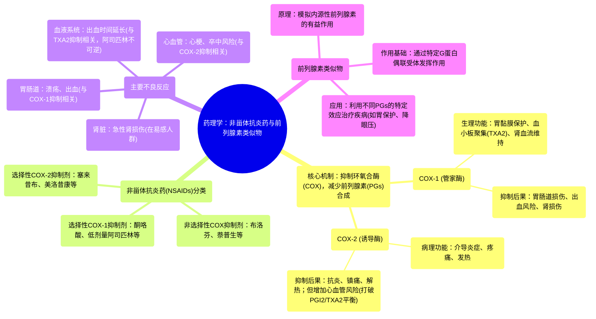

# 17 Pharmacology - NSAIDs & PROSTAGLANDIN ANALOGS (MADE EASY)

  <video controls preload="metadata" playsinline>
    <source src="https://helly.s3.bitiful.net/心血管学科/%E4%B8%93%E8%BE%91%2017%EF%BC%9A%E8%8D%AF%E7%90%86%E5%AD%A6%E5%A4%A7%E5%B8%88%E8%AF%BE%20%28Speed%20Pharmacology%29/17%20Pharmacology%20-%20NSAIDs%20%26%20PROSTAGLANDIN%20ANALOGS%20%28MADE%20EASY%29.mp4" type="video/mp4">
    
您的浏览器不支持播放，请升级。

  </video>

::: tip ⚡️ 核心考点 (30s速读)
*   **核心考点**：非甾体抗炎药（NSAIDs）通过抑制环氧合酶（COX）减少前列腺素（PGs）合成，从而发挥抗炎、镇痛、解热作用。其疗效与副作用主要取决于对COX-1和COX-2的选择性。
*   **临床意义**：COX-1抑制导致胃肠道损伤、出血风险增加和肾功能影响；COX-2抑制则与心血管事件风险升高相关。前列腺素类似物则利用PGs的有益作用，用于特定疾病的治疗。
:::

## 🧠 深度精讲

*   **炎症与前列腺素合成通路**：组织损伤激活磷脂酶A2，释放花生四烯酸。花生四烯酸是环氧合酶（COX）和5-脂氧合酶（5-LOX）的底物。本讲重点讨论COX通路。
*   **环氧合酶（COX）的两种主要亚型**：
    *   **COX-1**：在全身持续表达（“管家酶”），负责合成维持正常生理功能的前列腺素和血栓素A2（TXA2），如保护胃黏膜、调节肾血流、促进血小板聚集。
    *   **COX-2**：主要在炎症部位被诱导产生，其衍生的前列腺素主要介导炎症、疼痛和发热。
*   **非甾体抗炎药（NSAIDs）的作用机制与分类**：
    *   **机制**：通过抑制COX酶，减少所有前列腺素的生成。
    *   **分类（基于COX选择性）**：
        1.  **选择性COX-1抑制剂**：如酮咯酸、氟比洛芬、酮洛芬、吲哚美辛、低剂量阿司匹林。
        2.  **非选择性COX抑制剂**：如萘普生、布洛芬、吡罗昔康、二氟尼柳。
        3.  **选择性COX-2抑制剂**：如美洛昔康、双氯芬酸、塞来昔布、依托度酸。
*   **NSAIDs的主要不良反应**：
    *   **胃肠道反应**：抑制COX-1导致胃黏膜保护性前列腺素（PGE2， PGI2）减少，增加胃酸分泌、减少黏液和血流，引发溃疡和出血。COX-1选择性越高，风险越大。
    *   **出血倾向**：抑制COX-1减少血小板TXA2合成，抑制血小板聚集，延长出血时间。**阿司匹林**因不可逆抑制血小板COX-1，作用持续至血小板更新（约7-10天）。
    *   **肾损伤**：在肾功能依赖前列腺素维持血流的患者（如心衰、老年人）中，NSAIDs减少肾血管舒张性前列腺素（PGE2， PGI2）合成，可导致肾小球滤过率下降和急性肾损伤。
    *   **心血管风险**：主要与**高选择性COX-2抑制剂**相关。COX-2被抑制后，血管内皮产生的前列环素（PGI2， 血管舒张、抗血小板）减少，而血小板COX-1产生的TXA2（血管收缩、促血小板聚集）作用相对增强，导致血栓形成风险增加，可能引发心肌梗死和卒中。
*   **前列腺素类似物**：
    *   **概念**：人工合成的化合物，模拟内源性前列腺素的作用。
    *   **作用基础**：前列腺素通过至少9种不同的G蛋白偶联受体亚型发挥作用，效应因组织和受体亚型而异。
    *   **应用思路**：利用前列腺素的有益作用（如收缩子宫、降低眼压、保护胃黏膜等），开发用于特定适应症的药物（如米索前列醇用于胃黏膜保护，拉坦前列素用于降低眼压）。

## 📚 双语术语表 (Terminology)
| 英文术语 | 中文翻译 | 定义/解释 |
| :--- | :--- | :--- |
| NSAIDs | 非甾体抗炎药 | 一类通过抑制环氧合酶（COX）发挥抗炎、镇痛、解热作用的药物，不包括甾体激素。 |
| COX (Cyclooxygenase) | 环氧合酶 | 催化花生四烯酸转化为前列腺素和血栓素的关键酶，存在COX-1和COX-2两种主要亚型。 |
| Prostaglandins (PGs) | 前列腺素 | 由COX通路产生的一类脂质介质，具有广泛的生理和病理作用，如调节炎症、疼痛、发热、胃黏膜保护、肾血流等。 |
| Arachidonic Acid | 花生四烯酸 | 细胞膜磷脂的成分，是COX和LOX通路的共同底物，用于合成类二十烷酸（如前列腺素、白三烯）。 |
| COX-1 | 环氧合酶-1 | 构成型表达酶，负责合成维持正常生理功能的前列腺素。 |
| COX-2 | 环氧合酶-2 | 诱导型表达酶，主要在炎症部位被激活，合成介导炎症、疼痛和发热的前列腺素。 |
| Thromboxane A2 (TXA2) | 血栓素A2 | 主要由血小板COX-1产生，促进血管收缩和血小板聚集。 |
| Prostacyclin (PGI2) | 前列环素 | 主要由血管内皮COX-2产生，促进血管舒张并抑制血小板聚集。 |
| Prostaglandin E2 (PGE2) | 前列腺素E2 | 一种重要的前列腺素，在胃中起黏膜保护作用，在肾脏调节血流，在炎症部位介导疼痛和发热。 |
| Prostaglandin Analogs | 前列腺素类似物 | 人工合成的、结构或功能类似于内源性前列腺素的化合物，用于治疗特定疾病。 |

## 🗺️ 知识图谱

