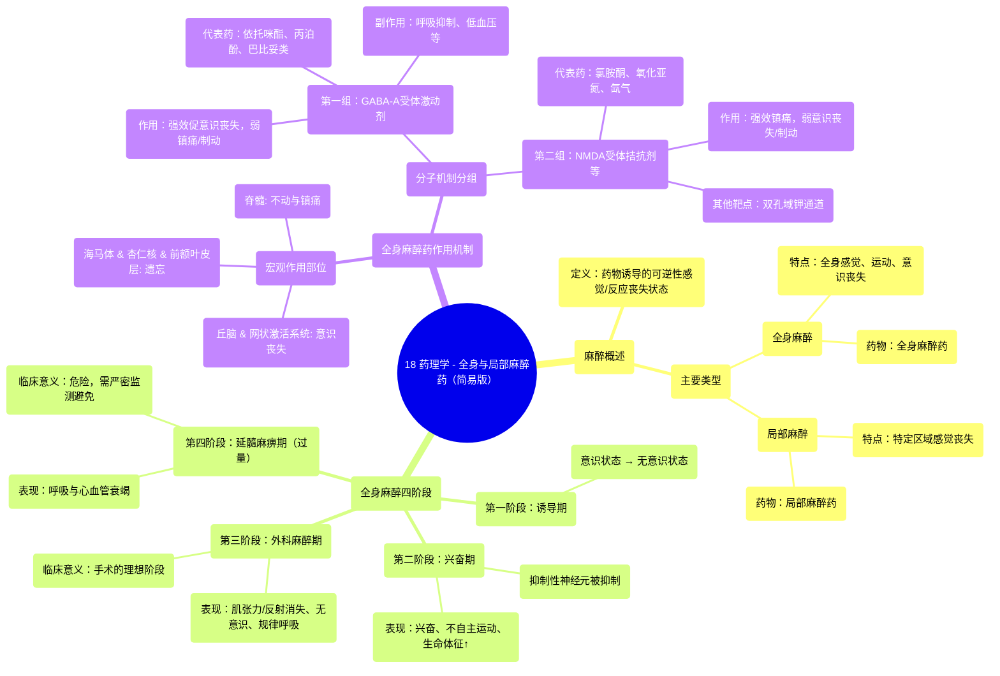

# 18 Pharmacology - GENERAL & LOCAL ANESTHETICS (MADE EASY)

  <video controls preload="metadata" playsinline>
    <source src="https://helly.s3.bitiful.net/心血管学科/%E4%B8%93%E8%BE%91%2017%EF%BC%9A%E8%8D%AF%E7%90%86%E5%AD%A6%E5%A4%A7%E5%B8%88%E8%AF%BE%20%28Speed%20Pharmacology%29/18%20Pharmacology%20-%20GENERAL%20%26%20LOCAL%20ANESTHETICS%20%28MADE%20EASY%29.mp4" type="video/mp4">
    
您的浏览器不支持播放，请升级。

  </video>

::: tip ⚡️ 核心考点 (30s速读)
*   **核心考点**：全身麻醉与局部麻醉的定义、区别及全身麻醉的四个阶段（诱导、兴奋、外科麻醉、延髓麻痹）。全身麻醉药按作用机制分为三组：GABA-A受体激动剂（如丙泊酚）、NMDA受体拮抗剂（如氯胺酮）以及吸入性麻醉药（如异氟烷）。
*   **临床意义**：理解麻醉阶段有助于安全实施麻醉，防止进入危险的第四阶段（过量）。不同作用机制的麻醉药联合使用，可实现“平衡麻醉”，优化麻醉效果（意识消失、镇痛、肌松）并减少单一药物的副作用。
:::

## 🧠 深度精讲

*   **麻醉的定义与分类**：麻醉是由药物诱导的一种可逆状态，其特征是对疼痛和感觉（如意识、肌肉运动）的反应减弱或消失。主要分为两类：**全身麻醉**（使整个身体失去感觉、运动和意识）和**局部麻醉**（仅使身体的特定目标区域失去知觉）。对应的药物分别称为全身麻醉药和局部麻醉药。

*   **全身麻醉的四个阶段**：
    1.  **诱导期**：患者从意识状态过渡到无意识状态的时期。
    2.  **兴奋期**：中枢神经系统抑制性神经元被抑制，导致兴奋性增强、出现不自主肌肉运动、心率增快、血压和呼吸频率升高。
    3.  **外科麻醉期**：肌肉张力和反射逐渐消失，患者完全无意识、对手术无反应、呼吸规律。这是进行手术的理想阶段。
    4.  **延髓麻痹期（过量期）**：发生呼吸和心血管衰竭，可导致死亡，必须严密监测以防止进入此阶段。

*   **全身麻醉药的作用机制（宏观与分子层面）**：
    *   **宏观层面**：药物作用于不同脑区产生综合效应。作用于丘脑和网状激活系统导致意识丧失；作用于海马体、杏仁核和前额叶皮层导致遗忘（记忆缺失）；作用于脊髓导致不动（制动）和镇痛。
    *   **分子层面**：机制复杂，涉及多种受体和离子通道。根据其主要作用特点，常将全身麻醉药分为三组：
        *   **第一组（GABA-A受体激动剂）**：如静脉用药**依托咪酯、丙泊酚、巴比妥类**。它们主要增强抑制性神经递质GABA的作用，通过延长GABA-A受体离子通道的开放时间，使氯离子内流增加，导致神经元超极化，从而**强效产生意识丧失**，但镇痛和制动作用相对较弱。常用于诱导。
        *   **第二组（NMDA受体拮抗剂等）**：如静脉用药**氯胺酮**和吸入药**氧化亚氮、氙气、环丙烷**。它们主要拮抗兴奋性神经递质谷氨酸的NMDA受体，阻断钙离子内流，从而**产生强效镇痛**。此外，它们还激活双孔域钾通道，促进钾离子外流，稳定神经元膜电位。其产生意识丧失和制动的作用相对较弱。常用于麻醉维持。
        *   **第三组（未在提供片段中详述，但常见于完整知识体系）**：主要是**挥发性吸入麻醉药**（如异氟烷、七氟烷）。它们对GABA-A受体和双孔域钾通道等多种靶点有作用，能**均衡地产生意识消失、制动和镇痛**，是外科麻醉期的主要维持药物。

*   **局部麻醉药**：（根据字幕开头定义）是用于诱导局部麻醉的药物，通过可逆地阻断神经冲动的产生和传导，使身体特定区域产生暂时性感觉丧失。其经典机制是阻断电压门控钠通道。

## 📚 双语术语表 (Terminology)
| 英文术语 | 中文翻译 | 定义/解释 |
| :--- | :--- | :--- |
| Anesthesia | 麻醉 | 由药物诱导的可逆状态，导致对疼痛或感觉的反应减弱或丧失。 |
| General anesthesia | 全身麻醉 | 使整个身体失去感觉、运动和意识的麻醉类型。 |
| Local anesthesia | 局部麻醉 | 仅使身体特定目标区域失去知觉的麻醉类型。 |
| General anesthetics | 全身麻醉药 | 用于诱导全身麻醉的药物。 |
| Local anesthetics | 局部麻醉药 | 用于诱导局部麻醉的药物。 |
| Induction | 诱导期 | 全身麻醉的第一阶段，患者从意识状态进入无意识状态。 |
| Excitement | 兴奋期 | 全身麻醉的第二阶段，特征为兴奋性增强、不自主运动及生命体征升高。 |
| Surgical anesthesia | 外科麻醉期 | 全身麻醉的第三阶段，患者无意识、无运动反应、呼吸规律，适于手术。 |
| Medullary paralysis | 延髓麻痹期 | 全身麻醉的第四阶段（过量期），发生呼吸和循环衰竭，危及生命。 |
| GABA-A receptor | γ-氨基丁酸A型受体 | 中枢神经系统主要的抑制性配体门控离子通道受体，被GABA激活后允许氯离子内流，使神经元超极化。 |
| NMDA receptor | N-甲基-D-天冬氨酸受体 | 一种对钙离子通透的离子型谷氨酸受体，在疼痛信号传递和突触可塑性中起关键作用。 |
| Thalamus | 丘脑 | 大脑中负责感觉信息中继的关键结构，与意识相关。 |
| Reticular activating system | 网状激活系统 | 脑干神经网络，负责调节觉醒和意识水平。 |

## 🗺️ 知识图谱

